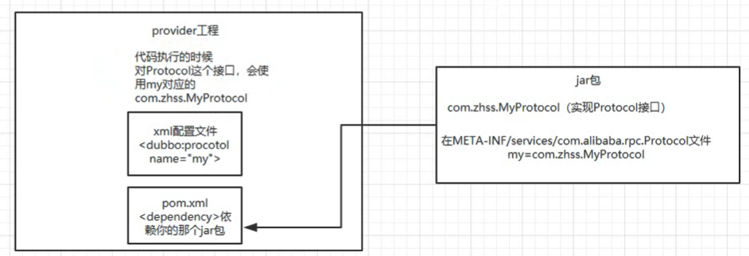
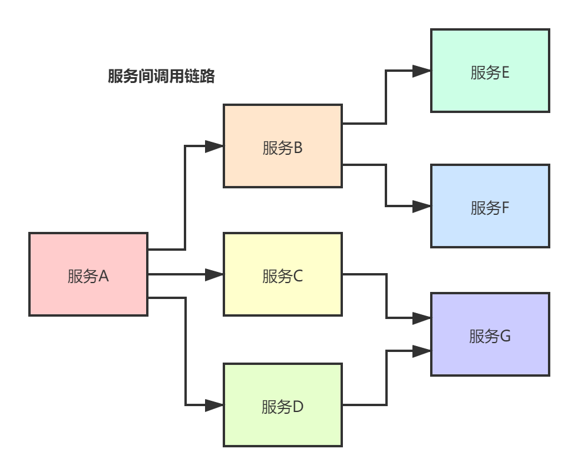
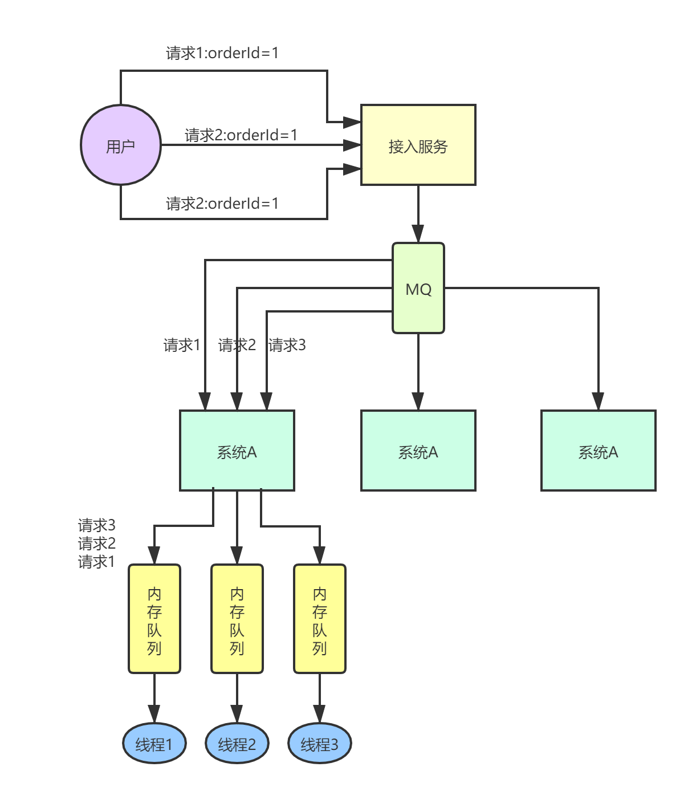
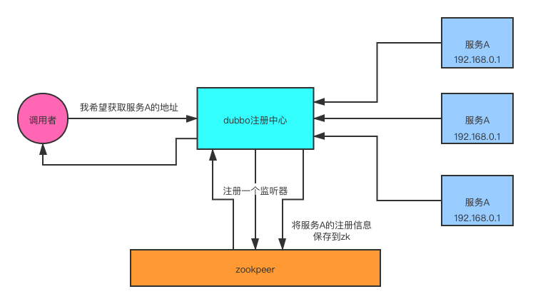
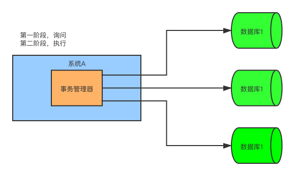
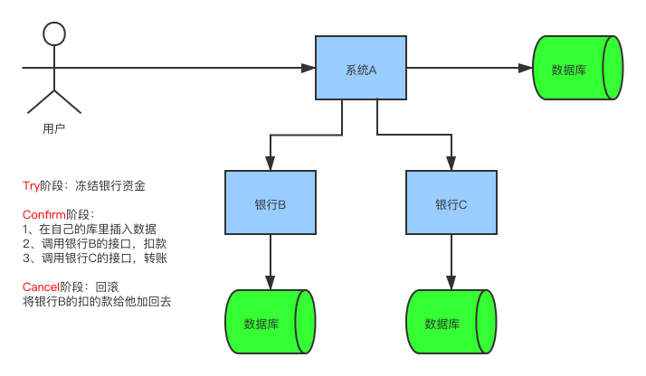
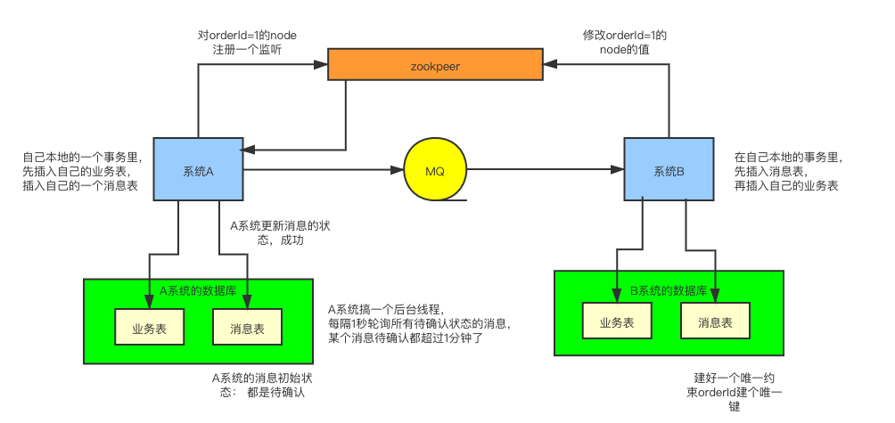
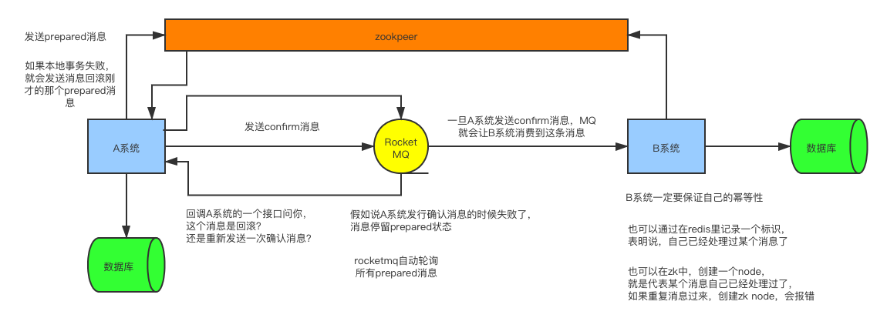

# RPC

## RPC 介绍

**RPC（Remote Procedure Call）** 即远程过程调用，通过名字我们就能看出 RPC 关注的是远程调用而非本地调用。

**为什么要有 RPC ？** 因为，两个不同的服务器上的服务提供的方法不在一个内存空间，所以，需要通过网络编程才能传递方法调用所需要的参数。并且，方法调用的结果也需要通过网络编程来接收。但是，如果我们自己手动网络编程来实现这个调用过程的话工作量是非常大的，因为我们需要考虑底层传输方式（TCP 还是 UDP）、序列化方式等等方面。

**RPC 能帮助我们做什么呢？** 简单来说，通过 RPC 可以帮助我们调用远程计算机上某个服务的方法，这个过程就像调用本地方法一样简单。并且！我们不需要了解底层网络编程的具体细节。

举个例子：两个不同的服务 A、B 部署在两台不同的机器上，服务 A 如果想要调用服务 B 中的某个方法的话就可以通过 RPC 来做。

一言蔽之：**RPC 的出现就是为了让你调用远程方法像调用本地方法一样简单。**

## RPC结构

1. client：服务调用方。
2. client stub：其实就是一个代理类，将调用方法、类、方法参数等信息传输给服务端。
3. 网络传输：将参数、方法信息等等用来定位调用什么、怎么调用的信息传输给服务端。实现方式有socket或者性能及封装更优秀的Netty。
4. server stub：接收到客户端执行方法的请求后，去指定对应的方法然后返回结果给客户端的类。
5. server：提供方法的服务端。


## 调用过程

1. 服务消费端（client）以本地调用的方式调用远程服务；
2. 客户端 Stub（client stub） 接收到调用后负责将方法、参数等组装成能够进行网络传输的消息体（序列化）：`RpcRequest`；
3. 客户端 Stub（client stub） 找到远程服务的地址，并将消息发送到服务提供端；
4. 服务端 Stub（桩）收到消息将消息反序列化为 Java 对象: `RpcRequest`；
5. 服务端 Stub（桩）根据`RpcRequest`中的类、方法、方法参数等信息调用本地的方法；
6. 服务端 Stub（桩）得到方法执行结果并将组装成能够进行网络传输的消息体：`RpcResponse`（序列化）发送至消费方；
7. 客户端 Stub（client stub）接收到消息并将消息反序列化为 Java 对象:`RpcResponse` ，这样也就得到了最终结果。over!

### 常见的RPC框架

- **RMI**：JDK自带的RPC，有很多局限性，不推荐使用
- **Dubbo**：阿里巴巴公司开源的一个高性能服务框架，使得应用可通过高性能的RPC实现服务的输出和输入功能，可以和 Spring 框架无缝集成。

- **gRPC** ：gRPC 是可以在任何环境中运行的现代开源高性能 RPC 框架。它可以通过可插拔的支持来有效地连接数据中心内和跨数据中心的服务，以实现负载平衡，跟踪，运行状况检查和身份验证。它也适用于分布式计算的最后一英里，以将设备，移动应用程序和浏览器连接到后端服务。
- **Hessian：** Hessian 是一个轻量级的 remotingonhttp 工具，使用简单的方法提供了 RMI 的功能。 相比 WebService，Hessian 更简单、快捷。采用的是二进制 RPC 协议，因为采用的是二进制协议，所以它很适合于发送二进制数据。
- **Thrift：** Apache Thrift 是 Facebook 开源的跨语言的 RPC 通信框架，目前已经捐献给 Apache 基金会管理，由于其跨语言特性和出色的性能，在很多互联网公司得到应用，有能力的公司甚至会基于 thrift 研发一套分布式服务框架，增加诸如服务注册、服务发现等功能。

### HTTP 调用 vs RPC 调用

RPC 只是一种概念、一种设计，就是为了解决 **不同服务之间的调用问题**, 它一般会包含有 **传输协议** 和 **序列化协议** 这两个。

实现 RPC 的可以传输协议可以直接建立在 TCP 之上，也可以建立在 HTTP 协议之上。**大部分 RPC 框架都是使用的 TCP 连接（gRPC 使用了 HTTP2）。**

**相比于 HTTP 框架来说，一个成熟的 RPC 框架往往还封装了服务发现、服务容错、负载均衡等服务治理相关的功能。**

很多文章中还会提到说 HTTP 协议相较于自定义 TCP 报文协议，增加的开销在于连接的建立与断开。

但是，HTTP 协议是支持连接池复用的，并不会频繁的进行连接的建立和断开。

很多人喜欢拿 RPC 和 HTTP 来做对比，实际上看完上面的讲解之后会发现：**实际上，对比 RPC 和 HTTP 没啥意义。**

**我们应该拿 RPC 的底层传输协议和 HTTP 协议对比。拿 RPC 常用的序列化协议如 hessian、protobuf、kyro 和 HTTP 调用常用的 JSON 来做对比。**

# 分布式系统

## 为什么要把系统拆成分布式的呢？为啥要用dubbo？

### 为什么要把系统拆分？

1. 如果不拆分的话，一个大系统几十万行代码，20个人维护一份代码，简直就是悲剧，代码改着改着就冲突了，各种代码冲突和合并要处理，非常好费时间。而且每次发布时需要将整个系统测试一遍。而且依赖特别复杂，技术版本不能随便动，牵一发而动全身。

   如果小A就检查了自己负责的1w行代码，没问题就闪人了，但上显示不小心修改了线上机器的某个配置，导致另外小B和小C负责的2w行代码对应的一些功能出错。

2. 拆分之后，原来几十万行的代码拆分为20个服务，每个服务一个git仓库、一个项目，每个码农维护一个项目。那改动的话就会很容易了，只要保证自己的输入输出正确即可。

3. 所以，一句话总结，如果代码量很大的单个系统，多人共同维护，不拆分系统的话开发效率及其低下，问题很多，但是拆分系统后，每个人负责自己的一小部分即可，开发效率大幅提升。

### 如何进行系统拆分？

这个问题可以扯到DDD领域驱动设计，也可以说的很小，如：

系统拆分分布式系统，拆成多个服务，拆成微服务的架构，会拆很多轮。

如果是多人维护一个服务， <= 3个人维护一个服务；最理想的情况下，几十个人，一个人负责1个或2~3个服务；如果某个服务的工作量变大了，代码量越来越多，某个同学负责一个服务，代码量变成10w行了，他自己不堪重负，他现在一个服务拆成五个服务，一个人顶着，然后招两个人给那个同学带着，3个人负责5个服务，其中两个人每个负责2个服务，1个人负责1个服务。

### 拆分了以后为什么要用dubbo，不用dubbo可以吗？

可以直接基于spring mvc进行纯http接口互相通信，但是需要考虑超时重试、负载均衡等等各种问题。

比如负载均衡的问题：订单系统调用商品系统，但是商品系统部署了5台机器，如何把请求均匀的分配给那五台机器？这个可以自己实现，但是很痛苦。

dubbo说白了就是一种rpc框架，本地进行接口调用时dubbo会代理这个调用请求去跟远程机器网络通信，dubbo实现了负载均衡、上下线自动感知、超时重试等等功能，使用时就可以不用自己做了。

## dubbo的工作原理是啥？注册中心挂了可以继续通信吗？

### dubbo工作原理

service层：provider和consumer，接口，由使用者来实现

config层：任何一个框架，都需要提供配置文件，让你可以进行配置

proxy层：代理层，无论是consumer还是provider，dubbo都会给你生成代理，代理之间进行网络通信

registry层：服务注册层，provider注册自己作为一个服务，consumer就可以找注册中心寻找要调用的服务

cluster层：集群层，provider可以部署在多台机器上，这一层封装多个服务提供者的路由，并且提供负载均衡，将多个实例组合成一个服务

monitor层：监控层，consumer调用provider调用了多少次就由此层监控

protocol层：负责具体的provider和consumer之间调用接口时的网络通信

exchange层：信息交换

transport层：网络传输层

serialize层：序列化

### 注册中心挂了之后还能继续通信吗？

是可以的。consumer启动后会在注册中心拉取provider的部署信息并缓存在本地，缓存完成之后是可以继续通过本地缓存来进行请求通信的。

## dubbo都支持哪些通信协议以及序列化协议？

### dubbo支持不同的通信协议

1. dubbo协议（默认）

   单一长连接、NIO异步通信、hessian序列化协议（了解一下：java序列化框架对比）

   适用场景：传输数据量很小（每次请求在100kb以内），但是并发量很高，consumer数量远远大于provider数量

2. rmi协议

   走 Java 二进制序列化，多个短连接，适合consumer和provider数量差不多的情况，适用于文件的传输，一般较少用。

3. hessian 协议

   走 hessian 序列化协议，多个短连接，适用于provider数量比consumer数量还多的情况，适用于文件的传输，一般较少用。

4. http 协议

   走 json 序列化。

5. webservice

   走 SOAP 文本序列化。

### dubbo支持的序列化协议

dubbo实际上基于不同的通信协议，支持hessian、Java 二进制序列化、json、SOAP 文本序列化多种序列化协议。但是 hessian 是其默认的序列化协议。

### 说一下 Hessian 的数据结构

Hessian 的对象序列化机制有 8 种原始类型：

- 原始二进制数据
- boolean
- 64-bit date（64 位毫秒值的日期）
- 64-bit double
- 32-bit int
- 64-bit long
- null
- UTF-8 编码的 string

另外还包括 3 种递归类型：

- list for lists and arrays
- map for maps and dictionaries
- object for objects

还有一种特殊的类型：

- ref：用来表示对共享对象的引用。

### 为什么 PB 的效率是最高的？

可能有一些同学比较习惯于 `JSON` or `XML` 数据存储格式，对于 `Protocol Buffer` 还比较陌生。`Protocol Buffer` 其实是 Google 出品的一种轻量并且高效的结构化数据存储格式，性能比 `JSON`、`XML` 要高很多。

其实 PB 之所以性能如此好，主要得益于两个：**第一**，它使用 proto 编译器，自动进行序列化和反序列化，速度非常快，应该比 `XML` 和 `JSON` 快上了 `20~100` 倍；**第二**，它的数据压缩效果好，就是说它序列化后的数据量体积小。因为体积小，传输起来带宽和速度上会有优化。

## Dubbo支持哪些负载均衡、高可用以及动态代理的策略？

### 负载均衡策略

1. random loadbalance（默认）

   **随机调用机器**，实现负载均衡。可以对provider设置不同的权重，dubbo会按照权重来进行负载均衡，权重越大，则分配的流量越多。

2. roundrobin loadbalance

   **轮询、均匀**的将流量打到各个机器上去，但如果各个机器性能不同，则容易导致性能差的机器负载过高。此时也可以通过调整权重来减少某些机器的流量。

3. leastactive loadbalance

   **自动感知**，如果发现某个机器性能差，则会减少对其的请求流量。

4. consistanthash loadbalance

   一致性hash算法，**相同参数的请求一定会分发到一个provider上面去**，当provider挂掉的时候，会基于虚拟节点来均匀分配剩余的流量，抖动不会太大。

### 集群容错策略

1. failover Cluster（默认）

   失败自动切换，自动重试其他机器，常见于读操作

2. failfast cluster

   一次调用失败就立即失败，常见于重要的写操作

3. failsafe cluster

   出现异常时忽略，常用于不重要的接口调用，比如记录日志

4. failback cluster

   失败了后台自动记录请求，然后定时重发，适合于写消息队列

   通常用于实时性要求较高的读操作，但需要浪费更多服务资源。

   可通过forks="2"来设置最大并行数。

5. forking cluster

   请求时并行调用多个provider，只要一个成功就立即返回

6. broadcast cluster

   请求时逐个调用所有的provider

### dubbo动态代理策略

默认使用javassist动态字节码生成，创建代理类

但是可以通过SPI(Service Provider Interface)扩展机制配置自己的动态代理策略。

## SPI是啥思想？dubbo的SPI机制是怎么玩儿的？

SPI——Service Provider Interface服务提供接口

微内核、可插拔，大量的组件，如protocol负责RPC调用的机制，可以自己实现自己的协议类

在dubbo的jar包中，有一个META-INF/dubbo.internal/com.alibaba.dubbo.rpc.Protoclo文件，这里面是key-value配置项，其中就包含了像Protocol、filter、hessian这些接口的实现类。

我们可以自己扩展这些东西，通过自己的配置来将自己的代码覆盖上去，以实现自己的定制化功能。

自己实现Protocol实现类示例：



## 基于dubbo如何做服务治理、服务降级以及重试？

### 服务治理

1. 调用链路自动生成

   服务A -> B -> C

   ​		  	    -->  E

   ​		   -> D

   ​					-> W

   需要可以自动的将服务调用链路生成出来，这样可以对系统有更清晰的认识。

   

2. 服务访问压力及时长统计

   需要自动统计每个接口的调用次数及延时

   比如从源头开始，一直到后面的依赖服务，每个服务进入的次数，每个服务从进入到返回的耗时

3. 其他

   服务分层（服务A一层，服务BD一层，服务CEW一层，避免循环依赖）

   服务接口失败监控和报警

   服务鉴权

   服务的可用性（接口调用成功率是多少？几个9？99.99%？99.9%？99%？）

### 服务降级

比如说服务A调用服务B，结果服务B挂掉了，服务A重试几次调用服务B，如果还是不行，则直接降级，走一个**备用逻辑**，给用户返回响应。

这里的备用逻辑，可以是直接返回null，也可以自己自定义一个mock函数，返回一个自定义的返回：

1. 返回null

   服务端的配置：

   ```xml
   <dubbo:service interface="com.zhss.service.HelloService" ref="helloServiceImpl" timeout="10000" />
   <bean id="helloServiceImpl" class="com.zhss.service.HelloServiceImpl" />
   ```

   客户端的配置：

   ```xml
   <dubbo:reference id="fooService" interface="com.test.service.HelloService"  timeout="10000" check="false" mock="return null">
   ```

   此处的mock参数的意思就是，降级时直接返回null

2. 自定义实现

   mock 的值修改为 true，然后再在接口同一个路径下实现一个 Mock 类，命名规则是 “接口名称+`Mock`” 后缀。然后在 Mock 类里实现自己的降级逻辑。

   例：

   ```java
   public class HelloServiceMock implements HelloService {
       public void sayHello() {
           // 降级逻辑
       }
   }
   ```

### 失败重试和超时重试

就是 consumer 调用 provider 要是失败了，比如抛异常了，此时应该是可以重试的，或者调用超时了也可以重试。配置如下：

```xml
<dubbo:reference id="xxxx" interface="xx" check="true" async="false" retries="3" timeout="2000"/>
```

可以结合公司具体的场景来说说你是怎么设置这些参数的：

- `timeout`：一般设置为 `200ms`，我们认为不能超过 `200ms` 还没返回。
- `retries`：设置 retries，一般是在读请求的时候，比如你要查询个数据，你可以设置个 retries，如果第一次没读到，报错，重试指定的次数，尝试再次读取。

## 分布式系统中接口的幂等性如何保证？比如不能重复扣款？

一个分布式系统，服务A被部署在了3台机器1、2、3上，如果前台同一个接口同一个参数，发送到同一个机器两次，或者同时发送到了机器1、2上，而导致执行了两次，那就有可能出现大问题，比如扣款两次、数据重复插入等问题。

此处一定需要考虑幂等性问题。

这个不是技术问题，没有通用的一个方法，需要结合业务来看应该如何考虑幂等性。此处考的是你的经验。

主要是3点：

1. 每个请求必须有一个唯一标识

2. 每次处理完请求之后，必须有一个记录来标识这个请求处理过了。比如一条数据的状态。

3. 每次接收请求时需要进行判断，判断之前是否处理过这个请求

比如，对于一个支付订单的接口：

- 支付一个订单后，需要插入一条支付流水，为order_id建一个唯一键
- 或者是更新订单的状态为已支付
- 或者是写入到redis里面一个标识，set order_id pay_status

然后每次进入接口时，都去判断一下此订单是否已处理。

## 分布式系统中的接口调用如何保证顺序性？

### 场景

用户向服务A发送了3个请求：请求1、请求2、请求3，这三个请求需要保证1、2、3的执行顺序，否则会报错。

如果采用分布式的架构，那请求1、2、3可能会被分发到不同的机器上去，如果机器互相之间不通信，则有可能造成顺序不符合要求的问题。

### 解决方案



#### 方案1（接入服务）

在用户和服务之间加一个接入服务B，接入服务通过dubbo的**一致性hash算法**的负载均衡策略来保证将所有请求都发送到同一个机器的实例上。

如果服务A内部采用了多线程处理，那还需要保证同一类请求（order_id相同）被提交到同一个线程上去，这个可以通过内存队列来保证，将所有的请求都放入到同一个内存队列中。

#### 方案2（分布式锁）

此方案可以不通过dubbo的负载均衡策略来实现。

每个请求中都加上序号seq，分别为1、2、3。

通过加入zk或者redis的分布式锁，每次获取完分布式锁之后，通过数据库中数据来判断，前面的请求是否已经处理完成了，只有前面的都处理完，当前请求才能处理。

##### 优化点

如果一个面向终端用户的服务这样来处理的话，吞吐量会很低，因此可以在接入服务和服务A中间加上MQ来达到异步的目的，接入服务将消息发送给A之后就返回，可以极大的提升系统吞吐量。

最后，建议将这三个请求合并为一个请求，不然后面的问题还会有很多，比如某个订单请求很多，造成某台机器变成了**热点**，负载很重。

## 如何设计一个类似dubbo的rpc框架？架构上该如何考虑？

1. 注册中心：通过这个来完成服务注册、发现、监控的功能
2. 负载均衡：consumer向哪个provider发送请求
3. 容错机制：当provider出错、网络出错时，怎么进行服务降级，使用什么策略保证接口的可用性
4. 动态代理：为consumer和provider都加上动态代理，来监听网络端口收到的请求
5. 序列化：使用hessian序列化协议来将内容序列化

## Zookeeper

### Zookeeper选举的基本原理

> 注意：如果 Zookeeper 是单机部署是不需要选举的，集群模式下才需要选举。

Zookeeper 的选举原理和人类选举的逻辑类似，套用一下人类选举的四个基本概念详细解释一下Zookeeper。

- **个人能力**

如何衡量 Zookeeper 节点个人能力？答案是靠`数据是否够新`，如果节点的数据越新就代表这个节点的个人能力越强，是不是感觉很奇怪，就是这么定的！

在 Zookeeper 中通常是以事务id（后面简称`zxid`）来标识数据的新旧程度（版本），节点最新的zxid越大代表这个节点的数据越新，也就代表这个节点能力越强。

> zxid 的全称是 `ZooKeeper Transaction Id`，即 Zookeeper 事务id。

- **遇强改投**

在集群选举开始时，节点首先认为自己时最强的（即数据是最新的），然后在选票上写上自己的名字（包括`zxid`和`sid`），zxid 是事务id，sid 唯一标识自己。

紧接着会将选票传递给其他节点，同时自己也会接收其他节点传过来的选票。每个节点接收到选票后会做比较，这个人是不是比我强（zxid比我大），如果比较强，那我就需要`改票`，明明别人比我强，我也不能厚着脸皮对吧。

- **投票箱**

与人类选举投票箱稍微有点不一样，Zookeeper 集群会在每个节点的内存中维护一个投票箱。节点会将自己的选票以及其他节点的选票都放在这个投票箱中。由于选票时互相传阅的，所以最终每个节点投票箱中的选票会是一样的。

- **领导者**

在投票的过程中会去统计是否有超过一半的选票和自己选择的是同一个节点，即都认为某个节点是最强的。一旦集群中有`超过半数`的节点都认为某个节点最强，那该节点就是领导者了，投票也宣告结束。

当 Zookeeper 集群中的一台服务器出现以下两种情况之一时，就需要进入 `Leader 选举`了。

（1）服务器初始化启动。

（2）服务器运行期间 Leader 故障。

#### 启动时期的 Leader 选举

假设一个 Zookeeper 集群中有5台服务器，id从1到5编号，并且它们都是最新启动的，没有历史数据。

假设服务器依次启动，我们来分析一下选举过程：

**（1）服务器1启动**

发起一次选举，服务器1投自己一票，此时服务器1票数一票，不够半数以上（3票），选举无法完成。

投票结果：服务器1为1票。

服务器1状态保持为`LOOKING`。

**（2）服务器2启动**

发起一次选举，服务器1和2分别投自己一票，此时服务器1发现服务器2的id比自己大，更改选票投给服务器2。

投票结果：服务器1为0票，服务器2为2票。

服务器1，2状态保持`LOOKING`

**（3）服务器3启动**

发起一次选举，服务器1、2、3先投自己一票，然后因为服务器3的id最大，两者更改选票投给为服务器3；

投票结果：服务器1为0票，服务器2为0票，服务器3为3票。 此时服务器3的票数已经超过半数（3票），**服务器3当选`Leader`**。

服务器1，2更改状态为`FOLLOWING`，服务器3更改状态为`LEADING`。

**（4）服务器4启动**

发起一次选举，此时服务器1，2，3已经不是LOOKING 状态，不会更改选票信息。交换选票信息结果：服务器3为3票，服务器4为1票。此时服务器4服从多数，更改选票信息为服务器3。

服务器4并更改状态为`FOLLOWING`。

**（5）服务器5启动**

与服务器4一样投票给3，此时服务器3一共5票，服务器5为0票。

服务器5并更改状态为`FOLLOWING`。

**最终的结果**：

服务器3是 `Leader`，状态为 `LEADING`；其余服务器是 `Follower`，状态为 `FOLLOWING`。

#### 运行时期的Leader选举

在 Zookeeper运行期间 `Leader` 和 `非 Leader` 各司其职，当有非 Leader 服务器宕机或加入不会影响 Leader，但是一旦 Leader 服务器挂了，那么整个 Zookeeper 集群将暂停对外服务，会触发新一轮的选举。

初始状态下服务器3当选为`Leader`，假设现在服务器3故障宕机了，此时每个服务器上zxid可能都不一样，server1为99，server2为102，server4为100，server5为101.

运行期选举与初始状态投票过程基本类似，大致可以分为以下几个步骤：

（1）状态变更。Leader 故障后，余下的`非 Observer` 服务器都会将自己的服务器状态变更为`LOOKING`，然后开始进入`Leader选举过程`。

（2）每个Server会发出投票。

（3）接收来自各个服务器的投票，如果其他服务器的数据比自己的新会改投票。

（4）处理和统计投票，没一轮投票结束后都会统计投票，超过半数即可当选。

（5）改变服务器的状态，宣布当选。

>  第一次投票，每台机器都会将票投给自己。
>
> 接着每台机器都会将自己的投票发给其他机器，如果发现其他机器的zxid比自己大，那么就需要改投票重新投一次。比如server1 收到了三张票，发现server2的xzid为102，pk一下发现自己输了，后面果断改投票选server2为老大。

#### 选举机制中涉及到的核心概念

敲黑板了，这些概念是面试必考的。

**（1）Server id（或sid）：服务器ID**

比如有三台服务器，编号分别是1,2,3。编号越大在选择算法中的权重越大，比如初始化启动时就是根据服务器ID进行比较。

**（2）Zxid：事务ID**

服务器中存放的数据的事务ID，值越大说明数据越新，在选举算法中数据越新权重越大。

**（3）Epoch：逻辑时钟**

也叫投票的次数，同一轮投票过程中的逻辑时钟值是相同的，每投完一次票这个数据就会增加。

**（4）Server状态：选举状态**

`LOOKING`，竞选状态。

`FOLLOWING`，随从状态，同步leader状态，参与投票。

`OBSERVING`，观察状态,同步leader状态，不参与投票。

`LEADING`，领导者状态。

### 说说zookeeper一般都有哪些使用场景？

#### 分布式协调

数据流：用户->服务A->MQ->服务B

当服务A把请求发出去之后，需要等服务B完成操作后进行后续操作，这时候可以在ZK上的某个节点注册一个监听器，当服务B操作完成之后修改这个节点的值，监听器会自动的通知到服务A，完美解决系统之间的协调工作。

#### 分布式锁

竞争创建一个全局唯一的临时节点，成功则代表获取到锁，否则获取锁失败。

#### 元数据/配置信息管理

zookeeper 可以用作很多系统的配置信息的管理，比如 kafka、storm 等等很多分布式系统都会选用 zookeeper 来做一些元数据、配置信息的管理，包括 dubbo 注册中心不也支持 zookeeper 么？



#### 高可用维护：主副节点切换

当主进程挂掉之后，副进程可以通过zk立刻感知到并切换到副进程。

## 分布式锁是啥？对比一下redis和zk这两种分布式锁

### redis的分布式锁实现

通过setnx key value来实现，只有key不存在时才能set key成功。

不成功的话，需要轮询一直重复获取。

### zookeeper的分布式锁实现

通过全局唯一的临时节点(ZNode)来实现：只有一个服务可以创建成功，创建成功的就拿到了锁。

当服务的连接断掉的话，临时节点会直接被删掉，可以避免死锁的问题。

没创建成功的服务，会注册一个监听器，当另一个服务释放时直接提醒他。

### 对比

redis的分布式锁，在国外还是有点争议的，是比较复杂的，而且也不保证其健壮性。

相比于redis，zk的分布式锁更加健壮、更加清晰，而且不用反复的轮询，反复的创建，只需要注册监听器即可（使用临时顺序节点来实现更优雅一些）。

## 说说你们的分布式session方案是啥？怎么做的？

### 使用Tomcat + Redis

设置session时，tomcat会同时将数据设置到redis中

获取session时，Tomcat会先去redis中获取数据

### 使用Spring Session + Redis

设置或者获取session时，spring会直接与redis交互，会略过服务器

## 了解分布式事务方案吗？你们都咋做的？有啥坑？

### 为什么要有分布式事务

单机的事务很容易实现，使用spring的事务管理即可，报错即回滚。

但是一旦改为分布式的，需要系统ABC全部执行成功才可以一起提交事务，否则需要回滚。这涉及到多个系统的通信问题。

### 分布式方案

#### 1. XA/两阶段提交

第一阶段，询问，看看每个系统是不是都可以执行

第二阶段，执行，通知每一个系统，可以进行事务提交了



这种方案，常见于一个系统操作多个数据库，当所有数据库都可以插入数据成功时，才可以提交事务。

这种分布式事务方案，比较适合单块应用里，跨多个库的分布式事务，而且因为严重依赖于数据库层面来搞定复杂的事务，**效率很低**，绝对不适合高并发的场景。如果要尝试一下，那么基于 `Spring + JTA` 就可以搞定，自己随便搜个 demo 看看就知道了。

这个方案，我们很少用，一般来说**某个系统内部如果出现跨多个库**的这么一个操作，是**不合规**的。我可以给大家介绍一下， 现在微服务，一个大的系统分成几十个甚至几百个服务。一般来说，我们的规定和规范，是要求**每个服务只能操作自己对应的一个数据库**。

如果你要操作别的服务对应的库，不允许直连别的服务的库，违反微服务架构的规范，你随便交叉胡乱访问，几百个服务的话，全体乱套，这样的一套服务是没法管理的，没法治理的，可能会出现数据被别人改错，自己的库被别人写挂等情况。

如果你要操作别人的服务的库，你必须是通过**调用别的服务的接口**来实现，绝对不允许交叉访问别人的数据库。

#### 2. TCC方案

TCC全程为：try、confirm、cancel



#### 3. 本地消息表

国外的eBay搞出来的

背景：请求发送给系统A，系统A去调用系统B



流程：

1. 系统A收到请求后，先自身处理自己的事务，成功后，**有序**的插入到本地的**业务表、消息表**，消息表中消息的初始状态为待确认

2. 系统A将消息传到MQ，系统B订阅消息
3. 系统B收到消息后，先将消息放到系统B的数据库的消息表，然后再进行处理，写入业务表。此处通过消息表的唯一性约束，来保证消息不被重复消费。
4. 系统B通知系统A：系统A提供一个接口给系统B调用，或者系统A在zk上加上监听器，B去修改节点的值，来达到回调的目的。
5. 为了防止消息丢失或者系统B的异常，系统A创建一个后台线程，每隔一段时间去重新发送那些状态为待确认的消息。

缺点：

严重依赖于MySQL的性能，因此高并发不推荐此方案。

#### 4. 可靠消息最终一致性方案

这个的意思，就是干脆不要用本地的消息表了，直接基于 MQ 来实现事务。比如阿里的 RocketMQ 就支持消息事务。



大概的意思就是：

1. A 系统先发送一个 prepared 消息到 mq，如果这个 prepared 消息发送失败那么就直接取消操作别执行了；
2. 如果这个消息发送成功过了，那么接着执行本地事务，如果成功就告诉 mq 发送确认confirm消息，如果失败就告诉 mq 回滚消息；
3. 如果发送了确认confirm消息，那么此时 B 系统会接收到确认消息，然后执行本地的事务；
4. mq 会自动**定时轮询**所有 prepared 消息回调你的接口，问你，这个消息是不是本地事务处理失败了，那些没发送确认confirm的消息，是继续重试还是回滚？一般来说这里你就可以查下数据库看之前本地事务是否执行，如果回滚了，那么这里也回滚吧。这个就是避免可能本地事务执行成功了，而确认confirm消息却发送失败了。
5. 这个方案里，要是系统 B 的事务失败了咋办？重试咯，自动不断重试直到成功，如果实在是不行，要么就是针对重要的资金类业务进行回滚，比如 B 系统本地回滚后，想办法通知系统 A 也回滚；或者是发送报警由人工来手工回滚和补偿。
6. 这个还是比较合适的，目前国内互联网公司大都是这么玩儿的，要不你就用 RocketMQ 支持的，要不你就自己基于类似 ActiveMQ？RabbitMQ？自己封装一套类似的逻辑出来，总之思路就是这样子的。

#### 5. 最大努力通知方案

这个方案的大致意思就是：

1. 系统 A 本地事务执行完之后，发送个消息到 MQ；
2. 这里会有个专门消费 MQ 的**最大努力通知服务**，这个服务会消费 MQ 然后写入数据库中记录下来，或者是放入个内存队列也可以，接着调用系统 B 的接口；
3. 要是系统 B 执行成功就 ok 了；要是系统 B 执行失败了，那么最大努力通知服务就定时尝试重新调用系统 B，反复 N 次，最后还是不行就放弃。

#### 你们公司是如何处理分布式事务的？

如果你真的被问到，可以这么说，我们某某特别严格的场景，用的是 TCC 来保证强一致性；然后其他的一些场景基于阿里的 RocketMQ 来实现分布式事务。

你找一个严格资金要求绝对不能错的场景，你可以说你是用的 TCC 方案；如果是一般的分布式事务场景，订单插入之后要调用库存服务更新库存，库存数据没有资金那么的敏感，可以用可靠消息最终一致性方案。

友情提示一下，RocketMQ 3.2.6 之前的版本，是可以按照上面的思路来的，但是之后接口做了一些改变，我这里不再赘述了。

## 说说一般如何设计一个高并发的系统架构？

1. 系统拆分，将单系统拆分为多个系统，每个系统有自己的数据库
2. 加缓存，可以轻松抗几万QPS，这样可以把大部分的读请求分出来，减轻数据库的压力
3. 在系统和数据库写请求中间加一个MQ来削峰，慢慢消费。
4. 如果MQ消息太多了，数据库的写请求需要每分钟几千请求才能消费消息，那可以分库分表，用多个数据库来分担压力。
5. 系统还是需要经常从数据库取数据写缓存，那这时可以进行数据库读写分离，主库写，从库读。
6. 对于一些全文检索请求来说，一开始数据量很小，可以基于lucene包来封装搜索引擎。但是后期数据量很大的时候，就需要使用分布式的es来支持搜索功能的实现了。

## 如何设计一个高可用系统？

在分布式的系统架构尤其是微服务架构中，限流、熔断、降级是最常见、简单和基础的保障系统高可用的手法。

在系统的接口调用中，我们是用hystrix去实现一整套的高可用保障机制的，基于hystrix去做了限流、熔断和降级。

### 高可用系统架构

资源隔离：让你的系统里某一块东西在故障的情况下，不会耗尽所有资源，比如线程资源，只能使用限定好的一些资源。

限流：高并发的流量涌入进来，比如说突然一秒钟有100WQPS,如果都涌进来系统就崩溃了，此时只允许10WQPS进入系统，其他90WQPS被拒绝，这就是限流。

熔断：系统后端的一些依赖出了一些故障，比如说MySQL挂掉了，这时候每次请求都会是报错的。熔断后，后续的请求过来就直接不接收了，直接拒绝访问，10分钟之后再去尝试看看MySQL恢复没有。

降级：MySQL挂了，系统发现之后自动降级，从内存中存的少量数据中提取一些数据出来。

运维监控：监控+报警+优化，各种异常情况，有问题就报警，优化一下系统的配置和参数，或者代码。


