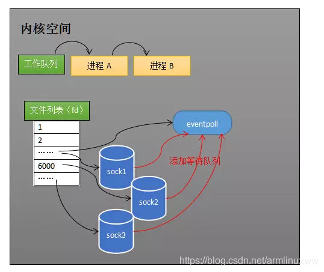

# IO流

## Java中的IO流体系

Java中的IO流可按照操作单元来分类，分成字节流和字符流，分别操作的数据单元为8位的字节和16位的字符。

字节流主要是由InputStream和OutPutStream作为基类，而字符流主要是由Reader和Writer作为基类。

## 五种IO模型

> 参考链接：https://zhuanlan.zhihu.com/p/115912936

1. 阻塞IO模型

   请求数据时，若没有数据准备好，应用会一直阻塞，直到内核准备好数据并返回给应用，才会结束此次数据请求的调用。

2. 非阻塞IO模型

   请求数据时，若没有数据准备好，会直接返回，通知应用此时没有数据，不会让应用一直在此等待。因此，应用如果想每次都迅速的相应数据，需要一直不断地调用数据请求的方法。

3. IO复用模型

   一个线程监控多个网络请求（fd文件描述符），这样就可以用一个或几个线程完成大量网络请求数据的监控，当有数据进来的时候，再去分配对应的线程去读取数据。

   进程通过将一个或多个fd传递给select，阻塞在select操作上，select帮我们侦测多个fd是否准备就绪，当有fd准备就绪时，select返回数据可读状态，应用程序再调用recvfrom读取数据。

   **此模型可达到不必为每个fd创建一个对应的监控线程，从而减少线程资源创建的目的。**

4. 信号驱动IO模型

   首先开启套接口信号驱动IO功能，并通过系统调用sigaction执行一个信号处理函数。

   此时进程通过将一个或多个fd传递给select，调用方法即刻返回，当数据准备就绪时，就生成对应进程的SIGIO信号，select通过信号回调对应的回调方法，应用程序再调用recvfrom读取数据。

   **实现了发出请求后只需要等待数据就绪的通知即可，这样就可以避免大量无效的数据状态轮询操作。**

5. 异步IO模型

   应用告知内核启动某个操作，并让内核在整个操作完成之后通知应用，这种模型与信号驱动模型的主要区别在于，信号驱动IO只是由内核通知我们何时可以开始下一个IO操作，而异步IO模型是由内核通知我们操作什么时候完成。

   **异步IO的优化思路是解决了应用程序需要先后发送询问请求、发送接收数据请求两个阶段的模式，在异步IO的模式下，只需要向内核发送一次请求就可以完成状态询问和数拷贝的所有操作。**

### 同步、异步模型的区别

同步的意思是，从请求发起到数据最后完成的这一段都是同一个线程亲力亲为。

而异步则相反，发送完指令就不再参与了，只需要等待最终完成的结果的通知。

### 阻塞、非阻塞的区别

阻塞的意思是，请求的时候，如果数据没有就绪就一直在这里等待数据的就绪。

非阻塞的意思则为，如果请求时没有数据就绪则直接返回。

### 同步阻塞、同步非阻塞、异步非阻塞

对于同步阻塞、同步非阻塞来说，区别仅仅在于请求时若数据没有就绪是否继续等待，他们都需要自己监控数据完成的过程。至于为何没有异步阻塞模型，原因则在于请求后就直接返回了，去等待通知了，所以注定不会被阻塞掉。

# IO多路复用的两种实现方式

> 参考链接：https://blog.csdn.net/songchuwang1868/article/details/89877739

IO多路复用指的是，通过一个进程就可以管理多个Socket网络IO数据源。

当进程 A 执行到创建 Socket 的语句时，操作系统会创建一个由文件系统管理的 Socket 对象(如下图)。文件使用fd（file description文件描述符）来描述。

每个Socket对象，包含三个重要的结构：

- 发送缓冲区：线程会将要发送的数据缓存到此处，供网卡进行数据发送
- 接收缓冲区：网卡收到数据后，会将数据保存在这里面，供线程获取数据使用
- 等待列表：所有等待此Socket数据的进程，都会被加入到这个列表中，当有数据进来时，会唤醒这里面的进程并将其放到工作队列中。

因此，当一个进程去调用此Socket的recv方法时，如果此Socket没有数据，那么此进程会被从工作队列移到这个Socket的等待列表中并阻塞。

而当Socket接收到数据时，会将等待列表中的进程唤醒，重新加入到工作队列中，由于Socket中存在数据，因此recv方法可以返回接收到的数据。

因为服务端需要管理多个客户端连接，而 Recv 只能监视单个 Socket，因此人们为了解决这种矛盾，开始寻找监视多个Socket的方法。

而一开始出现的则是select方法。

## Select

### 原理

使用一个fds数据来管理多个Socket对象。

当线程调用select时，会遍历一边fds数组，查看是否有Socket存在数据。

|--> 如果有任何一个Socket对象有数据，则直接返回数据。

|--> 如果都没有数据，则会将此线程挂起。当有任何一个被监控的Socket收到数据时，会将此线程唤起，然后线程再去遍历fds中的Socket对象，查看是哪个Socket收到了数据。

### 优点

简单且行之有效，在几乎所有操作系统都有对应的实现。

### 缺点

最坏的情况需要遍历四次监控的Socket对象列表，因此操作系统规定最大监控1024-3（标准输入和输出，标准错误输出）个Socket对象：

1. 调用select方法时，遍历一遍所有监控的Socket对象，查看是否有存在数据的。
2. 若不存在，则将当前线程遍历插入到所有Socket对象的等待队列中。
3. 当任何一个被监控的Socket对象接收到数据后，会遍历被监控的Socket对象列表，将线程从所有Socket对象的等待列表中移除。
4. 线程被唤醒后，并不知道哪个Socket对象收到了数据，因此需要遍历一遍Socket对象找到收到数据的Socket。

## Epoll

### 原理

因为select的低效率，epoll被发明创造了出来。简单来看，select低效的最大原因是多次遍历，存在如下两个问题：

- 一个线程要监控的Socket对象列表大部分时间是不变的，因此是否可以将监控列表单独的做成一个管理功能呢？
- 线程被唤醒之后，能不能直接知道有哪些Socket对象收到了数据呢？是不是可以增加一个Socket的就绪列表呢？

Epoll就是针对上面这两种设想被发明出来的。Epoll就是增加的一个中间管理员，这个管理员管理了多个Socket对象与多个线程之间的关系。

### 工作过程

#### 创建epoll对象

当某个进程调用 epoll_create 方法时，内核会创建一个 eventpoll 对象(也就是程序中 Epfd 所代表的对象)。

eventpoll 对象也是文件系统中的一员，和 Socket 一样，它也会有等待队列。

#### 维护监视列表

创建 Epoll 对象后，可以用 epoll_ctl 添加或删除所要监听的 Socket。此时eventpoll对象会被加入到Socket的等待队列中。

当 Socket 收到数据后，中断程序会操作 eventpoll 对象，而不是直接操作进程。

#### 接收数据

当Socket收到对象时，会将Socket的引用插入到eventpoll的就绪队列rdlist中。

如上图展示的是 Sock2 和 Sock3 收到数据后，中断程序让 Rdlist 引用这两个 Socket。eventpoll 对象相当于 Socket 和进程之间的中介，Socket 的数据接收并不直接影响进程，而是通过改变 eventpoll 的就绪列表来改变进程状态。

当程序执行到 epoll_wait 时，如果 Rdlist 已经引用了 Socket，那么 epoll_wait 直接返回，如果 Rdlist 为空，阻塞进程。

#### 阻塞和唤醒进程

当进程调用到epoll_wait语句时，如果rdlist中没有引用的Socket对象，则表明此时没有Socket对象接收到了数据，会将进行阻塞并放入eventpoll的等待队列中。

当某些 Socket 接收到数据，中断程序一方面修改 Rdlist，另一方面唤醒 eventpoll 等待队列中的进程，进程 A 会再次进入运行状态，如下：

也因为rdlist的存在，进程A被唤醒时就可以知道有哪些Socket对象准备好了，可以直接调用。

### 底层实现

#### 就绪列表

存放着就绪的Socket对象，需要快速的插入、删除节点，使用了双向链表进行管理。

#### 索引结构

存放着eventpoll所有监控的Socket对象，需要便于插入、删除，同时便于搜索，防止重复添加，使用了红黑树数据结构进行管理。

**注：**因为操作系统要兼顾多种功能，以及有更多需要保存的数据，Rdlist 并非直接引用 Socket，而是通过 Epitem 间接引用，红黑树的节点也是 Epitem 对象。

### 总结

epoll在select和poll（poll和select基本一样，有少量改进）的基础引入了eventpoll作为中间层，使用了先进的数据结构，是一种高效的多路复用技术。

由于epoll减少了大量的遍历操作，因此在大部分情况下epoll效率都是比select更高的。

**但是一般认为如果在并发量低，socket都比较活跃的情况下，select效率更高。**也就是说活跃socket数目与监控的总的socket数目之比越大，select效率越高，因为select反正都会遍历所有的socket，如果比例大，就没有白白遍历。加之于select本身实现比较简单，导致总体现象比epoll好）

