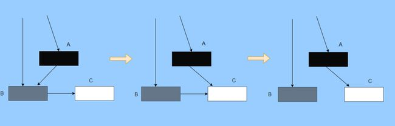
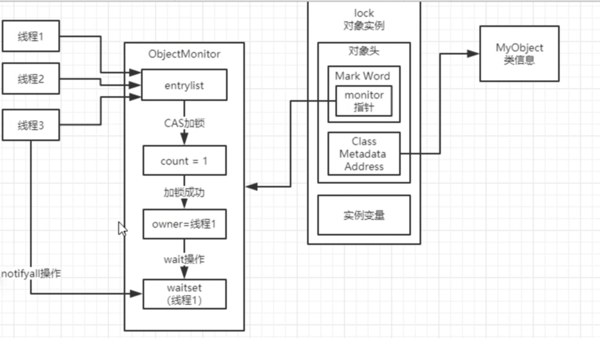
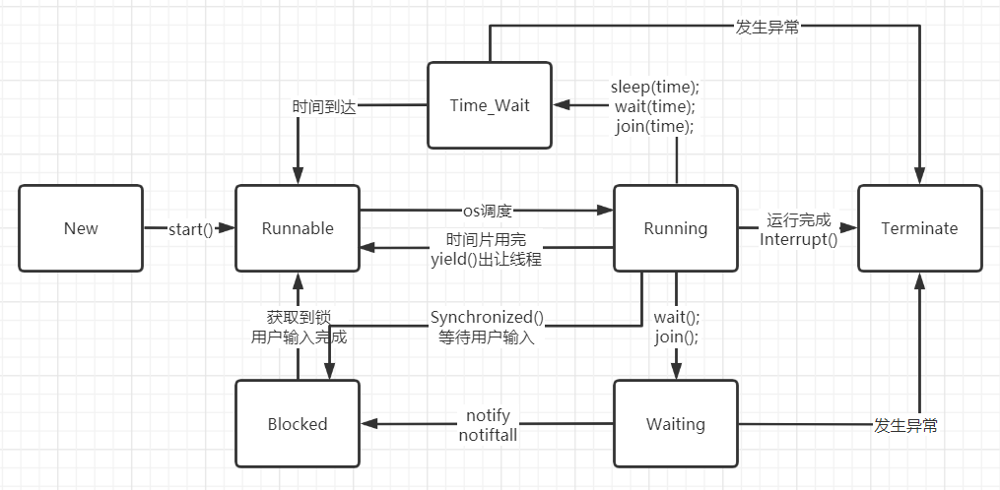

## 1. Java类加载过程

### 类加载机制

#### 全盘负责

当一个类加载器加载一个类时，和其有关的类的加载的任务这个类加载器都要负责，和其有关的类即为该class的依赖和该class引用的类

#### 双亲委派

一个类加载器加载一个类时不是直接就加载，而是先看看有没有父类加载器，有的话先让父类加载器看看其缓冲区内有没有，有的话就拿来用不会再加载了。而这个任务传给父类加载器之后父类加载器也和它的子类加载器一样，一代一代向上传，如果父加载器可以完成类加载任务，就成功返回；只有父加载器无法完成此加载任务时，才自己去加载。

即每个儿子都很懒，每次有活就丢给父亲去干，直到父亲说这件事我也干不了时，儿子自己才想办法去完成。

**优势：**

1. 避免类的重复加载：Java类随着它的类加载器一起具备了一种带有优先级的层次关系，通过这种层级关可以避免类的重复加载，当父亲已经加载了该类时，就没有必要子 ClassLoader 再加载一次。
2. 安全：保证java核心api库不会被随意篡改。假设通过网络传递一个名为java.lang.Integer的类，通过双亲委托模式传递到启动类加载器，而启动类加载器在核心Java API发现这个名字的类，发现该类已被加载，并不会重新加载网络传递的过来的java.lang.Integer，而直接返回已加载过的Integer.class，这样便可以防止核心API库被随意篡改。

#### 缓存机制

缓存机制将会保证所有加载过的Class都会被缓存，当程序中需要使用某个Class时，类加载器先从缓存区中搜寻该Class，只有当缓存区中不存在该Class对象时，系统才会读取该类对应的二进制数据，并将其转换成Class对象，存入缓冲区中。这就是为很么修改了Class后，必须重新启动JVM，程序所做的修改才会生效的原因。

## 2. JVM中有哪几块内存区域？Java 8之后对内存分代做了什么改进？

### 1. 虚拟机栈

​	Java方法执行的内存模型。每个方法执行时会创建一个栈帧，存储局部变量表、操作数栈、动态链接、方法出口等信息。

​	局部变量表中存放的有：编译器可知的各种基本数据类型、对象引用和returnAddress类型。

### 2. 本地方法栈

​	与虚拟机栈相似，不过这个是为native方法服务的。

### 3. 程序计数器

​	当前线程所执行的字节码的行号指示器。

### 4. 堆

大部分的对象实例和数组都要在堆上分配。

此处还有一个直接内存：通过一个存储在堆中的DirectByteBuffer对象作为这块内存的引用进行操作。

### 5. 方法区(永久代)

存储已被虚拟机加载的类信息、常量、静态变量、即时编译器编译后的代码等信息。其中有一个位置叫运行时常量池，存放编译期生成的各种字面量和符号引用。

java8以后的内存分代改进：

原来永久代里放了一些常量池 + 类信息，java8以后，常量池放到了堆里面，而类信息被放到了metaspace（元区域）中，永久代更名为元区域。

#### 面试题：下面代码的运行结果是什么？

```java
String str1 = new StringBuilder("计算机").append("软件").toString();
System.out.println(str1 == str1.intern()); // jdk1.6及之前为FALSE，1.7之后为true
String str2 = new StringBuilder("ja").append("va").toString();
System.out.println(str2 == str2.intern()); // 一直为false
```

上面这段代码执行后，运行结果如注释中所说。

**原因：**

jdk1.6及之前，intern()方法会将首次遇到的字符串实例复制到永久代中，返回的也是永久代这个字符串实例的引用，而由StringBuilder创建的字符串实例在堆上，所以必然不是一个同一个引用，返回false。

而jdk1.7及之后的虚拟机，不会再复制实例，而是在常量池里记录首次出现的实例引用，因此intern()返回的引用与StringBuilder创建的那个字符串实例是同一个。但是对str2的判断之所以为false，是因为java这个字符串之前已经出现过了，字符串常量池中已经有它的引用了，不会再记录一次StringBuilder在堆上所创建的实例的引用，不符合首次出现的规则，而“计算机软件”则是首次出现的，因此为true。

**扩展：**

1. java这样一个字符串为何之前就存在？

   java线程初始化完成之后，虚拟机会自动调用System类的initializeSystemClass方法，其中有一行代码为sun.misc.Version.init();，而Version类中有静态变量：

   ```java
   private static final String launcher_name = "java";
   private static final String java_version = "1.8.0_202";
   private static final String java_runtime_name = "Java(TM) SE Runtime Environment";
   private static final String java_profile_name = "";
   private static final String java_runtime_version = "1.8.0_202-b08";
   ```

   因此，这些字符串会自动加载进字符串常量池。

2. “计算机软件”这个字符串也是一开始就不存在的字符串，为何也是false呢？因为此处的字符串在编译时期就已经确定了，类加载时就会将这个字符串加载到常量池。

    ```
    String str1 = new StringBuilder("计算机软件").toString();
    System.out.println(str1 == str1.intern()); // 一直为false
    ```
    
    而第一个例子中，“计算机”和“软件”也会一开始加载到堆中，而新出现的“计算机软件”是由stringBuilder这个对象调用toString方法来创建的，因此是新字符串。

## 3. 创建对象的过程：

1. 先去方法区的常量池查看是否有这个类的符号引用，并且检查这个符号引用代表的类是否已被加载、解析和初始化过，没有的话要先进行类加载过程。
2. 通过后，虚拟机将为新生对象分配内存（内存大小在类加载完成后即可完全确定），分配方式有“指针碰撞”和“空闲列表”。分配时的并发安全问题，用CAS(compare and swap)或者TLAB(Thread local allocation buffer)方法保证。

   3. 虚拟机为分配到的内存空间都初始化为零值。
      进行必要的设置：如这个对象是哪个类的实例、如何才能找到类的元数据信息、对象的哈希吗、对象的GC分代年龄等信息。
   4. 执行init方法。

## 4. 锁升级过程

无锁态(01) -> 偏向锁(01) -> 轻量级锁(自旋锁)(00) --(自旋 > 10次 / 自旋线程数 > CPU核数/2, 1.6之后，加上了自适应自旋，JVM自己控制，也就是自适应自旋)--> 重量级锁(内核态级别的锁)(10)

## 5. GC相关

### 如何判断对象已死？

1. 引用计数法：给对象添加一个引用计数器，有引用的地方就加一，引用失效时减一
   - 效率高
   - 不能解决循环引用的问题
2. 可达性分析算法：一系列GCRoots对象作为起始点
   - 虚拟机栈中引用的对象
   - 方法区中类的静态属性和常量引用的对象
   - 本地方法栈中JNI（即一般说的Native方法）引用的对象。

### 四种引用关系

1. 强引用：平常代码中类似“Object obj = new Object();”这类的引用都是强引用，只要存在就不会被GC收集器回收。
2. 软引用：描述一些有用但非必须的对象。jdk提供了SoftReference类来实现软引用。在要发生内存溢出之前，会将软引用的对象列入垃圾回收范围之内，如果这次回收后还是没有足够的内存，才会抛出内存溢出的异常。基本上用于缓存。
3. 弱引用：ThreadLocal、WeakHashMap会用到。也是用来描述非必须对象的，GC收集器发现就回收，jdk提供了WeakReference类来实现弱引用。
4. 虚引用：get方法拿不到对象，唯一作用就是管理堆外内存。创建虚引用时需要制定一个队列，当队列中有数据的时候，证明有对象被回收了。

### 回收方法区

1. 回收内容：废弃常量和无用的类
2. 回收常量和回收一个普通的java对象非常类似，会查看是否有地方引用到这个常量
3. 回收类的条件比较苛刻，如下：
   1. 该类所有实例均已回收
   2. 加载该类的classLoader已经被回收
   3. 该类对应的java.lang.Class对象没有在任何地方被引用，且无法在任何地方通过反射访问该类的方法

### 垃圾收集算法

#### 标记-清除算法

先标记，再清除。但这两个过程的效率都不高，且会产生大量不连续的碎片，容易在后续为一个大对象分配内存时提前出发一次垃圾回收。

#### 复制算法(针对新生代)

将堆分为两块，这块用完了就把还存活的对象复制到另一块。

目前大部分的划分方法：

Eden：Survivor = 8 : 1，且Eden空间只有一块，Survivor空间有两块。每次只使用Eden区和其中一块Survivor区。

回收时会将Eden区和Survivor区存活的对象复制到另一块Survivor区，然后清理掉刚刚使用的Eden区和Survivor区。因此每次新生代中可用的内存空间为整个新生代容量的90%。

此处有一个分配担保的问题：如果Eden区和第一块Survivor区存活的对象在第二块Survivor区盛不下，那么会有一部分对象通过分配担保机制被复制到老年代。

#### 标记-整理算法(针对老年代)

与标记-清除算法不同，标记-整理算法标记完成之后，会将所有存活的对象向一端移动，然后直接清理完边界以外的内存。

#### 三色标记清除算法（非JVM实现）

将对象分为三种颜色：白色表示还未搜索到的对象、灰色表示正在搜索还未搜索完的对象、黑色表示搜索完成的对象

三色的转换过程：

1. GC开始前所有对象都是白色
2. GC一开始，所有根能够直达的对象被压到栈中待搜索，此时颜色全部都是灰色
3. 灰色对象依次从栈中取出搜索子对象，子对象也会被涂为灰色，入栈。当此次搜索的灰色对象其所有的子对象都涂为灰色之后该对象被涂为黑色。
4. 当 GC 结束之后灰色对象将全部没了，剩下黑色的为存活对象，白色的为垃圾。

问题：



1. 第一个阶段搜索到 A 的子对象 B了，因此 A 被染成了黑色，B 为灰色。此时需要搜索 B。

2. 但是在 B 开始搜索时，A 的引用被 mutator 换给了 C，然后此时 B 到 C 的引用也被删了。

3. 接着开始搜索 B ，此时 B 没有引用因此搜索结束，这时候 C 就被当垃圾了，因此 A 已经黑色了，所以不会再搜索到 C 了。

这就是出现**漏标**的情况，把还在使用的对象当成垃圾清除了，非常严重，这是 GC 不允许的，**宁愿放过，不能杀错。**

还有一种情况**多标**，比如 A 变成黑色之后，根引用被 mutator 删除了，那其实 A 就属于垃圾，但是已经被标记为黑色了，那就得等下次 GC 清除了。

这其实就是标记过程中没有暂停 mutator 而导致的，但这也是为了让 GC 减少对应用程序运行的影响。

多标其实还能接受，漏标的话就必须处理了，我们可以总结一下为什么会发生漏标：

1. mutator 插入黑色对象 A 到白色对象 C 的一个引用
2. mutator 删除了灰色对象 B 到白色对象 C 的一个引用

只要打破这两个条件任意一个就不会发生漏标的情况。这时候可以通过以下手段来打破两个条件：

1. 利用写屏障在黑色引用白色对象时候，将白色对象置为灰色，这叫**增量更新**。

2. 利用写屏障在灰色对象删除对白色对象的引用时，将白色对象置为灰，其实就是保存旧的引用关系。这叫**STAB（snapshot-at-the-beginning）。**

#### 内存分配、回收策略

1. 对象优先在Eden区分配

2. 大对象直接进入老年代

3. 长期存活的对象将进入老年代

   对象在Survivor空间每熬过一次MinorGc，年龄就+1，当增加到一定程度的时候（默认为15岁，最大其实也就是15岁，因为年龄信息存在于对象头中，只有四位，最大就是15），就会被晋升到老年代中。

4. 动态对象年龄判定

   如果在Survivor区中，相同年龄所有对象大小的总和大于Survivor空间的一半，年龄大于等于该年龄的对象就可以直接进入老年代。

5. 空间分配担保

   1. minorGC前，会先判断一下老年代的最大可用连续空间是否大于新生代所有对象总空间

   2. 如果成立则代表MinorGC是安全的，否则就要去看下HandlePromotionFailure设置的值是否为允许担保失败。

   3. 如果允许则会继续检查老年代最大可用的连续空间是否大于历次晋升到老年代对象的平均大小，如果大于则会尝试进行这次不安全的minorGc，如果小于或者不允许担保失败，则会进行一次FullGc。

      此处的冒险指的就是上文提到的，如果Eden区和第一块Survivor区存活的对象在第二块Survivor区盛不下，那么会有一部分对象通过分配担保机制被复制到老年代。

因此，放到老年代的对象有：

1. 长期存活的对象
2. S去放不下的对象
3. 大对象

### OOM类型总结

1. OutOfMemoryException
   - 堆：创建对象时内存不够用了
   - 方法区：由于此处主要存放一些类的定义，因此像大量使用JSP、GcLib等动态代理技术时容易出现
   - 运行时常量池：使用String.intern()方法时此区容易溢出
2. StackOverflowException
   - 虚拟机栈：当方法调用栈过深时，会报这个异常
   - 本地方法栈；同上
3. DirectMemoryError：堆外内存溢出，可能是可请求的内存大小超过了设置值，也可能是超出了实体机内存容量。

### -------------说说JVM在哪些情况下会触发垃圾回收

如果eden区域满了，此时必然触发垃圾回收，young gc，minor gc，没有引用的对象都会被回收（使用GCRoot来判断是否存活，栈、类的静态变量引用的对象都是需要存活的）。

### 说说老年代的垃圾回收算法？常用的垃圾回收器都有什么？

由于老年代的对象中存活的是比较多的，可能甚至有几百MB，所以肯定不能用复制算法。

有一个标记-清理算法，是先把所有要回收的对象标记出来，然后再进行清理，但很容易出现内存碎片，导致分配不了足够的内存给新对象。

因此实际使用的是标记-整理算法，标记完成之后会将所有存活的对象移动到一端，这样就可以避免内存碎片的问题了。

垃圾回收器：

parnew+cms的组合

parnew回收年轻代的垃圾回收

cms回收老年代的垃圾回收(比较复杂)

g1

## 6. 虚拟机性能监控与故障处理工具

- jps：JVM Process Status Tool，显示系统中所有的HotSpot虚拟机进程
- jstat：JVM Statistics Monitoring Tool，收集HotSpot虚拟机各方面的运行数据
- jinfo：Configuration Info for Java，显示虚拟机配置信息
- jmap：生产虚拟机的内存转储快照
- jhat：java heap dump browser，分析heapdump文件
- jstack：stack trace for java，显示虚拟机的线程快照
- 可视化工具：
  - jvisualvm
  - jconsole

### 你们生产环境中的Tomat是如何设置JVM参数的？如何检查JVM运行情况？

内存区域分配多大、每个线程的栈多大、metaspace大小、堆内存大小、年轻代和老年代分别的大小、eden和survivor区域的大小分别是多少，如果没有设置，会有一些默认值。

垃圾回收器，年轻代用的什么，老年代用的什么，每种垃圾回收期是否有对应的一些特殊参数需要配置，那些特殊参数分别是用来干什么的。

**为什么要这样设置呢？当前系统上线运行的时候，jvm的表现如何？**

**先预估系统的使用**

每个接口会有多少请求，请求过来之后会创建多少个对象，这些对象会占用多少内存空间，这次会在eden区占用多少内存空间，多久会触发ygc，触发ygc后存活对象会剩下多少，s区能不能盛得下，有哪些对象会被转移到老年代，长期存活的对象会有多少，偶尔出现s区放不下的情况，大对象会有多少，老年代填满有多快。

预估完毕之后，可以根据预估的情况去设置jvm的参数

**然后进行压测**

在压测的时候，其实就需要去观察jvm运行的情况，jstat工具去分析jvm运行的情况，他的年轻代里的eden区域的对象增长的情况，ygc的频率，每次ygc过后有多少对象存活，s能否放的下，老年代对象增长速率，老年代多久会触发一次fgc。

就可以根据压测的情况去进行一定的jvm参数的调优，一个系统的QPS，一个是系统的接口的性能，压测到一定程度的时候 ，机器的cpu、内存、io、磁盘的一些负载情况，jvm的表现。

可能需要对一些代码进行优化，比如优化性能，或者减轻一点cpu负担，减轻io和磁盘负担，发现jvm的gc过于频繁，内存泄漏，此时就需要对jvm的各个内存区域的大小以及一些参数进行调优。

**跑到线上实际生产环境**

在线上运行的过程中，也需要基于一些监控工具，或者是jstat，除了观察系统的QPS和性能外，还有接口可用性、调用成功率、机器的负载、jvm的表现、gc的频率、gc耗时、内存的消耗等参数

## 7. 说一下线程池的工作原理

线程池是基于池化思想而创造出来的一个类，他可以让我们在使用多线程来执行任务的时候不那么频繁的创建、销毁线程。

### 当一个任务被提交到线程池的时候，会经历如下几个步骤：

1. 判断当前运行的线程数是否小于核心线程数：
   - 如果小于的话，直接创建新线程执行（不会插入等待队列等待核心线程来获取任务）；
   - 否则加入到等待队列中，等待空闲线程来获取任务。
2. 如果空闲线程满了，则会判断当前线程数是否小于最大线程数：
   - 如果小于的话，则会直接创建新线程来执行此任务；
   - 否则执行拒绝策略。
3. 需要注意的点：
   1. 核心线程之外的线程，会根据空闲等待时间来销毁，根据`keepAliveTime`和`unit`来确定
   2. 拒绝队列有好几种，

### 等待队列

1. 无界等待队列：基于链表实现的，可以一直往里面塞任务
   - 如果遇到高峰期，那可能会出现任务一直往里面塞，消费速度赶不上生产速度，就会导致响应变慢
   - 当任务耗时较长时可能会导致大量新任务在队列中堆积最终导致OOM
2. 有界等待队列：基于数组实现的，有最大任务容纳数
   - 如果任务要调用远程方法，而远程方法阻塞了，那会一直创建新线程出来，如果最大线程数=Integer.MAX_VALUE，那会造成OOM。

### Executors 返回的线程池对象的弊端

1） FixedThreadPool 和 SingleThreadPool : 允许的请求队列长度为 Integer.MAX_VALUE ，可能会堆积大量的请求，从而导致 OOM 。

2） CachedThreadPool 和 ScheduledThreadPool : 允许的创建线程数量为 Integer.MAX_VALUE ，可能会创建大量的线程，从而导致 OOM 。

在 java.util.concurrent 包中，提供了 ThreadPoolExecutor 的实现。

```java
public ThreadPoolExecutor(int corePoolSize,
	int maximumPoolSize,
	long keepAliveTime,
	TimeUnit unit,
	BlockingQueue<Runnable> workQueue,
	ThreadFactory threadFactory,
	RejectedExecutionHandler handler) {
} 
```

### 线程池核心参数含义

**corePoolSize**- 核心线程数大小，既然如前原理部分所述。需要注意的是在初创建线程池时线程不会立即启动，直到有任务提交才开始启动线程并逐渐时线程数目达到corePoolSize。若想一开始就创建所有核心线程需调用prestartAllCoreThreads方法。

**maximumPoolSize**-池中允许的最大线程数。需要注意的是当核心线程满且阻塞队列也满时才会判断当前线程数是否小于最大线程数，并决定是否创建新线程。

**keepAliveTime** - 当线程数大于核心时，多于的空闲线程最多存活时间

**unit** - keepAliveTime 参数的时间单位。

**workQueue** - 当线程数目超过核心线程数时用于保存任务的队列。主要有3种类型的BlockingQueue可供选择：无界队列，有界队列和同步移交。将在下文中详细阐述。从参数中可以看到，此队列仅保存实现Runnable接口的任务。 别看这个参数位置很靠后，但是真的很重要，因为楼主的坑就因这个参数而起，这些细节有必要仔细了解清楚。

***threadFactory*** - 执行程序创建新线程时使用的工厂。

***handler*** - 阻塞队列已满且线程数达到最大值时所采取的饱和策略。java默认提供了4种饱和策略的实现方式：中止、抛弃、抛弃最旧的、调用者运行。将在下文中详细阐述。

### 线程池抛弃策略

1. AbortPolicy中止策略（默认）

   抛出异常，外部线程处理

2. DiscardPolicy抛弃策略

   直接将任务抛弃，没有任何响应

3. DiscardOldestPolicy抛弃队列头任务策略

   将队列头上面的任务抛弃，可能会将优先级最高的任务（使用PriorityBlockIngQueue优先级阻塞队列时）抛弃

4. CallerRunsPolicy调用者运行

   让提交任务的线程去运行此任务，会降低吞吐量

## 8. HashMap数据类型

### 	在多线程环境下会出现的问题

​		由于hashmap底层是用数组+链表/红黑树组成的，而只有当链表长度大于8且总容量大于threshold时才会将链表进化为红黑树，而在此之前是走的扩容来降低哈希冲突的。

​		因此，扩容时涉及到一个rehash的操作，rehash时，需要将原链表中的数据分流到两个链表中，此时涉及到了链表操作，在多线程情况下就会出现问题。下面详细探讨一下：

```java
/**
 * 重新hash的核心逻辑
 */
void transfer(Entry[] newTable)
{
    Entry[] src = table;
    int newCapacity = newTable.length;
    //下面这段代码的意思是：
    //  从OldTable里摘一个元素出来，然后放到NewTable中
    for (int j = 0; j < src.length; j++) {
        Entry<K,V> e = src[j];
        if (e != null) {
            src[j] = null;
            do {
                Entry<K,V> next = e.next;
                int i = indexFor(e.hash, newCapacity);
                e.next = newTable[i];
                newTable[i] = e;
                e = next;
            } while (e != null);
        }
    }
} 
```

### 正常的ReHash的过程

画了个图做了个演示。

- 我假设了我们的hash算法就是简单的用key mod 一下表的大小（也就是数组的长度）。

- 最上面的是old hash 表，其中的Hash表的size=2, 所以key = 3, 7, 5，在mod 2以后都冲突在table[1]这里了。

- 接下来的三个步骤是Hash表 resize成4，然后所有的<key,value> 重新rehash的过程

  

  #### 并发下的Rehash

  **1）假设我们有两个线程。**我用红色和浅蓝色标注了一下。

  我们再回头看一下我们的 transfer代码中的这个细节：

  ```java
  do {
  	Entry<K,V> next = e.next; // <--假设线程一执行到这里就被调度挂起了
  	int i = indexFor(e.hash, newCapacity);
  	e.next = newTable[i];
  	newTable[i] = e;
  	e = next;
  } while (e != null);
  ```

  而我们的线程二执行完成了。于是我们有下面的这个样子。

  

  注意，**因为Thread1的 e 指向了key(3)，而next指向了key(7)，其在线程二rehash后，指向了线程二重组后的链表**。我们可以看到链表的顺序被反转了。

  **2）线程一被调度回来执行。**

  - **先是执行 newTalbe[i] = e;**

  - **然后是e = next，导致了e指向了key(7)，**

  - **而下一次循环的next = e.next导致了next指向了key(3)**

    

    **3）一切安好。**

    线程一接着工作。**把key(7)摘下来，放到newTable[i]的第一个，然后把e和next往下移**。


​			**4）环形链接出现。**

​			**e.next = newTable[i] 导致 key(3).next 指向了 key(7)**

​			**注意：此时的key(7).next 已经指向了key(3)， 环形链表就这样出现了。**


**于是，当我们的线程一调用到，HashTable.get(11)时，悲剧就出现了——Infinite Loop。**

## 9. Volatile关键字干什么用的和底层原理，CAS干什么用的以及原理

volatile关键字可用来修饰类的属性

## 10. 详解equals()方法和hashCode()方法

1. equals方法在Object类中的具体实现如下：

   ```java
   public boolean equals(Object obj) {
       return (this == obj);
   }
   ```

2. hashCode方法在Object类中的方法声明如下：

   ```java
   public native int hashCode();
   ```

   ​		总的来说，equals方法用来比较两个对象是否相等，而hashCode方法主要在Hash类中起作用，用来定位要放到哪个桶里面。

   ​		当我们向hashMap中put一个数据时，首先会拿到这个key的hashCode，用这个hashCode去直接定位这个object在表中的位置。如果该位置没有对象，则直接插入；否则会调用equals方法比较这些对象与object是否相等，如果相等，则不需要做任何操作，否则需要插入object。

   ​		因此，equals与hashCode的判断结果应该是相等的，否则：

    	1. 如果equals相等而hashCode不等，则会出现一个对象被映射到了多个hash位置
    	2. 如果hashCode相等而equals不等，则会出现一个对象被多次存储的现象

## 11. 什么是线程安全性

当多个线程访问某个类时，这个类始终都能表现出正确的行为，那么就称这个类是线程安全的。

当多个线程访问某个类时，不管运行时环境采用何种调度方式或者这些线程将如何交替执行，并且在主调代码中不需要任何额外的同步或协同，这个类都能表现出正确的行为，那么就称这个类是线程安全的。

## 12. 在一个静态方法内调用一个非静态成员为什么是非法的?

这个要结合JVM的类加载来说了，静态方法是属于类的，在类加载的时候就会分配内存，可以通过类名直接访问。而非静态方法是属于实例对象的，必须创建对象后才能访问。

在类没有实例化之前，静态方法就已经存在了，这时候调用在内存中不存在的非静态方法是非法的。

## 13. HashMap、Hashtable、ConcurrentHashMap的原理与区别

1. HashTable

   + 底层数组+链表实现，无论key还是value都不能为null，线程安全，实现线程安全的方式是在修改数据时都锁住了整个HashTable，效率低，ConcurrentHashMap做了相关优化
   + 初始size为11，扩容：newsize = olesize*2+1
   + 计算index的方法：index = (hash & 0x7FFFFFFF) % tab.length

2. HashMap

   + 底层数组+链表实现，可以存储null键和null值，线程不安全

   + 初始size为16，扩容：newsize = oldsize*2，size一定为2的n次幂

   + 扩容针对整个Map，每次扩容时，原来数组中的元素依次重新计算存放位置，并重新插入

   + 插入元素后才判断该不该扩容，有可能无效扩容（插入后如果扩容，如果没有再次插入，就会产生无效扩容）

   + HashMap能够将键设为null(只能用有一个)，也可以将值设为null，所以使用contain(key)之后如果返回null，有两种可能：

     + HashMap中没有这个key
     + 这个key对应的value是null

   + 当Map中元素总数超过Entry数组的75%(**这个数为加载因子，默认为75%，可修改，此值的设置用到了泊松分布，经过大量的计算研究之后发现，大于75%之后哈希碰撞的概率几乎可以不计，所以使用了75%**)，触发扩容操作，为了减少链表长度，元素分配更均匀

   + 计算index方法：index = hash & (tab.length – 1)

   + 初始的entry数组的长度一定为2的幂次方，只有这样，算hashcode--hash & (tab.length – 1)的时候才能大大减小hash碰撞的概率

     + 原因：假设不是2的幂次方，而是10，则计算hashcode时是计算的传进来的数与10及0000 1001相与，中间的两个0与任何数相与都是0，这样就会大大增加hash碰撞的概率

   + 一般而言，HashMap的key是要用类似String、Integer这样的不可变类的。为什么呢？

     > String这种不可变类有一个private变量--hash
     >
     > 所以，使用String当做key，会在第一次调用hashCode方法时，计算出hash值，以后的调用直接使用已缓存的hash值。这样设计，又能大大的提升HashMap的性能。
     >
     > 所以，推荐使用这种不可变类。
     >
     > 如果你想用自定义的类当做key，那么，请参考String类的设计，而且，这个你自定义的类必须是不可变得，至少参与hashCode计算的字段是不可变的，不然，会出现存进去的键值对和取出来的键值对不一致。 

3. ConcurrentHashMap（1.7及其之前的实现）

   - 底层采用分段的数组+链表实现，线程安全
   - 通过把整个Map分为N个Segment，可以提供相同的线程安全，但是效率提升N倍，默认提升16倍。(读操作不加锁，由于HashEntry的value变量是 volatile的，也能保证读取到最新的值。)
   - Hashtable的synchronized是针对整张Hash表的，即每次锁住整张表让线程独占，ConcurrentHashMap允许多个修改操作并发进行，其关键在于使用了锁分离技术
   - 有些方法需要跨段，比如size()和containsValue()，它们可能需要锁定整个表而而不仅仅是某个段，这需要按顺序锁定所有段，操作完毕后，又按顺序释放所有段的锁
   - 扩容：段内扩容（段内元素超过该段对应Entry数组长度的75%触发扩容，不会对整个Map进行扩容），插入前检测需不需要扩容，有效避免无效扩容
   - ConcurrentHashMap是使用了锁分段技术来保证线程安全的。
   - 锁分段技术：首先将数据分成一段一段的存储，然后给每一段数据配一把锁，当一个线程占用锁访问其中一个段数据的时候，其他段的数据也能被其他线程访问。 

4. ConcurrentHashMap（1.8开始之后的实现）

   使用数组+链表+红黑树+CAS+synchronized这些机制，来保证了查询的效率、更新和移除节点的效率，减小了锁的粒度，同时增大了并发量

5. 区别：一开始用的是HashTable和HashMap，HashTable是为了线程安全，但是效率实在太低，于是增加了一个 ConcurrentHashMap，也是线程安全，但是实现方式不一样了，分成了n个段，访问一个段的时候也能访问其他段，提升了效率

## 14. ConcurrentHashMap实现线程安全的底层原理是什么？

### 实现对比

HashTable使用一把锁，锁了整个结构，多个线程使用一把锁，会阻塞，影响效率；

jdk1.7ConcurrentHashMap使用分段锁，锁的粒度降低；

jdk1.8的ConcurrentHashMap使用volatile+CAS+synchronized，将锁的粒度再次降低，提高并发量。

### 锁机制分析

1.7使用分段锁的机制，底层使用数组加链表的结构，使用Segment、HashEntry数据结构，Segment继承ReentrantLock可重入锁，使用它来保护HashEntry操作的数据原子性
1.8使用Node、CAS、synchronized关键字来保证并发安全，取消了Segment这一层；同时使用了红黑树机制，红黑树可以和链表相互转化，以提升查询性能；

### put方法的线程安全保障

volatile变量（sizeCtl）：它是一个标记位，用来告诉其他线程这个坑位有没有人在，其线程间的可见性由volatile保证。

CAS操作：CAS操作保证了设置sizeCtl标记位的原子性，保证了只有一个线程能设置成功

在tabAt(tab, i)方法，其使用Unsafe类volatile的操作volatile式地查看值，保证每次获取到的值都是最新的
Unsafe类volatile式地拿到最新的Node
如果需要添加到桶中已有的节点，对头节点进行加锁

### 计数的安全性

1. 使用CAS操作
2. 使用数组+基础计数来实现计数的高并发性

### 扩容的线程安全性

减小锁粒度：将Node链表的头节点作为锁，若在默认大小16情况下，将有16把锁，大大减小了锁竞争（上下文切换），就像开头所说，将串行的部分最大化缩小，在理想情况下线程的put操作都为并行操作。同时直接锁住头节点，保证了线程安全
Unsafe的getObjectVolatile方法：此方法确保获取到的值为最新
ConcurrentHashMap运用各类CAS操作，将扩容操作的并发性能实现最大化，在扩容过程中，
就算有线程调用get查询方法，也可以安全的查询数据，若有线程进行put操作，还会协助扩容，
利用sizeCtl标记位和各种volatile变量进行CAS操作达到多线程之间的通信、协助，在迁移过程中只锁一个Node节点，即保证了线程安全，又提高了并发性能。

### ConcurrentHashMap 的并发度是什么？

1.7 默认的并发度为16，可以在构造函数进行设置，但是进行设置时，ConcurrentHashMap会使用一个 >=要改数字的2的最小次方数作为实际并发数，比如设置为17，实际并发度为 32；
1.8 并发度没有实际意义，当我设置初始容量小于并发度时，将容量提升至并发度大小，但是默认还是16。也就是说并发度就是桶的个数，因为1.8锁住的是node。

### ConcurrentHashMap迭代器是强一致性还是弱一致性？HashMap呢？

弱一致性，HashMap强一致性。

util包下面的集合都是强一致性--fail-fast

而juc包下面线程安全的集合都是弱一致性--fail-safe

### ConcurrentHashMap1.7和1.8的区别

jdk1.8的实现降低锁的粒度，jdk1.7锁的粒度是基于Segment的，包含多个HashEntry，而jdk1.8锁的粒度就是Node

数据结构：jdk1.7 Segment+HashEntry；jdk1.8 数组+链表+红黑树+CAS+synchronized

## 15. AQS(Abstract Queue Synchronizer抽象队列同步器)

ReentrantLock lock = new ReentrantLock();

lock.lock();

lock.unlock();

假设线程1和线程2同时去尝试获取锁：

- 线程尝试使用CAS去更新AQS里面的state=1，更新成功的线程会将AQS里面的加锁线程更改为自身（线程1）。
- 线程2加锁失败，会将自己加入到AQS里面的**等待队列**中。
- 线程1解锁的时候，会将state更新为0，同时加锁线程会更新为null。然后去唤醒等待队列里面处于队头的线程。
- 线程2被唤醒之后会再次去尝试使用CAS操作去更新state。

默认是非公平锁，新来的线程可以插队；构造时传入一个true可以改为公平锁。

## synchronized锁同时对原子性、可见性以及有序性的保证

原子性：基本的赋值写操作都是可以保证原子性的，复杂的操作是无法保证原子性的

可见性：MESI协议、flush、refresh配合麒麟，才可以解决可见性

有序性：三个层次，最后一个层次有四种重拍（LoadLoad、StoreStore、LoadStore、StoreLoad）

synchronized关键字是可以同时保证可见性、可见性和有序性的。

原子性的层面而言，加了synchronized关键字之后，有一个加锁和释放锁（monitor锁）的过程，加锁之后，同一段代码就只有它才可以执行了。

可见性：在同步代码块中对变量做的写操作，都会在释放锁的时候，全部强制执行flush操作（将数据从CPU高速缓存写入内存，并且CPU有嗅探机制，监听到内存中数据变化之后，会将CPU高速缓存中的缓存置为无效，再次读取时会强制从内存中读取），在进入同步代码块的时候，对变量的读操作，全部会强制执行refresh操作（将数据从内存读入CPU高速缓存）。

更新的数据，别的线程只要进入代码块，就一定可以读到。

有序性，synchronized关键字会通过加各种各样的内存屏障，来保证不发生LoadLoad、StoreStore等重排序。

## synchronized是如何通过加锁保证原子性的



```java
MyObject lock = new MyObject();
synchronized(lock) {
}
```

java对象在内存中被分为对象头、实例变量以及填充数据三部分，而对象头中有两块区域：

一块是markWord，包括hashCode、锁数据、GC数据等等；

另一块则是class metadata address，指向类的元数据的指针，标识这个实例的类。

markword中有一个monitor指针，指向这个对象关联的monitor的地址，这个monitor是C++shixian的，不是java实现的。这个monitor实际上是C++实现的一个ObjectMonitor对象，里面包含了一个_owner指针，指向了持有锁的线程。

下面讲一讲ObjectMonitor的结构以及加锁解锁的过程：

当有线程想要获取对象的monitor锁时，先加入到monitor的entrylist等待获取机会尝试加锁，实际有机会加锁的线程，就会用CAS的方式竞争设置\_owner指针指向自己，然后对\_count计数器累加一次（可重入锁）。

然后释放锁的时候，先对\_count计数器递减1，如果为0了就可以设置\_owner=null，不在指向自己，代表自己彻底释放锁。

如果获取了锁的线程执行wait，就会将计数器递减，同时\_owner设置为null，然后自己进入waitset中等待唤醒，别的线程获取了锁之后执行notify的时候就会唤醒waitset中的线程竞争尝试获取锁。

## synchronized是如何使用内存屏障保证可见性和有序性的？

可见性和有序性主要是通过内存屏障来保证的。

按照可见性来划分，内存屏障可以分为Load屏障和Store屏障。

Load屏障的作用是指向refresh处理器缓存的操作，说白了就是对别的处理器更新过的变量，读取时会从其他处理器的高速缓存（或者主内存）中加载数据到自己的高速缓存中来，确保自己看到的是最新的数据。

Store屏障的作用是执行flush处理CPU缓存的操作，说白了就是把自己当前处理器更新的变量的值都刷新到高速缓存（或主内存）中去。

- 在monitorexit指令之后，会有一个store屏障，让线程把自己在同步代码块里面修改的变量的值都执行flush处理器缓存的操作，刷到高速缓存或者主内存中去；
- 在monitorenter指令后会加一个Load屏障，执行refresh处理器缓存的操作， 把别的处理器修改过的最新值加载到自己的高速缓存中来。

所以说通过Load和Store内存屏障，就可以让synchronized保证可见性。

```java
int a = 1;
int c = 0;
synchronized(this) {
	// Load 内存屏障：强制将a从高速缓存或主存中将最新值载入进来
    // Acquire 内存屏障：防止后面的读操作和前面的外部读写操作代码发生指令重排
    int b = a;
    c = 1; ==> synchronized代码块里面还是可能会发生指令重排，但是肯定不会和代码块外部的代码发生指令重排
    // Release 内存屏障：防止内部的写操作和后面的外部读写操作代码发送指令重排
    // Store 内存屏障：强制将c的值刷新的主存或者高速缓存中
}
```

按照有序性保障来分的话，可以分为Acquire屏障和Release屏障。

在monitorenter指令之后，load屏障之后，会加一个Acquire屏障，这个屏障的作用是禁止读操作和读写操作之间发生指令重排序。在monitorexit指令之前，会加一个Release屏障， 这个屏障的作用是禁止写操作和读写操作之间发生指令重排序。

所以说，通过Acquire屏障和Release屏障，就可以让synchronized保证有序性，只有synchronized内部的指令可以重排序，但是绝对不会跟外部的指令发生重排序。

## synchronized的锁优化：锁消除、锁粗化、偏向锁、自旋锁

从JDK1.6开始，JVM就对synchronized锁进行了很多优化

```java
synchronized(this) {}
```

#### 锁消除（编译时）

锁消除是JIT编译器对synchronized锁做的优化，在编译的时候，JIT会通过逃逸分析技术，来分析synchronized锁对象是不是只可能被一个线程来加锁，没有其他的线程来竞争加锁，这个时候编译时就不用加入monitorenter和monitorexit指令

#### 锁粗化（编译时）

JIT编译器如果发现有代码里连续多次加锁、释放锁的代码，会合并为一个锁，这就是锁粗化，把一个锁给搞粗了，避免频繁多次加锁、释放锁

#### 偏向锁（object头记录偏向线程id）

monitorenter和monitorexit是使用CAS操作加锁和释放锁的，开销比较大，因此如果发现大概率只有一个线程来竞争这个锁，那么会给这个锁维护一个偏好（Bias），后面加锁和释放锁就基于Bias来执行，不需要通过CAS。

但是**如果有新的线程过来竞争，则会收回之前分配的Bias偏好**

#### 轻量级锁

如果偏向锁没能成功加锁，那就是因为不同线程竞争太频繁了，此时就会尝试采用轻量级锁的方式来加锁，就是将对象头的MardWord里的轻量级锁指针尝试**指向持有锁的线程，然后判断一下是不是自己加的锁。

如果判断是自己加的锁，那就说明持有了锁。

如果不是自己加的锁，那就说明加锁失败，说明有其他人加了锁，这个时候就会升级为重量级锁。

#### 适应性自旋锁

这是JIT编译器对锁的另一个优化，如果各个线程持有锁的时间很短，那么一个线程竞争锁不到，就会暂停，发生上下文切换，让其他线程来执行。但是其他线程很快就释放锁了，然后暂停的线程再次被唤醒。

也就是说在这种情况下，线程会频繁的上下文切换，导致开销过大。

所以对这种线程持有锁时间很短的情况下，是可以采取忙等待的策略的，也就是一个线程没竞争到锁时，进入一个while循环不停的等待，不会暂停不会发生线程上下文切换，等到机会获取锁就继续执行。

## ThreadLocal

### 结构

Thread中保存有如下一个变量：

```java
ThreadLocal.ThreadLocalMap threadLocals = null;
```

ThreadLocal内部存有此类的定义：

```java
// hash桶
private Entry[] table;
// 容量大小，必须为2的幂次倍
private static final int INITIAL_CAPACITY = 16;
// 当前存了多少值
private int size = 0;
// 下次要变成的长度
private int threshold; // Default to 0
```

Entry的定义：

```java
static class Entry extends WeakReference<ThreadLocal<?>> {
    /** The value associated with this ThreadLocal. */
    Object value;

    Entry(ThreadLocal<?> k, Object v) {
        super(k);
        value = v;
    }
}
```

### 使用步骤

**set时**

查看当前Thread的threadLocals变量是否初始化完成：

- 没有的话就直接调用creatMap来初始化一个桶
- 否则直接获取到这个桶然后放进去即可。

**get时**

查看当前Thread的threadLocals变量是否初始化完成：

- 没有的话，直接初始化一个桶，然后放进去一个null
- 有的话直接将其取出来就好了

一个Thread可以有多个不同的ThreadLocal，这些ThreadLocal公用一个ThreadLocalMap，这个ThreadLocalMap使用ThreadLocal为key，其保存的值为value。

每次使用完必须要用remove方法将其释放，如果Thread对象长时间不被回收（比如是线程池里面的核心线程），那就会造成内存泄漏。

## 线程的状态

> 参考文章：https://blog.csdn.net/shi2huang/article/details/80289155



### sleep()、wait()和yield()的区别

#### 1 区别

在`java`中，`sleep()`和`yield()`方法是`Thread`类中的方法，而`wait()`是`Object`类中的方法。也就是说，在java中，所有的类都有`wait()`方法，而只有继承了`Thread`类的方法才有`sleep()`和`yield()`方法。

| 功能           | sleep                                        | yield                                                        | wait                         |
| -------------- | -------------------------------------------- | ------------------------------------------------------------ | ---------------------------- |
| 含义           | 睡眠指定时间，到时重新进入Runnable等待被调度 | 出让CPU，直接进入Runnable状态与其他线程竞争，可以让优先级相等或更高的任务执行 | 等待同步资源                 |
| 哪个类中的方法 | Thread                                       | Thread                                                       | Object                       |
| 是否会释放锁   | 不会                                         | 不会                                                         | 会                           |
| 唤醒方式       | 指定时间                                     | 不会睡眠和阻塞，直接进入Runnable                             | 调用notify(all)方法          |
| 使用位置       | 任意位置均可                                 | 任意位置均可                                                 | 只能用在synchronized代码块里 |


