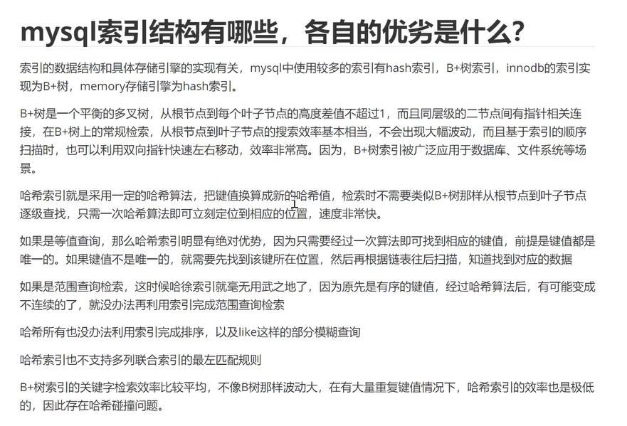
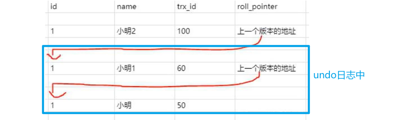
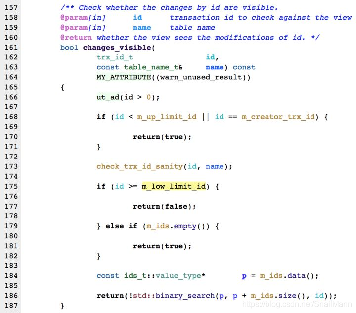
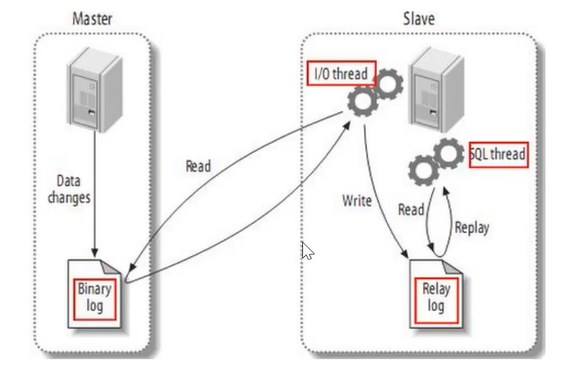

# 索引

## 用途

提升访问效率

## 存储位置

索引和实际的数据都是存储在磁盘中的，只不过在进行数据读取的时候会优先把索引加载到内存中。

MySQL数据库中，什么情况下设置了索引但无法使用

1. 没有符合最左前缀原则
2. 字段进行了隐私数据类型转化
3. 走索引没有全表扫描效率高

存储的数据是K-V格式的数据。K为要查询的字段，V为存储在哪一个文件中及其offset

OLAT：联机分析处理——数据仓库——HIVE，不要求在很短的时间返回结果，只需要

OLTP：联机事务处理——数据库——MySQL、db2、Oracle——业务系统的需要，在很短的时间返回结果

## 数据结构为B+树，为什么呢？

hash类型的索引：查询单条快，范围查询慢

btree类型的索引：b+树，层数越多，数据量指数级增长，范围查找效率高，一般三四层就可以支持千万级的数据量

B树特点：多叉树、有序、平衡

阶：每个节点最多存储多少个数据

B树每个节点存储的数据有：键值即表中记录的主键、指针即存储子节点地址信息、数据即表记录中除主键外的数据

B+树相比于B树而言，将所有数据全部放到了叶子结点，而非叶节点中只放置了key值和子节点地址信息

### 为什么不用哈希表

1. 哈希表是为了将数据进行散列的数据结构，如果hash算法设计不好的话，很容易造成哈希碰撞、哈希冲突，会造成存储空间的浪费，查询效率低
2. Hash表不支持范围查找

### 为什么不用B树？

1. B树每个索引节点都会有Data域。将索引存储在磁盘上时，占用的磁盘空间会变大，增加了磁盘IO次数（磁盘IO一次读出的数据量大小是固定的，单个数据变大，每次读出的就少，IO次数增多，一次IO多耗时），寻址时要访问的磁盘范围也会变大。
2. B树的叶子结点之间没有双向指针，因此进行区间访问时效率不如B+树

### 为什么不用红黑树？

红黑树是二叉树，数据量大时红黑树会过高，而造成磁盘IO读写过于频繁的问题。

## MySQL聚簇索引和非聚簇索引的区别是什么？

MySQL的索引类型跟存储引擎是相关的，innodb存储引擎数据文件跟索引文件全部放在ibd文件中；而myisam的数据文件放在myd文件中，索引放在myi文件中。其实区分聚簇索引和非聚簇索引非常简单，只要判断数据跟索引是否存储在一起就可以了。

innodb存储引擎在进行数据插入的时候，数据必须要跟索引放在一起，如果有主键就使用主键，没有主键就使用唯一键，没有唯一键就使用6字节的rowid，因此跟数据绑定起来的索引就是聚簇索引，而为了避免数据冗余存储，其他索引的叶子结点中存储的都是聚簇索引的key值，因此innodb中既有聚簇索引也有非聚簇索引，而myisam中只有非聚簇索引。

## MySQL索引类型有哪些，以及对数据库的性能的影响

- 普通索引：允许被索引的数据列包含重复的值（列是普通的，不是唯一的
- 唯一索引：可以保证数据记录的唯一性
- 主键索引：是一种特殊的唯一索引，在一张表中只能定义一个主键索引，主键用于唯一标识一条记录，使用关键字primary key来创建
- 联合索引：索引可以覆盖多个数据列
- 全文索引：通过建立倒排索引，可以极大地提升检索效率，解决判断字段是否包含的问题，是目前搜索引擎使用的一种关键技术

索引可以极大地提高数据的查询速度，通过使用索引，可以在查询的过程中，使用优化隐藏器，提高系统的性能。

但是会降低插入、删除、更新表的速度，因为在执行这些写操作的时候，还要操作索引文件。

索引需要占用物理空间，除了数据表占数据空间之外，每一个索引还要占一定的物理空间，如果要建立聚簇索引，那么需要的空间就会更大，如果非聚簇索引很多，一旦聚簇索引改变，那么所有非聚簇索引都会跟着变

## MySQL索引结构有哪些，各自的优劣是什么？



# 事务

## ACID理论

`ACID`理论是指在数据库管理系统`（DBMS）`中事务所具有的**四个特性：**

- 原子性（`Atomicity`）：多个操作放到一个事务中，保证这些操作要么都成功，要么都不成功。通过undo log支持的回滚来支持原子性。
- 一致性（`Consistency`）：避免数据的凭空产生或消失，比如转账前后两人总金额不变。
- 隔离性（`Isolation`，又称独立性）：事务之间互相不干扰，MySQL支持4中事务隔离级别来保证隔离性。
- 持久性（`Durability`）：操作完成之后，数据可以持久化到磁盘上，数据不会丢失。MySQL通过redo重做日志来保证。

**此处的C和CAP理论中的C的区别：**

此处的C指的是数据的完整性和正确性；

CAP理论中的C指的是多节点中数据的一致性，如强一致性、弱一致性、最终一致性。

## 并发情况MySQL会出现的问题

1. **脏读**
   事务A修改了数据，但未提交，而事务B查询了事务A修改过却没有提交的数据，这就是脏读，因为事务A可能会回滚。（读取了一个可能会被回滚的数据）
2. **不可重复读**
   事务A 先 查询了金额，是200块钱，未提交 。事务B在事务A查询完之后，修改了金额，变成了300, 在事务A前提交了；如果此时事务A再查询一次数据，就会发现钱跟上一次查询不一致，是300，而不是200。这就是不可重复读。强调**事务A对要操作的数据被别人修改了**，但在不知请的情况下拿去做之前的用途
3. **幻读**
   事务A先修改了某个表的所有纪录的状态字段为已处理，未提交；事务B也在此时新增了一条未处理的记录，并提交了；事务A随后查询记录，却发现有一条记录是未处理的，很是诧异，刚刚不是全部修改为已处理嘛，以为出现了幻觉，这就是幻读。幻读强调的是**我修改了数据，等我要查的时候，却发现有我没有修改的记录**，为什么，**因为有其他人`插`了一条新的**

## MySQL的隔离级别

1. **Read Uncommitted 读未提交**
   限制最弱的事务级别，忽略其他事务放置的锁，该级别下的事务可以在读取其他事务修改后(插/删/更)但未提交的的数据；说白了这个级别的事务就是个弱鸡，只能保证多个操作的原子性，完整不能解决并发问题；无法解决脏读，不可重复读，幻读

2. **Read Committed 读提交**
   SQL Server默认级别，指定事务执行期间(未提交)不能读取其他事务还未提交的数据，禁止脏读；但可以读取到其他事务 (插/删/更)操作后并提交了的 数据；从而造成多次查询的数据不一致，即不可重复读，同时也不法避免幻读，因为当前事务执行期间，其他事务可以插入新记录

3. **Repeatable Read 可重复读**
   MySQL的默认级别，事务执行期间(未提交)不能读取其他事务还未提交的数据，也不能其他事务读取更新操作后并提交的数据，所以可以避免脏读和不可重复读；但是可以读取到其他事务插/删操作并提交的数据，因此因为可以读取到其他事务插入并提交的新数据，所以可能会造成幻读

4. **Serializable 事务同步，串行**
   最严格的事务管理，等于事务同步执行，**不允许并发**，所以不存在并发问题，所有问题都解决了，但是存在性能问题，执行数据慢


## 什么是当前读和快照读？

当前读：像select for update、insert、delete这种操作都是当前读，读取的都是当前最新数据，是一种加锁的读，不受事务隔离性影响。

快照读：事务中执行的、像简单的**不加锁的**select语句就是快照读（事务隔离级别如果为串行化，则会退化为当前读），其基于MVCC多版本并发控制，在很多情况下实现了读-写冲突不加锁，但并不保证读到的数据为最新版本，有可能是历史版本。

### 什么是MVCC？

> 参考文章：https://blog.csdn.net/SnailMann/article/details/94724197

多版本并发控制：读取数据时通过一种类似快照的方式将数据保存下来，这样读锁和写锁就不冲突了，不同的事务session会看到自己特定版本的数据，这样就形成了一个**版本链**：



MVCC只会在读已提交和可重复读的隔离级别下工作。

MVCC的实现，靠的是表中的`3个隐藏字段`、`undo日志`、`readView`实现的。

#### 3个隐藏字段

- **DB_TRX_ID**：6byte，记录最近修改（修改/插入）此数据的事务ID。
- **DB_ROLL_PTR**：7byte，回滚指针，指向这条记录的上一个版本。
- **DB_ROW_ID**：6byte，隐藏的自增ID，如果数据表中没有主键，InnoDB会自动以此来产生一个聚簇索引。

#### undo日志

如果表中数据被修改了，则表里面记录最新修改的数据，修改前的老数据会被存档至此。

undo日志主要分为两种：

insert undo log：事务在insert时产生的日志，只在事务回滚时需要，在事务被提交后可以立即丢弃。

update undo log：事务在update和delete时产生的日志，在事务回滚、快照读时都需要，所以不能随便删除，只有在快照读和事务回滚不涉及到此日志时才可以被purge线程统一清除。


因此，事务对同一记录的修改会在undo log中形成一条记录版本链表，链首为最新数据，链尾为有用的最老数据。

#### Read View读视图

首先明确一点：每个事务开启时都会被分配一个事务ID，这个ID是递增的。

为了实现读写分离，事务进行快照读时会进行数据可见性判断，某些影响事务执行的数据是不可见的。

因此进行数据读取时，会将表中记录的DB_TRX_ID取出来，和read view中保存的值进行比较判断，判断表中数据是否可见，如果不可见，则通过DB_ROLL_PTR去undo log中保存的记录版本链表中拿数据，遍历链表中的DB_TRX_ID重复进行判断，直到数据可见性满足条件，那这个旧数据就是当前事务能看见的最新`老版本`：

读视图是**事务中执行快照读**时产生的，会记录当前系统中活跃事务的ID，然后会记录三个值来进行数据可见性判断：

1. trx_list

   记录进行**快照读**时的**活跃事务ID号**

2. up_limit_id

   trx_list中的最小值

3. low_limit_id

   trx_list中最大值+1

下面说一下判断过程，先看一下源码：



从代码中可以看到，判断过程是这样的：

1. 如果DB_TRX_ID < trx_list || DB_TRX_ID == 当前trx_id，则可见，否则进行下一步
2. 如果DB_TRX_ID >= low_limit_id，则不可见，通过DB_ROLL_PTR遍历下一条数据
3. 如果DB_TRX_ID in trx_list，则DB_TRX_ID标识的事务还是活跃的，没有提交，数据不可见，继续遍历，如果not in，则相关事务已提交，此数据可见。

#### RR 是如何在 RC 级的基础上解决不可重复读的？

在RR和RC的隔离级别下，任何一个事务只有进行一次快照读才会创建read view，事务中快照读的结果非常依赖该事务首次出现快照读的地方，即某个事务中首次出现快照读的地方非常关键，它有决定该事务后续快照读结果的能力

因此，正是Read View生成时机的不同，才导致他们能解决的问题不同。

RR级别下：只会在第一次快照读时创建Read View，后续的快照读都会用这个Read View，所以对之后其他事务的修改不可见。

RC级别下，事务中每次进行快照读时都会创建一个新的Read View，因此之后其他事务的修改对此事务也可见。

## MySQL SQL命令模拟测试

select @@tx_isolation
查询当前会话的事务隔离级别

select @@global.tx_isolation
查看当前数据库的全局事务隔离级别

set session transaction isolation level repeatable read
设置当前会话隔离级别

set global transaction isolation level repeatable read
查看数据库全局隔离级别

set autocommit = 0\ set autocommit = 1
会话级别，0取消自动提交，则当执行语句commit或rollback时才算结束,1开启自动提交；数据库默认是自动提交

show variables like '%autocommit%'
查看是否开启自动提交

begin / start transaction
开启事务

rollback/rollback work
回滚事务

select * from information_schema.INNODB_TRX
查看当前正在执行的事务

# 面试题

## MySQL索引的B+树一般有几层？

一般情况下，3到4层的B+树足以支撑千万级的数据量存储

key值在存储容量上起到了决定性的作用，当key值占用空间较大时，每个磁盘块中能放的节点数就会减少，会导致同样层数，同样节点数的B+树存储的索引节点变少，减少存储量。

## 一般选择索引的时候用int类型还是varchar类型？

此处需要查看key值所占用的存储空间，int占用4个字节，因此如果varchar的长度小于等于3时使用varchar，若大于4则选择int

## 选择索引时，int类型要不要自增呢？

在满足业务场景的情况下，能自增最好自增。因为新增数据时如果只在最右侧新增数据，则可以减少索引的维护成本。

## MySQL的一张表中可以包含几个索引？

理论上来说没有限制，但是并不是越多越好，不是给每一个列添加索引后都会加快查询效率。

## 在刚刚的图中，发现叶子结点存储索引，如果一个表有3个索引，那么有几棵B+树？

3棵B+树，一个索引对应一棵树。

## 如果有三棵树的话，数据存储几份？

数据只存储一份，不会冗余存储数据

## 如果只有一份的话，那么索引的叶子结点中存储什么？

innodb存储引擎在进行数据插入的时候，必须要将数据跟某一个索引列绑定存储，如果表中有主键则用主键，没有主键用唯一键，没有唯一键会自动生成一个6字节的rowid来进行数据存储，也就是说，数据跟某一个索引列放在一起，所以索引树的叶子结点中存储的是跟数据绑定的索引列的key值。

id,name,age,gender id主键、name普通索引

# 一些概念

### 回表

select * from table where name = 'san';

先根据name的值查询name B+树，找到对应的id，再根据id去id的B+树上查找所有的数据，这个过程就称之为回表

回表的效率较低，不推荐

### 索引覆盖

select id, name from table where name = 'zhangsan';

根据name区nameB+树上找到叶子结点，能够取到name、id的值，不需要回表了，这个过程叫做索引覆盖

查询的索引树的叶子结点中包含了所有要查询的字段，推荐。

### 最左匹配

id, name, age, gender： id是主键；name,age组成组合索引

select * from table where name = 1 and age = 1; 能匹配到索引

select * from table where name = 1; 能匹配到索引

select * from table where age = 1; 不能匹配到索引

select * from table where age = 1 and name = 1; 能匹配到索引（优化器的功劳）

### 索引下推

select * from table where name = 1 and age = 1;

没有索引下推之前：先根据name去存储引擎之中拉取数据，然后在server层对age做数据过滤

有了索引下推之后：直接根据name和age的值去存储引擎拉取数据，不需要在server层做数据过滤

除此之外，or关键字是否使用索引需要分情况讨论，where name =1 or name = 2; 除此之外还有using merge、use intersaction

## 索引的设计原则有哪些？

在进行索引设计的时候，应该保证索引字段占用的空间越小越好，这只是一个大的方向，还要一些细节点需要注意下：

1. 适合索引的列是出现在where条件中的列，或者连接字句中的列
2. 基数较小的表，索引效果差，没必要建立索引
3. 在选择索引列的时候，越短越好，可以指定某些列的一部分，没必要用全部字段的值
4. 不要给表中的每一个列都创建索引，并不是索引越多越好
5. 更新频繁的字段不要有索引
6. 创建索引的列不要过多，可以创建组合索引，但是组合索引的列的个数不建议太多
7. 大文本、大对象不要创建索引

### 优化SQL，考量的是你的体系性，你需要知道要考虑哪些点

一般在数据库建立的前期，我们就会对字段进行考量，比如说字段的长度、字段的类型

但这个还只是预防，大部分的优化还是上线后出现问题但主要还是在建表、有了一定数据之后再去优化的

一般出现优化问题的时候，我会从以下几个维度去考虑：

第一个是服务器库的资源是否充足

第二,我会通过索引的判断，比如查看SQL语句的执行计划查看SQL的执行是否高效

第三，我会调整具体的SQL语句

第四，我会调整MySQL的参数

第五，我会进行数据库架构的调整

在我写的项目经历中，某个金融相关的SQL语句执行的就比较慢，因为它在整个执行过程中进行了大量的回表操作，所以我把我要查询的三个字段，一起组成了一个组合索引，那么在运行的时候它不需要回表了，整个效率提升了100倍都不止。

之前进行数据库备份时很慢，因此我把我的**双一设置**关掉了，每次执行完之后在某一个时间窗口里面直接去做的。

#### 双一设置

1. innodb_flush_log_at_trx_commit
   如果innodb_flush_log_at_trx_commit设置为0：log buffer将每秒一次地写入log file中，并且log file的flush(刷到磁盘)操作同时进行。该模式下，在事务提交的时候，不会主动触发写入磁盘的操作;
   如果innodb_flush_log_at_trx_commit设置为1：每次事务提交时MySQL都会把log buffer的数据写入log file，并且flush(刷到磁盘)中去;
   如果innodb_flush_log_at_trx_commit设置为2：每次事务提交时MySQL都会把log buffer的数据写入log file，但是flush(刷到磁盘)操作并不会同时进行。该模式下,MySQL会每秒执行一次 flush(刷到磁盘)操作。

   **注意：**由于进程调度策略问题，这个"每秒执行一次 flush(刷到磁盘)操作"并不是保证100%的"每秒"。

2. sync_binlog
   sync_binlog 的默认值是0，像操作系统刷其他文件的机制一样，MySQL不会同步到磁盘中去而是依赖操作系统来刷新binary log。
   当sync_binlog =N (N>0) ，MySQL 在每写 N次 二进制日志binary log时，会使用fdatasync()函数将它的写二进制日志binary log同步到磁盘中去。

   **注意：**如果启用了autocommit，那么每一个语句statement就会有一次写操作；否则每个事务对应一个写操作。

## 处理MySQL慢查询的步骤

1. 开启慢查询日志，准确定位到哪个SQL语句出现了问题
2. 分析SQL语句，看看是否load了额外的数据，可能是查询了多余的行并且抛弃掉了，可能是加载了许多结果中并不需要的列，对语句进行分析以及重写
3. 分析语句的执行计划，然后获得其使用索引的情况，之后修改语句或者修改索引，使得语句可以尽可能的命中索引
4. 如果对语句的优化已经无法进行，可以考虑表中的数据量是否太大，如果是的话可以进行横向或者纵向的分表

# 主从复制

## MySQL为什么需要主从同步？

1. **读写分离：**在复杂的业务系统中，有这么一个情景，有一句SQL语句需要锁表，导致暂时不能使用读的服务，那么就很影响运行中的业务。

   使用主从复制，让主库负责写，从库负责读，这样即使主库出现了锁表的情景，通过读从库也可以保证业务的正常运作。

   除此之外，当单数据库的并发量过高时，也可以通过读写分离来扩大读的并发量。

   一般来说，从库数量在四五个为宜，多了可能会导致性能下降。

2. **数据的热备**

3. **架构的扩展：**业务量越来越大，IO访问频率过高，单机无法满足，此时做多库的存储，降低磁盘IO访问的频率，提高单个机器的IO性能。

## MySQL主从复制原理是什么？

**binlog日志：**

MySQL中每一个增删改类的操作，会改变数据的操作，除了更新数据以外，增删改查操作还会写入一个日志文件来记录这个操作，这个日志就是binlog日志。

## 主从复制原理

1. 主库的变更会写入binlog日志
2. 从库和主库都有一个IO线程，主库的IO线程会将binlog日志传给从库的binlog日志
3. 从库会将binlog日志写入到本地的relay-log中继日志中
4. 从库有一个SQL线程，会将中继日志中的内容拿出来，在从库执行一遍


## 主从延迟问题

从库读取binlog日志、写relay日志、应用日志变更到自己本地的数据，这个步骤是**串行化**的。5.6.x之后，IO线程读取binlog日志、写relay日志支持多线程读取了，但是SQL线程写数据还是串行化的。

但是主库那边写数据却是并行的，因此从库那边的数据相比于主库来说肯定会有主从延迟。

>  一般来说：
>
> 主库的写并发达到1000/s时，从库的延时会有几ms
>
> 主库的写并发达到2000/s时，从库的延时会有几十ms
>
> 主库的写并发达到4000/s 6000/s 8000/s时，主库都快死了，从库的延时可能会有个几秒

## 数据丢失问题

由于主从延迟问题，有可能主库的数据写入成功了，同时将数据写入到库里面了，而且操作也写入到binlog日志里了，但是这时候主库宕机了。

而此时从库还没有拿到最新的binlog日志，这就会导致从库切换为主库后，刚刚新写入的那条数据消失了。

MySQL在这里有两个机制：

1. **半同步复制**：用来解决主库**数据丢失**问题
2. **并行复制：**用来解决主从**同步延时**问题

所谓半同步复制，也叫`semi-sync`复制，主库写入binlog日志后，强制此时立即将数据同步到从库，从库此时将日志写入到自己本地的relay log后，接着会返回一个ack给主库，主库接收到至少一个从库的ack之后才会认为此时写操作成功了。

所谓并行复制，知道是从库开启多个线程，来并行读取relay log中不同库的日志，然后并行重放不同库的日志，这是库级别的并行。但是

由于28法则，一般高并发量的数据操作都在一个库里面，因此对于使用并行复制来解决同步延时来说意义不大。

一般来说，如果主从延迟较为严重可以走下面四条路：

1. 分库来降低并发，将主库拆分为四个主库，每个主库的写并发由2000变为500/s，此时主从延迟可以忽略不计
2. 打开MySQL支持的并行复制，多个库并行复制，如果说某个库的写入并发就是特别高，单库写并发达到了2000/s，并行复制还是没意义。28法则，很多时候少数的几个订单表写入2000/s，但其他几十个表10/s
3. 重写代码，写代码时要慎重，要考虑到主从延迟
4. 如果确实存在那种必须先插入，立马要求就查询到，然后立马就要反过来执行一些操作，对这个查询设置直连主库。（不推荐这种做法，因为读写分离就没有意义了）

注意：

1. master将操作语句记录到binlog中，然后授予slave远程连接的权限（master一定要开启binlog二进制日志功能；通常为了数据安全考虑，slave也开启binlog功能）
2. slave开启两个线程：IO线程和SQL线程。其中IO线程负责读取master的binlog内容到中继日志relay-log中；而SQL线程负责从relay-log中读取出binlog内容，并更新到slave的数据库中，这样就能保证slave数据和master数据保持一致了
3. MySQL复制至少需要两个MySQL的服务。当然MySQL服务可以分布在不同的服务器上，也可以在一台服务器上启动多个实例。
4. MySQL复制最好确保master和slave服务器上的MySQL版本相同(如果不能保持一致，则需要保证master主节点的版本低于slave从节点的版本)
5. master和slave节点两节点时间需同步。



具体步骤：

1. 从库通过手工执行change master to 语句来连接主库，提供连接用户的一切条件（user、password、port、ip），并且让从库知道，二进制日志的起点位置（file名 position号）； start slave
2. 从库的io线程和主库的dump线程建立连接
3. 从库根据change master to语句提供的file名和position号，IO线程向主库发起binlog的请求
4. 主库dump线程根据从库的请求，将本地binlog以events的方式发给从库IO线程
5. 从库IO线程接收binlog events，并存放到本地relay-log中，传送过来的信息会记录到master.info中
6. 从库SQL线程应用relay-log，并且把应用过的记录到relay-log.info中，默认情况下，已经应用过的relay会自动被清理purge

# 锁

## mysql锁的类型有哪些？

基于锁的属性分类：共享锁、排它锁

基于锁的粒度分类：行级锁（innodb）、表级锁（innodb、myisam）、页级锁（innodb）、记录锁、间隙锁、临键锁

基于锁的状态分类：意向共享锁、意向排它锁

表锁：上锁时锁住整个表，下一个事务访问同一张表时，必须等待前一个事务释放了锁才能对表进行访问，特点：粒度大、加锁简单、容易冲突

行锁：上锁时锁住某一行或某些行，其他事务访问同一张表时，只有被锁住的记录不能访问，其他记录可正常访问。特点：粒度小、加锁比表锁麻烦，不容易冲突，相比表锁支持的并发要高

记录锁：记录锁也属于行锁中的一种，只不过记录锁的范围只是表中的某一条记录，记录锁是说事务在加锁后锁住的只是表的某一条记录，加了记录锁之后可以避免数据在查询的时候被修改的重复读问题，也避免了在修改的事务未提交前被其他事务读取的脏读问题

页锁：页级锁时MySQL中锁定粒度介于行级锁和表级锁之间的一种锁。表级锁速度快但冲突多；行级锁冲突少但速度慢。所以折中取了页级，一次锁定相邻的一组记录。特点：开销和加锁时间介于行锁和表锁之间，会出现死锁，锁定粒度介于表锁和行锁之间，并发度一般。

间隙锁：是属于行锁的一种，间隙锁是在事务加锁后锁住表记录的某一个区间，当表的相邻ID之间出现空隙时，则会形成一个区间，遵循左开右闭原则。范围查询并且查询未命中记录，查询条件必须命中索引，间隙锁只会出现在重复度的事务级别中。

临键锁：也属于行锁的一种，并且他是innodb的行锁默认算法，总结来说他就是记录锁和间隙锁的组合，临键锁会把查询出来的记录锁住，同时也会把该范围查询内的所有间隙空间也锁住，再之他会把相邻的下一个区间也锁住。

## MySQL如何做分布式锁

在MySQL中创建一张表，设置一个主键或者unique key，这个key就是要锁的key（商品ID），所以同一个key在MySQL表里只能插入一次了，这样对锁的竞争就交给了数据库，处理同一个key数据库保证了只有一个节点能插入成功，其他节点都会插入失败。

DB分布式锁的实现：

通过主键id或者唯一索引的唯一性进行加锁，说白了就是加锁的形式是向一张表中插入一条数据，该条数据的id就是一把分布式锁，例如当一次请求插入了一条id为1的数据，其他想要进行插入数据的并发请求必须等待第一次请求执行完成后删除这条id为1的数据才能继续插入，实现了分布式锁的功能。

这样lock和unlock的思路就很简单了，伪代码：

```python
def lock:
    exec sql: insert into locked-table(xxx) values(xxx)
    if result == true:
        return true
    else:
        return false
def unlock:
    exec sql: delete from lockedOrder where order_id = 'order_id'
```

# 分库分表

## 使用分库分表的步骤

1. 选择一个数据库中间件：调研、学习、测试
2. 设计分库分表的方案，要分成多少库，每个库多少表。3个库，每个库4个表
3. 基于选择好的数据库中间件，以及在测试环境建立好的分库分表的环境，然后测试一下能否正常进行分库分表的读写
4. 完成单库单表到分库分表的迁移，双写方案
5. 显示系统开始基于分库分表对外提供服务
6. 扩容之后，扩容成6个库，每个库需要12个表，你怎么来增加更多库和更多表呢？

## 简单介绍

### 好处

1. 单机->3机，可承受并发量*3
2. 磁盘消耗量降低，变为原来值的三分之一
3. SQL效率*3

### 中间件

有些是代理proxy层，有些是客户端client层的

独立部署在服务器上的是proxy层的中间件。

只是一个jar包、一个依赖、不用独立部署的中间件就是client层的。

比较常见的包括：

- Cobar
- TDDL
- Atlas
- Sharding-jdbc
- Mycat

#### Cobar

阿里 b2b 团队开发和开源的，属于 proxy 层方案，就是介于应用服务器和数据库服务器之间。应用程序通过 JDBC 驱动访问 Cobar 集群，Cobar 根据 SQL 和分库规则对 SQL 做分解，然后分发到 MySQL 集群不同的数据库实例上执行。早些年还可以用，但是最近几年都没更新了，基本没啥人用，差不多算是被抛弃的状态吧。而且不支持读写分离、存储过程、跨库 join 和分页等操作。

#### TDDL

淘宝团队开发的，属于 client 层方案。支持基本的 crud 语法和读写分离，但不支持 join、多表查询等语法。目前使用的也不多，因为还依赖淘宝的 diamond 配置管理系统。

#### Atlas

360 开源的，属于 proxy 层方案，以前是有一些公司在用的，但是确实有一个很大的问题就是社区最新的维护都在 5 年前了。所以，现在用的公司基本也很少了。

#### Sharding-jdbc

当当开源的，属于 client 层方案，目前已经更名为 [`ShardingSphere`](https://github.com/apache/incubator-shardingsphere)（后文所提到的 `Sharding-jdbc`，等同于 `ShardingSphere`）。确实之前用的还比较多一些，因为 SQL 语法支持也比较多，没有太多限制，而且截至 2019.4，已经推出到了 `4.0.0-RC1` 版本，支持分库分表、读写分离、分布式 id 生成、柔性事务（最大努力送达型事务、TCC 事务）。而且确实之前使用的公司会比较多一些（这个在官网有登记使用的公司，可以看到从 2017 年一直到现在，是有不少公司在用的），目前社区也还一直在开发和维护，还算是比较活跃，个人认为算是一个现在也**可以选择的方案**。

#### Mycat

基于 Cobar 改造的，属于 proxy 层方案，支持的功能非常完善，而且目前应该是非常火的而且不断流行的数据库中间件，社区很活跃，也有一些公司开始在用了。但是确实相比于 Sharding jdbc 来说，年轻一些，经历的锤炼少一些。

#### 总结

综上，现在其实建议考量的，就是 Sharding-jdbc 和 Mycat，这两个都可以去考虑使用。

Sharding-jdbc 这种 client 层方案的**优点在于不用部署，运维成本低，不需要代理层的二次转发请求，性能很高**，但是如果遇到升级啥的需要各个系统都重新升级版本再发布，各个系统都需要**耦合** Sharding-jdbc 的依赖；

Mycat 这种 proxy 层方案的**缺点在于需要部署**，自己运维一套中间件，运维成本高，但是**好处在于对于各个项目是透明的**，如果遇到升级之类的都是自己中间件那里搞就行了。

通常来说，这两个方案其实都可以选用，但是建议中小型公司选用 Sharding-jdbc，client 层方案轻便，而且维护成本低，不需要额外增派人手，而且中小型公司系统复杂度会低一些，项目也没那么多；但是中大型公司最好还是选用 Mycat 这类 proxy 层方案，因为可能大公司系统和项目非常多，团队很大，人员充足，那么最好是专门弄个人来研究和维护 Mycat，然后大量项目直接透明使用即可。

## 分库分表的两种方式

### 垂直拆分

将表结构拆分开来，把少数的几个访问频率高的字段放到一个表里面，把剩下的访问频率低的字段放到一个表里面。

这样的话，因为数据库是有缓存的，访问频率高的行字段越少，在缓存里就可以缓存更多条数据，性能就越好。

订单表 -> 订单支付表+订单商品表

### 水平拆分

表结构不变，将表的数据分流到多个表中。

表的分流方式：

1. hash分发：可以先拆库，然后再拆表，存放数据的时候，先使用主键对库的数量取模，再对表的数量取模来确定落到哪个表。

2. range分发：按照时间范围来分发，不同时间分发到一个表中。

   hash分发这种方式，好处在于数据量和请求压力可以平均分配到各个库、各个表。但是扩容比较难。

range分发这种方式，好处在于扩容的时候可以直接给每个月都准备好一个库就可以了。缺点是，大部分请求都是访问最新的数据，会出现热点数据。

分库：单库最高承载2000/s的QPS，3个库最高承载6000/s的QPS。

分表：单表数据量600w -> 50w数据，SQL的执行效率可能会提升好几倍。

## 你们当时是如何把系统不停机迁移到分库分表的？

### 1. 长时间停机分库分表

步骤基本上如下：

1. 发公告，停机维护
2. 到时间之后将系统停掉，运行一个写好的临时程序，将原数据库中的数据取出来，写入到数据库中间件中。
3. 数据库中间件将数据写入到提前建好的数据库中。

缺点：

1. 一定会出现几个小时的停机
2. 如果说凌晨3点没搞定，就需要回滚，明天继续搞
3. RD很累，连续通宵吃不消

### 2. 不停机双写迁移方案

1. 修改系统中所有写库的服务，让它同时写老库和新库。
2. 后台运行一个数据迁移临时工具，通过数据库中间件在新库里面查数据，对比两个表中数据的时间戳：
   - 如果新库中不存在数据，则直接插入。
   - 如果老库中数据比新库的数据新，那就覆盖。
   - 如果老库中数据比新库的数据旧，那就丢弃。

3. 迁移一轮之后，600w数据迁移完了，此时就需要执行一次检查，检查单库单表中的数据和分库分表中的数据是不是一模一样，如果一模一样的话才说明迁移成功。

4. 如果依然有差别，则从单库单表中读取出来，看看是否需要再次覆盖分库分表中的数据。

5. 依次循环往复，一直到老库和新库的数据变得一模一样。
6. 修改系统的代码，将写单库单表的代码删除掉，变得只写分库分表，再重新部署一下就OK了。

## 如何设计可以动态扩容缩容的分库分表方案？

### 停机扩容

与停机迁移的步骤一样

从单库单表迁移到分库分表的时候，数据量并不是很大，单表最大也就两三千万，写个数据多弄几台机器并行跑，1小时数据就导完了。

但是如果3库+12个表，跑了一段时间之后，数据量都1亿~2亿了，光是导数据都要几个小时，之后还需要验证，很耗时。

### 优化后的方案

第一次分库分表就一次性给他分个够，32个库，32\*32=1024个表。

假设一张表中存放500w的数据，那么当前32\*32个表的总容量为32\*32\*500w=51亿，对于大部分互联网公司都是够得。对于中小型公司已经够够的了。

**具体方案：**

一开始可以先在4个高性能服务器上部署，每个服务器上部署8个库，每个库32个表，这样就可以拥有4\*8\*32 = 1024个分表了，一开始就可以将映射关系维护好：

uuid % 32 = 库id

uuid / 32 % 32 = 库上的表id

这样映射到的表就会很均匀的分布在多个库里（主键自增时，每32个为一组，其表id不变，按照库id++的顺序写）。

假设每个服务器支持1000/s的写吞吐量，那当前4个服务器就支持4000/s的写吞吐量。

**扩容时的处理：**

服务器\*2，然后将原来服务器上的库分一半出来，迁移到新的服务器上，这种方式避免了对库数量和表数量的变更，减少了代码的改动量，不需要对映射关系进行改变，只需要改动一些配置即可（更改服务器ip等等基础配置即可）。

除此之外，数据迁移仅仅涉及到整个库的迁移，dba是有完善的迁移库的方案的，很容易。

**ps：**

如果数据量的增速非常快，那可以进一步扩大初始容量，64\*64、128\*128、256\*256都是可以的。

## 分库分表之后全局id咋生成？

### 数据库自增ID

创建一个专门生成主键的库，这个库全局唯一，然后插入的时候就可以拿到一个自增的id，然后再去分表里面插入数据即可。

好处是非常的简单，但是这个库的并发就成了瓶颈了。

适合于并发很低，几百/s，但是数据量很大，需要分库分表来存储海量的数据。

### UUID（128bit = 16byte）

好处是本地生成，不用基于数据库了。

但是太长了，作为主键时性能太差了。

适合用于生成一个随机文件名或者编号的时候。

### 获取系统当前时间

并发很高时，比如一秒并发几千，会有重复的情况，这个是肯定不合适的。

适合于：将当前时间与其他业务字段拼接起来共同组成主键的场景。

### snowflake（雪花）算法（64bit = 8byte）

使用雪花算法，可以生成一个64bit的全局唯一的id，其每个bit的含义为：

| 位数 | 0位               | 41bit  | 5bit   | 5bit   | 12bit                                  |
| ---- | ----------------- | ------ | ------ | ------ | -------------------------------------- |
| 含义 | 一定是0，保证正数 | 时间戳 | 机房id | 机器id | 同一个机器的同一时间单位自增长的序列号 |

由于同一机器同一时间的序列号只有12位，因此同一毫秒只能生成2^12=4096个id

除此之外，机房有5bit，机器有5bit，因此最多有32个机房，每个机房最多有32台机器。

#### 时钟回拨问题如何解决？

当前的机器的可能会跟一台基准时间服务器进行时间校准，导致你的机器的时间本来跑的稍微快了一点，此时跟基准时间服务器进行了校准，你的时间回拨回去了，倒退回去了。

那可能此时按照老时间继续生成id，就会有可能出现id重复的问题，导致分布式id重复。

**判断方式：**判断当前生成的id与上一次生成的id，如果新id更小了，则出现了时钟回拨问题。

**解决方案**：

一般回拨不会太多时间，因此可以在内存里把过去1个小时之内、生成的每一毫秒的每台机器生成的id都在内存里保存最大的那个id。

如果发生了时钟回拨，此时看看时钟回拨到了之前的哪一毫秒，那可以直接接着之前那一毫秒的id接着自增就OK了。


