笔记：https://blog.csdn.net/unique_perfect/article/details/109380996

### RabbitMq环境搭建过程

1. 安装docker

   ```shell
   sudo yum install -y yum-utils  device-mapper-persistent-data  lvm2
   sudo yum-config-manager  --add-repo   https://download.docker.com/linux/centos/docker-ce.repo
   sudo yum install docker-ce docker-ce-cli containerd.io
   ```

2. 启动docker

   ```shell
   sudo service docker restart
   sudo service dockser status
   sudo service docker status
   ```

3. 测试docker

   ```shell
   sudo docker run hello-world
   ```

4. 安装rabbitMq

   ```shell
   docker pull rabbitmq:3.8.2-management
   docker run -d --hostname my-rabbit --name rabbit -p 15672:15672 -p 5672:5672 rabbitmq:3.8.2-management
   # docker启动时启动rabbitmq
   docker container update --restart=always 6b49aa0e85ca
   ```

5. 关闭防火墙

   ```shell
   systemctl status firewalld
   systemctl stop firewalld
   ```

rabbitmq管理命令行

```shell
systemctl stop|start|status|restart rabbitmq-server
rabbitmqctl help 查看更多命令
rabbitmq-plugins enable|list|disable
```

网络协议的三要素：

语法。是用户数据与控制信息的结构与格式，以及数据出现的顺序

语义。解释控制信息每个部分的意义，它规定了需要发出何种控制信息，以及完成的动作与做出什么样的相应。

时序。时序是对事件发生顺序的详细说明。


### 分发机制策略和对比

|                    | ActiveMQ | RabbitMQ        | Kafka | RocketMQ |
| ------------------ | -------- | --------------- | ----- | -------- |
| 发布订阅           | 支持     | 支持            | 支持  | 支持     |
| 轮询分发(能者多劳) | 支持     | 支持（autoACK） | 支持  | /        |
| 公平分发           | /        | 支持            | 支持  | /        |
| 重发               | 支持     | 支持            | /     | 支持     |
| 消息拉取           | /        | 支持            | 支持  | 支持     |


### 直连模式

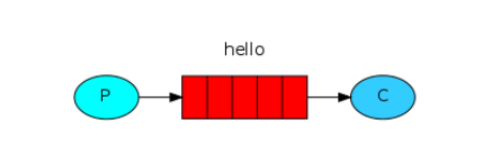

生产者将消息发到消息队列中，消息队列中的消息被发到消费者

### work queue模式

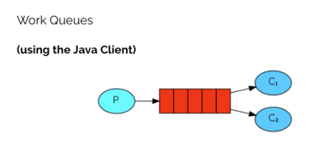

生产者将消息发到消息队列中，消息队列平均将所有的消息分配到多个消费者中，这种分发消息的方式称为循环。

但如果有一个消费者消费效率很慢，会降低整个任务处理效率。

因此，想要找到一个“能者多劳”的工作模式。

消息自动确认机制：消费者收到消息后自动发给mq确认信号

因此，能者多劳的工作模式的实现方式：手动进行消息确认

### 第三种模型(fanout扇出)

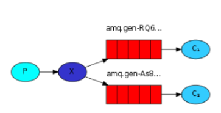

在广播模式下，消息发送流程是这样的：

- 可以有多个消费者
- 每个消费者有自己的queue（队列）
- 每个队列都要绑定到Exchange（交换机）
- 生产者发送的消息，只能发送到交换机，交换机来决定要发给哪个队列，生产者无法决定
- 交换机把消息发送给绑定过的所有队列
- 队列的消费者都能拿到消息。实现一条消息被多个消费者消费


### 第四种模型(Routing路由模式)

#### 1 Routing 之订阅模型-Direct(直连)

在Fanout模式中，一条消息，会被所有订阅的队列都消费。但是，在某些场景下，我们希望不同的消息被不同的队列消费。这时就要用到Direct类型的Exchange。

在Direct模型下：

- 队列与交换机的绑定，不能是任意绑定了，而是要指定一个RoutingKey（路由key）
- 消息的发送方在 向 Exchange发送消息时，也必须指定消息的 RoutingKey。
- Exchange不再把消息交给每一个绑定的队列，而是根据消息的Routing Key进行判断，只有队列的Routingkey与消息的 Routing key完全一致，才会接收到消息

流程：

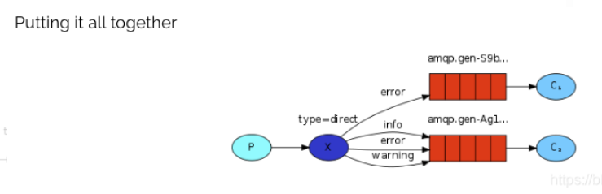

图解：

- P：生产者，向Exchange发送消息，发送消息时，会指定一个routing key。
- X：Exchange（交换机），接收生产者的消息，然后把消息递交给 与routing key完全匹配的队列
- C1：消费者，其所在队列指定了需要routing key 为 error 的消息
- C2：消费者，其所在队列指定了需要routing key 为 info、error、warning 的消息

#### 2 Routing 之订阅模型-Topic

Topic类型的Exchange与Direct相比，都是可以根据RoutingKey把消息路由到不同的队列。只不过Topic类型Exchange可以让队列在绑定Routing key的时候使用通配符！这种模型Routingkey一般都是由一个或多个单词组成，多个单词之间以”.”分割，
例如： item.insert

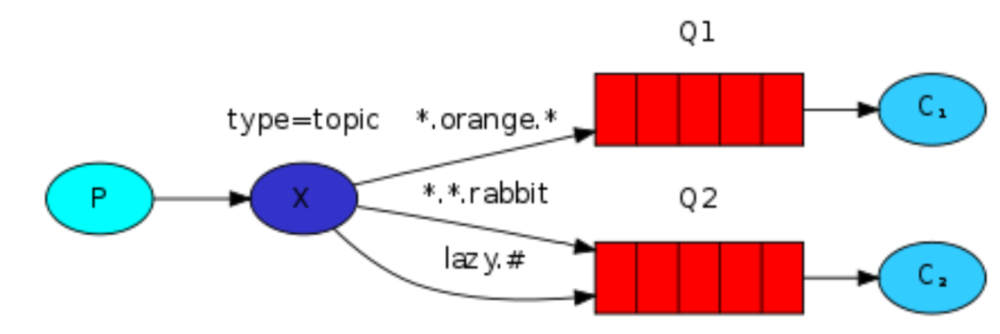

> 通配符
> 		* (star) can substitute for exactly one word.    匹配不多不少恰好1个词
> 		# (hash) can substitute for zero or more words.  匹配零个、一个或多个词
> 	如:
> 		audit.#    匹配audit、audit.irs 、或者audit.irs.corporate等
> 		audit.*   只能匹配 audit.irs

## 面试问题

### 为什么使用消息队列？

直接把mq的应用场景说出来就好：解耦、异步、削峰

#### 异步处理（高延时 -> 低延时）

场景说明：用户注册后，需要发注册邮件和注册短信,传统的做法有两种：1.串行的方式 2.并行的方式

串行方式: 将注册信息写入数据库后,发送注册邮件,再发送注册短信，以上三个任务全部完成后才返回给客户端。 这有一个问题是：邮件、短信并不是必须的,它只是一个通知,而这种做法让客户端等待没有必要等待的东西。

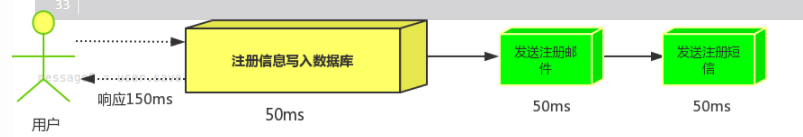

并行方式: 将注册信息写入数据库后,发送邮件的同时,发送短信,以上三个任务完成后,返回给客户端,并行的方式能提高处理的时间。 

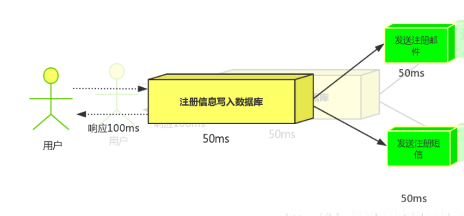

消息队列：假设三个业务节点分别使用50ms,串行方式使用时间150ms,并行使用时间100ms。虽然并行已经提高的处理时间,但是,前面说过,邮件和短信对我正常的使用网站没有任何影响，客户端没有必要等着其发送完成才显示注册成功,应该是写入数据库后就返回.

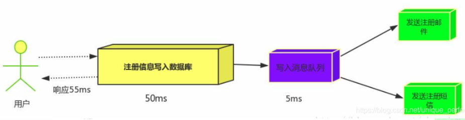

引入消息队列后，把发送邮件,短信不是必须的业务逻辑异步处理 

#### 应用解耦

一开始A系统调用B、C、D系统的接口来发送数据，后面又出现了一个依赖A系统的E系统，需要A系统来调用E系统的接口，那如果D系统不依赖A系统了，A系统又需要取消接口调用的代码。此时A系统与其余系统是严重耦合起来的。除此之外，A系统还需要考虑其他系统的异常场景，如超时、宕机等等等...

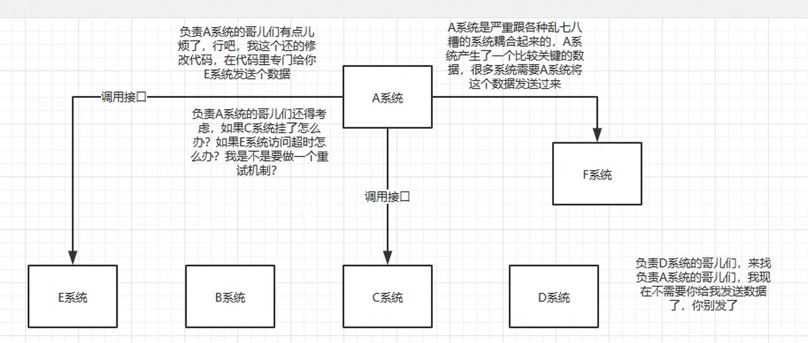

**面试技巧：**考虑一下你负责的系统中是否有这样的场景，就是一个系统或者一个模块，调用了多个系统或者模块，并且互相之间的调用很复杂，维护起来很麻烦。但是其实这个调用是不需要直接同步调用接口的，如果用MQ给他异步化解耦也是可以的。

**场景：**双11是购物狂节,用户下单后,订单系统需要通知库存系统,传统的做法就是订单系统调用库存系统的接口. 

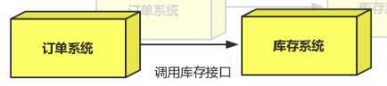

这种做法有一个缺点:
当库存系统出现故障时,订单就会失败。 订单系统和库存系统高耦合.  

**引入消息队列：**

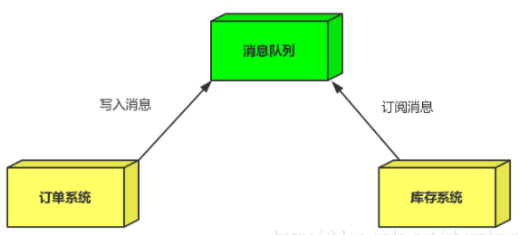


订单系统:用户下单后,订单系统完成持久化处理,将消息写入消息队列,返回用户订单下单成功。

库存系统:订阅下单的消息,获取下单消息,进行库操作。就算库存系统出现故障，消息队列也能保证消息的可靠投递，不会导致消息丢失

#### 流量削峰

场景: 秒杀活动，一般会因为流量过大，导致应用挂掉,为了解决这个问题，一般在应用前端加入消息队列。  

作用:

1.可以控制活动人数，超过此一定阀值的订单直接丢弃(我为什么秒杀一次都没有成功过呢^^) 

2.可以缓解短时间的高流量压垮应用(应用程序按自己的最大处理能力获取订单) 

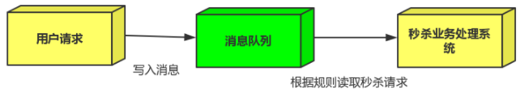

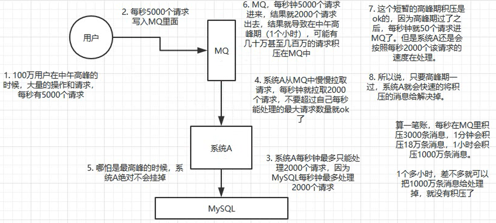

1.用户的请求,服务器收到之后，首先写入消息队列，若加入时消息队列长度超过最大值，则直接抛弃用户请求或跳转到错误页面。

2.秒杀业务根据消息队列中的请求信息，再做后续处理。

一般来说，MySQL每秒能扛到2000个请求，如果每秒5000个请求的话，可能就直接把MySQL打死了。

### 引入MQ后，有什么缺点呢？

1. 系统可用性降低，MQ一旦故障了，所有依赖的上下游系统就崩溃了，就没办法运转了。
2. 导致系统要考虑的问题变多，进而导致系统复杂性提高。系统A本来给系统B发送一条数据即可，结果因为A和MQ之间协调出现一些问题，系统A不小心把同一条消息给系统B发送了两次，导致系统B内部插入了两条一模一样的数据。还有丢消息、消息积压的各种问题。
3. 一致性问题，有人给系统A发送一个请求，本来这个请求应该是系统ABCD都执行成功才能返回成功的，结果系统ABC都执行成功了，但是系统D执行失败了，就导致整个请求给用户返回的是成功，结果后台逻辑实际上差了一点儿，没有执行成功。

### 为什么消息中间件不直接使用http协议呢？

1. 因为http请求报文头和响应报文头是比较复杂的，包含了cookie、数据的加密解密、状态码、响应码等附加的功能，但是对于一个消息而言，我们并不需要这么复杂，也没有这个必要性，他其实就是负责数据传递、存储、分发就行，一定要追求的是高性能，尽量简洁、快速。
2. 大部分http是短连接，在实际的交互过程中，一个请求到相应很有可能会中断，中断以后就不会进行持久化，就会造成请求的丢失，这样就不利于消息中间件的业务场景，因为消息中间件可能是一个长期的获取消息的过程，出现问题和故障要对数据或消息进行持久化等，目的是为了保证消息和数据的高可靠和稳健的运行。

### 各个消息中间件的比较

#### ActiveMQ

特点：非常成熟，但偶尔会丢失消息，而且吞吐量是万级，比rocketMQ和kafka低了一个量级，而且社区越来越不活跃。主要是基于解耦和异步来使用的，较少用在大规模吞吐的场景。

定位：小规模吞吐量

#### RabbitMq

优点：基于erlang语言开发，性能极好，延时很低，微秒级，高可用，高吞吐量——W级。开源提供的很好。社区很活跃。

缺点：基于erlang语言，研究和定制比较难。吞吐量会低一些，因为它的实现机制比较重。

#### RocketMQ

优点：单机吞吐量10w级，topic可以达到几百几千个，高可用、分布式架构，功能较为完善。有阿里的保障，性能很好，社区比较活跃，易扩展，底层为java实现的。  

缺点：要做好不维护的准备

#### kafka

优点：10w级，可扩展，天然适合大数据实时计算以及日志收集。经过参数配置，消息可以做到0丢失。是大数据领域使用事实上的标准。

缺点：功能简陋，只支持了基本的MQ功能。有可能出现消息重复。

**kfka为什么这么快？**

1. 顺序读写磁盘
2. MMAP内存映射文件
3. Zero Copy（零拷贝）
4. Batch Data（数据批量处理）

#### 总结

一般的业务系统要引入MQ，一开始大家都用的ActiveMQ，但是现在大家用的不多了，没经过大规模吞吐量场景的验证，社区也不是很活跃。

后来大家开始用RabbitMQ，但是确实erlang语言阻止了大量的java工程师去深入研究和掌控他，对公司而言，几乎处于不可控的状态，但是确实是开源的，有比较稳定的支持，活跃度也高。

不过现在确实越来越多的公司会去使用RocketMQ，确实很不错，但是会面临社区忽然黄掉的风险，对自己公司技术实力有绝对自信的，推荐使用RocketMQ，否则老老实实的使用RabbitMQ。

所以中小型公司，技术实力较为一般，技术挑战不是特别高，用RabbitMQ是不错的选择；而大型公司基础架构研发实力较强，用RocketMQ是很好的选择。

如果是大数据领域的实时计算、日志采集等场景，用kafka是业内标准，绝对没问题，社区活跃度很高，绝对不会黄，何况几乎是全世界这个领域的事实性规范。

### 引入消息队列之后该如何保证其高可用性？

#### 1.RabbitMQ的高可用

##### 1. 普通集群(副本集群)

All data/state required for the operation of a RabbitMQ broker is replicated across all nodes. An exception to this are message queues, which by default reside on one node, though they are visible and reachable from all nodes. To replicate queues across nodes in a cluster --摘自官网
默认情况下:RabbitMQ代理操作所需的所有数据/状态都将跨所有节点复制。这方面的一个例外是消息队列，默认情况下，消息队列位于一个节点上，尽管它们可以从所有节点看到和访问

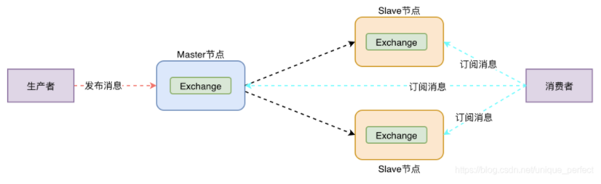

普通集群，只能将exchange的信息同步到slave中，queue的数据只存储在master节点中。因此如果master节点宕机的话，并不能保证集群的高可用。

在多台机器上启动多个rabbitmq实例，每个机器启动一个。但是你创建的queue只会放在一个rabbitmq实例上，但是每个实例都同步queue的元数据（没有真正数据）。消费时实际上如果连接到了另外一个实例，那么那个实例会在queue所在实例上拉取数据过来。

这种方式确实很麻烦，也不怎么好，没做到所谓的分布式，就是个普通集群。因为着导致你要么消费者每次随机连接一个实例然后拉取数据，要么固定连接那个queue所在实例消费数据，前者有数据拉取的开销，后者导致单实例性能瓶颈。

而且如果那个放queue的实例宕机了，会导致接下来其他实例无法从那个实例拉取数据，如果开启了数据持久化，并且数据成功落地存储在了磁盘上，那这数据才不会丢，但是要等实例恢复后才能继续从这个queue拉取数据。

核心解决问题:  提高吞吐量，让集群中多个节点来服务某个queue的读写操作。而且当集群中某一时刻master节点宕机, 可以对Quene中信息进行备份，但消息可能会丢失。

##### 2. 镜像集群

镜像队列机制就是将队列在三个节点之间设置主从关系，消息会在三个节点之间进行自动同步，且如果其中一个 节点不可用，并不会导致消息丢失或服务不可用的情况，提升MQ集群的整体高可用性。

当消费者与master队列建立连接，消费者可以直接从master队列上获取信息，当消费者与slave队列建立连接呢？消费者是从slave队列直接获取数据的吗？当然不是的，消息的流转顺序如下所示：

-  slave队列先将消费者的请求转发给master队列
- 然后再由master队列准备好数据返回给slave队列
- 最后由slave队列将消息返回给消费者

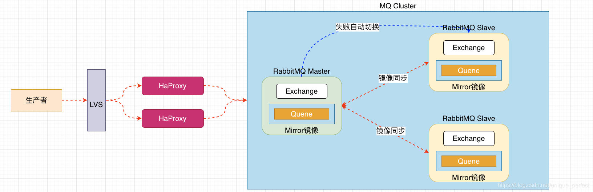

这种模式才是所谓的rabbitmq的真正的高可用集群，跟普通集群模式不一样的是，创建的queue，无论是元数据还是queue中的消息，都会存在于多个实例上，每次写消息到queue时，都会自动把消息往多个实例的queue中进行消息同步。

这样的话，好处在于任何一个机器宕机了都没事，别的机器还可以用。但坏处在于，性能开销大、资源浪费，消息要同步到所有机器，导致网络带宽的压力和消耗都很重，而且由于一份数据要存在所有的实例上，内存、磁盘耗费是之前的n倍。除此之外，没有扩展性可言了，如果某个queue的负载很重，加机器时新增的机器也要包含这个queue的所有数据，并没有办法线性扩展queue。

开启方式：在管理控制台新增策略（镜像集群模式），指定时可以要求数据同步到所有节点，也可以要求同步到指令数量的节点。当再次创建queue的时候应用这个策略，就会自动将数据同步到其他节点。

#### 2. kafka的高可用性

kafka0.8以后提供了HA机制，就是replica副本机制。每个partica内的数据都会同步到其他机器上，形成自己的多个replica副本。然后所有replica会选举一个leader出来，其他replica就是follower。生产者和消费者都跟这个leader打交道，写的时候leader负责将数据同步到所有follower上去，读的时候就直接读leader上面的数据即可。

为什么只能读写leader呢？

很简单，如果可以随意读写每个follower，那么就要关注数据一致性的问题，系统复杂度太高，很容易出问题。kafka会均匀的将一个partition的所有replica分布在不同的机器上，这样才可以提高容错性。

这样就有所谓的高可用性了，因为如果某个broker宕机了，没事，那个broker上面的partition在其他机器上都有副本的，如果有某个partition的leader挂掉了，那么此时会重新选举一个新的leader出来，大家继续读写哪个新的leader即可，这样就有所谓的高可用性了。

写数据的时候，生产者就写leader，然后leader将数据落地写本地磁盘，接着其他follower自己主动从leader来pull数据，一旦所有follower同步好数据了，就会发送ack给leader，leader收到所有follower的ack之后，就会返回写成功的消息给生产者。（当然，这只是其中一种模式，还可以适当调整这个行为）

消费的时候，只会从leader去读，但是只有一个消息已经被所有follower都同步成功返回ack的时候，这个消息才会被消费者读到。

### 如何保证消息不被重复消费啊？（如何保证消息消费时的幂等性？）

**重复消费的问题：**

比如rabbitMQ、RocketMQ、Kafka都有可能出现消息重复消费的问题，正常。因为这个问题通常不是MQ自己保证的，是程序员自己来保证的。

具体一点，讲一下kafka的重复消费问题：

kafka实际上有个offset的概念，每个消息写进去的时候都会有一个offset，代表他的序号，然后consumer消费了数据之后每隔一段时间就会把自己消费过的消息的offset提交一下，代表我已经消费过了，下次我要是重启啥的，你就让我继续从上次消费到的offset来继续消费吧。

但是凡事总有意外，比如我们之前生产经常遇到的，有时候重启系统时，如果着急一点直接kill再重启，会导致consumer有些消息处理了但是没有来得及提交offset，重启后少数数据会重新消费一次。

其实重复消费不可怕，可怕的是没有考虑到如何在重复消费后保证幂等性。

**幂等性问题：**

假如消费一条消息就往数据库里插入一条数据，重复消费就会插入两条，数据就会出现问题。

但消费第二次时，自己判断一下是否已经消费过了，若是就直接扔了，这样就只保留了一条数据，保证了数据的正确性。

还有比如基于数据库的唯一键来保证重复数据不会重复插入多条，使用唯一性约束来解决幂等性问题。

### 如何保证消息的可靠性（如何处理消息丢失的问题）

用 MQ 有个基本原则，就是**数据不能多一条，也不能少一条**，不能多，就是前面说的重复消费和幂等性问题。不能少，就是说这数据别搞丢了。

#### RabbitMQ

##### 消息丢失的环节

1. 生产者：写消息的过程中，消息没到RabbitMQ，在网络传输的过程中就丢了，或者是消息到了RabbitMQ，但是MQ内部出错了，没有保存下来
2. mq：收到消息之后暂存在内存中，但是消费者还没来得及消费，RabbitMQ自己挂掉了，就导致暂存在内存中的数据搞丢了。
3. 消费者：消费者消费到了这个消息，但是还没来得及处理自己就挂掉了，但是RabbitMQ以为这个消费者已经处理完了。

##### 解决方案：

1. ###### 生产者：

   - 打开事务：生产者发送数据之前打开rabbitmq事务（channel.txSelect)，然后发送消息，如果消息发送失败，生产者会收到异常报错，此时可以回滚事务（channel.txRollback)，然后重试发送消息；如果收到了消息，那可以提交事务(channel.txCommit)。但是问题是事务会影响性能，吞吐量会降低。

   - 开启confirm模式（回调机制）：在生产者那里开启confirm模式之后，每次写的消息都会分配一个唯一的id，如果写入了rabbitmq中，则会回传一个ack消息，告诉你这个消息ok了，如果rabbitmq没能处理这个消息，则会回调一个nack接口，告诉你这个消息接收失败，然后可以重试。而且你可以结合这个机制自己在内存里维护每个消息 id 的状态，如果超过一定时间还没接收到这个消息的回调，那么你可以重发。

   事务机制和 `confirm` 机制最大的不同在于，**事务机制是同步的**，你提交一个事务之后会**阻塞**在那儿，但是 `confirm` 机制是**异步**的，你发送个消息之后就可以发送下一个消息，然后那个消息 RabbitMQ 接收了之后会异步回调你的一个接口通知你这个消息接收到了。

   所以一般在生产者这块**避免数据丢失**，都是用 `confirm` 机制的。

2. ###### RabbitMQ

   为了避免RabbitMQ自己弄丢数据，必须开启rabbitMQ的持久化，消息写入后会持久化到磁盘。

   设置持久化有两个步骤（必须要同时设置这两个持久化才行）：

   1. 创建queue的时候将其设置为持久化的，这样就可以保证rabbitMQ持久化queue的元数据，但是不会持久化queue中的数据
   2. 发送消息的时候将消息的deliveryMode设置为2，就是将消息设置为持久化的，此时rabbitMQ就会将消息持久化到磁盘上去。

   但是有一个小概率事件：如果RabbitMQ收到了消息还没来得及持久化就挂了，那这个消息就会丢失，重启也恢复不了这些消息数据。

   而且此处的持久化可以和生产者那边的confirm机制结合起来，只有将消息持久化到磁盘上去之后，才会通知生产者ack。

3. ###### 消费者

   打开了autoAck的机制，则在开始消费数据的时候，消费者就自动通知rabbitMQ已经消费完成消息了。

   如果处理时报错，RabbitMQ也不知道这条消息处理到一半失败了，那么这条消息不会再通过RabbitMQ重新发给消费者了，后续只会发送刚刚那条消息后面的消息。

   因此为了消息不丢失，需要在消费者这边将autoAck关闭，每次由消费者来决定什么时候处理完再发送ack信号给rabbitMQ。

   如果还没处理完这条消息就宕机了，此时rabbitMq还没收到发送的ack消息，则rabbitMQ就会将这条消息重新分配给其他的消费者去处理。

#### Kafka

##### 消费端丢失了数据

唯一可能导致消费者丢失数据的情况：消费到这个消息的时候自动提交了offset，让kafka认为你已经消费好了这条消息，但是消费者这边处理到一半就挂了，此时这条消息就会丢失。

因此此处需要关闭自动提交转而手动提交。

但是此时确实还是**可能会有重复消费**，比如你刚处理完，还没提交 offset，结果自己挂了，此时肯定会重复消费一次，自己保证幂等性就好了。

##### kafka丢失了数据

这块有一个比较常见的场景：生产者某个partition的leader宕机，重新选举这个partition的leader后，若原来leader的某些最新数据还没有来得及同步到follower上就宕机了，那这个新的leader岂不是就少了一部分数据。

此时一般需要设置如下4个参数：

1. 给 topic 设置 `replication.factor` 参数：这个值必须大于 1，要求每个 partition 必须有至少 2 个副本。
2. 在 Kafka 服务端设置 `min.insync.replicas` 参数：这个值必须大于 1，这个是要求一个 leader 至少感知到有至少一个 follower 还跟自己保持联系，没掉队，这样才能确保 leader 挂了还有一个 follower 吧。
3. 在 producer 端设置 `acks=all`：这个是要求每条数据，必须是**写入所有 replica 之后，才能认为是写成功了**。
4. 在 producer 端设置 `retries=MAX`（很大很大很大的一个值，无限次重试的意思）：这个是**要求一旦写入消息给broker失败，就无限重发**，卡在这里了。

##### 生产者会不会丢数据

如果按照上述的思路设置了ack=all，那么一定不会丢失消息，要求是broker的leader接收到消息，所有的follower都同步到了消息之后才认为本次写成功了。如果没满足这个条件，那生产者会不断地重发，重发无限次。

### 如何保证消息被顺序消费？

先看看顺序会错乱的两个场景：

1. rabbitMQ，一个queue，多个consumer，消费者是并行的，执行顺序没有保证
2. kafka：一个topic，一个partition，一个consumer，内部多线程

如何保证消息的顺序性：

1. RabbitMQ：给每个消费者开一个queue，然后把相关的数据按照顺序发到响应的queue里，这样消费者就可以顺序消费消息了。

2. kafka：一个topic，一个partition，一个consumer，内部单线程消费，写入N个内存queue，然后N个线程分别消费一个内存queue即可。

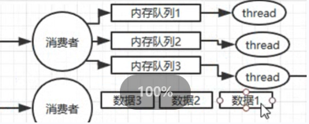

kafka保证写入到一个partition中的数据一定是有顺序的。生产者在写的时候，可以制定一个key，比如你指定某个订单id作为key，这个订单相关的数据一定会被分发到一个partition中，而且这个partition中的数据一定是有顺序的。

一个partition只能被一个消费者消费，如果三个partition四个消费者，那肯定会有一个消费者那边没有顺序的。

做过压测，如果消费者是单线程消费+处理，如果处理比较耗时，处理一条消息是几十ms，1s只能处理几十条数据，吞吐量太低了。

肯定要用消费者的多线程去做并发的处理，可以最高做到，压测消费者4核8G的机器，单机，32条线程，最高每秒可以处理上千条消息。

### 如何解决消息队列的延时以及过期失效问题？消息队列满了之后该怎么处理？有几百万消息持续积压几小时，说说怎么解决？

#### 积压问题

一个真实场景：几千万条数据在MQ里积压了七八个小时，从下午4点多积压到了晚上11点多。

一个消费者1秒是1000条，1秒3个消费者是3000条，一分钟是18w条，1000多w条也需要将近一个小时的时间才能恢复过来。此时不能傻等，不然耗时太久了，对公司损耗太大了。

1. 先修复consumer的问题，确保其恢复消费速度，然后将现有的consumer都停掉
2. 新建一个topic，partition是原来的十倍，临时建立好原先10倍或者20倍的queue数量
3. 然后写一个临时的分发数据的consumer程序，这个程序部署上去消费积压的数据，消费之后不做耗时的处理（例如写数据库），直接均匀轮训写入临时建立好的10倍数量的queue
4. 接着临时征用10倍的机器来部署consumer，每一批consumer消费一个临时queue的数据
5. 这种做法相当于是临时将queue资源和consumer资源扩大十倍，以正常的10倍速度来消费数据
6. 等快速消费完积压的数据之后，得恢复原先的部署架构，重新用原先的consumer机器来消费消息

#### 消息过期失效问题

假设你用的是rabbitMQ，其是可以为消息设置过期时间的，就是TTL，如果消息在queue中积压超过一定的时间就会被rabbitMQ给清理掉，这个数据就没了。

解决方案：批量重导。

手动写程序，将丢失的那批数据写个临时程序，一点一点的查出来，然后重新发到MQ里面去，把白天丢失的数据给他补回来。

#### 磁盘满了的问题

这个问题可以用上面两个问题的解决方案来解决

1. 分流

   将这个MQ里面的消息通过一个消费者发到另一个临时机器上面的MQ，然后有一个新的消费者去消费这里面的消息

2. 丢弃+批量重导

   将消息直接丢弃掉，然后等到低峰期的时候再写个程序重新查出来发到MQ上面去。

### 如果让你来开发一个消息队列中间件，你会怎么设计架构

#### 考察点

1. 有没有对一个消息队列做过较为深入的原理的了解，或者从整体了解把握住一个MQ的架构原理。

2. 看看你的设计能力，给你一个常见的系统，就是消息队列系统，看看你能不能从全局把握一下整体架构设计，给出一些关键点出来。

#### 面试题剖析

1. 首先得支持可伸缩性，需要的时候可以快速扩容，就可以增加吞吐量和容量，那怎么搞呢？我们可以设计一个分布式的系统，参照一下kafka的设计理念，broker->topic->partition，每个partition放在一台机器上，就存储一部分数据。如果现在资源不够了，简单，可以给topic增加partition，然后做数据迁移，增加机器，就可以存放更多的数据，提供更高的吞吐量了。
2. 其次需要考虑一下MQ的数据要不要落地磁盘。落磁盘才能保证进程挂了数据不丢失。那落磁盘的时候怎么落呢？顺序写，这样就没有磁盘随机读写的寻址开销，磁盘顺序读写的性能是很高的，这就是kafka的思路。
3. 其次考虑一下mq的可用性。这个问题可以参考讲解高可用时，kafka的高可用保障机制，多副本->leader & follower -> broker挂了重新选举leader即可对外服务。
4. 能不能保证数据0丢失呢？可以的，参考我们之前说的哪个kafka数据零丢失方案。

其实一个mq肯定是很复杂的，面试官问这个问题其实是一个开放题，他就是看看你有没有从架构角度整体构思和设计的思维以及能力。

### 总结一下消息队列相关问题的面试技巧

面试官问，你们项目里是怎么用到的MQ消息中间件的呢？是怎么保证它的幂等性、可靠性以及高可用性的呢？如果消息积压了很多，要怎么处理呢？如果磁盘满了要怎么解决呢？你有解决过MQ相关的生产问题吗？最后，你来给我设计一个消息队列吧。

如果面试官问道了，就一个个答过去，如果没问到，可以自己小秀一把，把上面的这些东西都说出来。


# RabbitMQ的死信队列原理
[RabbitMQ死信队列](https://blog.csdn.net/weixin_44688301/article/details/116237294)
> 概念解读：
> 
> “死信”是RabbitMQ中的一种消息机制，当你在消费消息时，如果队列里的消息出现以下情况：
> 1. 消息被否定确认，使用 channel.basicNack 或 channel.basicReject ，并且此时requeue 属性被设置为false。
> 2. 消息在队列的存活时间超过设置的生存时间（TTL)时间。
> 3. 消息队列的消息数量已经超过最大队列长度。
> 那么该消息将成为“死信”。
> 
> “死信”消息会被RabbitMQ进行特殊处理，如果配置了死信队列信息，那么该消息将会被**丢进死信队列中**，如果没有配置，则该消息将会被**丢弃**。

**死信消息的生命周期：**
1. 业务消息被投入业务队列
2. 消费者消费业务队列的消息，由于处理过程中发生异常，于是进行了nck或者reject操作
3. 被nck或reject的消息由RabbitMQ投递到死信交换机中
4. 死信交换机将消息投入相应的死信队列
5. 死信队列的消费者消费死信消息


[Apache RocketMQ开发者指南](https://github.com/apache/rocketmq/tree/master/docs/cn)
# RocketMQ的延时队列的原理简单介绍一下
[延迟队列](https://blog.csdn.net/weixin_38361347/article/details/119706637)
## 概念
消息发送到某个队列后，在指定多长时间之后才能被消费。

## 时间配置
**broker**有配置项messageDelayLevel，默认值为“1s 5s 10s 30s 1m 2m 3m 4m 5m 6m 7m 8m 9m 10m 20m 30m 1h 2h”, 共18个level。
1. broker配置messageDelayLevel
2. 发消息时，设置delayLevel
> level有以下三种情况：
> 
> level == 0，消息为非延迟消息1<=level<=maxLevel，消息延迟特定时间，例如level1，延迟1s
> 
> level > maxLevel，则level maxLevel，例如level==20，延迟2h
## 原理
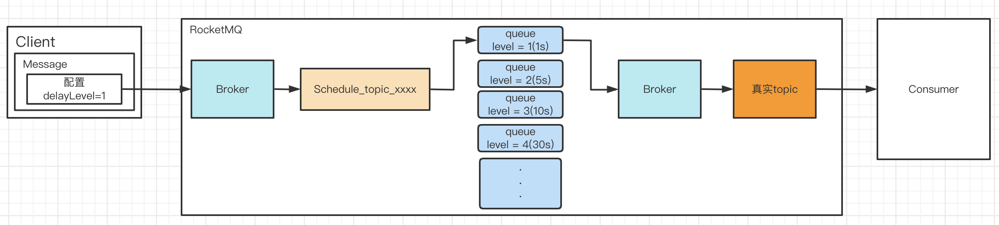


# 如果队列的消息消费失败了，RocketMQ会怎么处理呢？
> 参考文档：[关于RocketMQ之消息重试简述](https://blog.csdn.net/ysds20211402/article/details/124569910)

对于所有消费者消费失败的消息，rocketMQ都会把重试的消息 重新new出来（即上文提到的MessageExtBrokerInner对象），然后投递到主题SCHEDULE_TOPIC_XXXX 下的队列中，然后由定时任务进行调度重试。

而重试的周期符合我们在上文中提到的delayLevel周期，也就是：
`private String messageDelayLevel = "1s 5s 10s 30s 1m 2m 3m 4m 5m 6m 7m 8m 9m 10m 20m 30m 1h 2h";`

如果发现消费失败，则一开始会初始化为原有延时等级+3，然后继续放到对应的延时队列里面后续重试。

当重试次数达到最大时，会将消息投送给死信队列，死信 topic 为：`%DLQ%+consumerGroup`。

可开发对应的死信队列消费者进行异常消息处理，如重新投递、报警等操作。


# RocketMQ发送一条消息过去之后，是如何定位到对应的Broker上面的
RocketMQ的工作流程：
1. 启动NameServer，启动后会监听端口，等待Producer、Consumer、Broker连接
2. 启动Broker时，Broker会与所有的NameServer建立连接，而且每30s会发送一次心跳包
3. 发送消息前可以先创建Topic，创建Topic时可以指定该Topic要存储在哪个Broker上面，而且创建Topic时，Broker和Topic的关系也会同步写入到NameServer上中。是否指定Broker是可选的，也可以在发送消息时自动创建Topic。
4. Producer发送消息前先会与NameServer中的一个实例创建长连接并从NameServer处获取路由信息，即当前要发送的Topic的queue及Broker的地址映射关系。然后根据算法策略从中选出一个Queue来，并与队列的Broker建立长连接然后发消息到Broker。PS：获取路由信息后，Producer会先将路由信息缓存到本地，而且每30s会从NameServer处更新路由信息。
5. Consumer与Producer类似，启动后先跟其中一台 Nameserver建立长连接,获取本机所订阅 Topic的路由信息,然后根据算法策略从路由信息中获取到其所要消费的queue,然后直接跟 Broker建立长连接,开始消费其中的消息。 Consumer在获取到路由信息后,同样也会每30秒从 Name Server更新一次路由信息。不过不同于Producer的是,Consumer还会向 Broker发送心跳,以确保 Broker的存活状态。
> 参考文档：[RocketMQ学习：Broker](https://www.cnblogs.com/panxianhao/p/15656538.html)

# TODO：RocketMQ顺序消费原理


