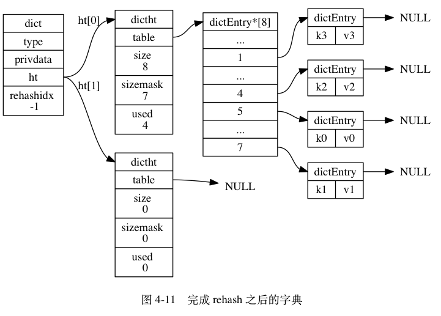
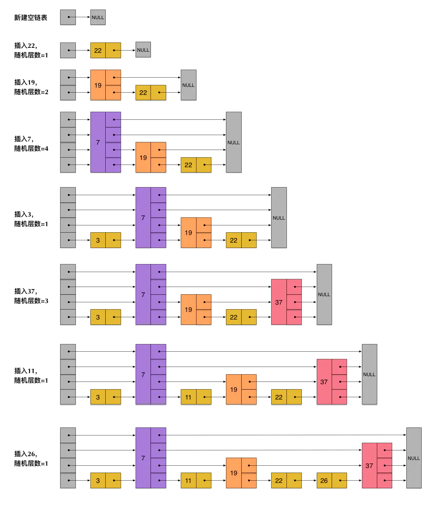
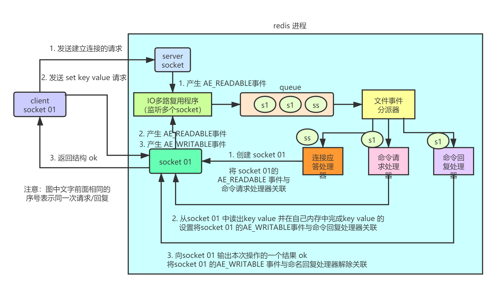
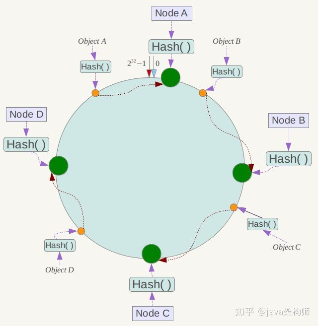
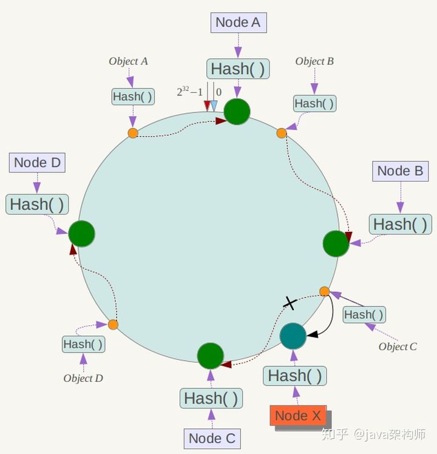

# 面试题

## 在项目中缓存是如何使用的？

## 为啥要在项目中用缓存呢？

### 高性能

对于长时间不变化并且查询很耗时的数据，如果不加缓存，那每次请求时都需要耗费很长时间去数据库里面查询，这会导致用户的使用体验非常不好。

在这种情况下可以加一个缓存，将耗时600ms查出来的结果扔到缓存里，下次查询时直接查缓存就行了，而且缓存是存储于内存中的，2ms搞定，性能提升300倍。

因此，对于需要复杂操作耗时查询出来的结果，且确定后面不怎么变化，但是会有很多读请求，那么可以直接将查询出来的结果放在缓存中，后面直接读缓存即可。

### 高并发

mysql 这么重的数据库，压根儿设计不是让你玩儿高并发的，虽然也可以玩儿，但是天然支持不好。mysql 单机支撑到 `2000QPS` 也开始容易报警了。

所以要是你有个系统，高峰期一秒钟过来的请求有 1万，那一个 mysql 单机绝对会死掉。这个时候就只能上缓存，把很多数据放缓存，不放 mysql。缓存功能简单，说白了就是 `key-value` 式操作，单机支撑的并发量轻松一秒几万十几万，支撑高并发 so easy。单机承载并发量是 mysql 单机的几十倍。

> 缓存是走内存的，内存天然就支撑高并发。

### 用了缓存之后会有什么不良后果？

常见的缓存问题有以下几个：

- 缓存与数据库双写不一致
- 缓存雪崩、缓存穿透
- 缓存并发竞争

# Redis

## Redis的基础使用

### String

```shell
get key value # 获取键值
set key value # 设置键值
del key # 删除键
```

### List

```shell
RPUSH key element [...element] # 将给定值推入列表的右端
LPUSH key element [...element] # 将给定值推入列表的左端
LRANGE key start end # 获取列表从start下标到end下标的所有数据
LPOP/RPOP # 从列表的左端/右端弹出一个值
LINDEX key index # 获取列表位于index位置的值
```

### Set

```shell
SADD key element [...element] # 将给定值加入到集合中
SREM key  element [...element] # 将给定值从集合中删除
SISMEMBER key  element [...element] # 判断给定值是否在集合中
SMEMBERS key # 获取集合中所有元素，会引起阻塞，生产环境慎用
SINTER/SUNION/SDIFF key1 key2 # 对集合1和集合2取交集、并集、差集
```

### Hash

```shell
HSET key field value # 将给定value插入到key的hash表中，以field为key
HGET key field # 获得key的hash表中field的value
HGETALL key # 获取key的hash表中的所有field、value键值对
HDEL key field # 在key的hash表中删除指定的field
```

### ZSet

```shell
ZADD key score member [... score member] # 将给定的member和score加入到zset中
ZRANGE key start end # 从zset中获取排序后的index在start到end的所有值
ZRANGEBYSCORE key startScore endScore # 从zset中获取score在startScore到endScore的所有值
ZREM key member # 如果zset中有这个值，则移除0
ZINCRBY key score mebmer # 为zset中member的score新增一个值
```

## Redis里面数据结构的实现

> 参考书籍：http://redisbook.com/

### String（SDS）

String底层使用了SDS（simple dynamic string）简单动态字符串，其结构包括：

- free：int，标识当前SDS还有多少未使用的长度
- len：int，标识当前SDS已保存字符串的长度
- buf：char[], 存放当前字符串

下面是一个SDS实例：

- 这个 SDS 和之前展示的 SDS 一样， 都保存了字符串值 `"Redis"` 。
- 这个 SDS 和之前展示的 SDS 的区别在于， 这个 SDS 为 `buf` 数组分配了五字节未使用空间， 所以它的 `free` 属性的值为 `5` （图中使用五个空格来表示五字节的未使用空间）。


#### 解决的问题

##### 减少内存重分配次数

**获取长度的效率提高**

因为 C 字符串并不记录自身的长度信息， 所以为了获取一个 C 字符串的长度， 程序必须遍历整个字符串， 对遇到的每个字符进行计数， 直到遇到代表字符串结尾的空字符为止， 这个操作的复杂度为 O(N) 。

通过使用 SDS 而不是 C 字符串， Redis 将获取字符串长度所需的复杂度从 O(N) 降低到了 O(1).

**拼接字符串的安全性提高**

C语言里面的char数组，当执行拼接操作的时候，不会检查空闲空间是否足够，可能会直接将后续内存中的内容修改掉。而如果执行缩短字符串操作，那需要通过内存重分配来释放无用空间，不然会出现内存泄漏。

SDS在拼接时会先检查free，不足的话会自动扩容，过多的话会保存到free字段中。

通过未使用空间， SDS 实现了空间预分配和惰性空间释放**两种优化策略**：

- **空间预分配**

  当字符串扩容时：

  - 如果对SDS修改后，len < 1MB，则直接分配和len属性相同长度的free空间

  - 如果对SDS修改后，len >= 1MB，则直接分配1MB的free空间

- **惰性空间释放**

  字符串长度被减少时，不会立即将空间全部回收，而是先将其放到free空间存储起来。

##### 二进制安全

由于C字符串中的字符必须符合某种编码，且除字符串末尾外，不能存储空字符，否则会被认为是字符串结尾。

而SDS规避了此种问题，所有SDS API都会以处理二进制的方式来处理SDS存放在buf数组里的数据，且使用buf和len共同存取数据，使得可以存储空字符和任意格式的二进制数据。

##### 兼容部分C字符串函数

虽然 SDS 的 API 都是二进制安全的， 但它们一样遵循 C 字符串以空字符结尾的惯例： 这些 API 总会将 SDS 保存的数据的末尾设置为空字符， 并且总会在为 `buf` 数组分配空间时多分配一个字节来容纳这个空字符， 这是为了让那些保存文本数据的 SDS 可以重用一部分 `<string.h>` 库定义的函数。

#### 总结

| C 字符串                                             | SDS                                                  |
| ---------------------------------------------------- | ---------------------------------------------------- |
| 获取字符串长度的复杂度为 O(N) 。                     | 获取字符串长度的复杂度为 O(1) 。                     |
| API 是不安全的，可能会造成缓冲区溢出。               | API 是安全的，不会造成缓冲区溢出。                   |
| 修改字符串长度 `N` 次必然需要执行 `N` 次内存重分配。 | 修改字符串长度 `N` 次最多需要执行 `N` 次内存重分配。 |
| 只能保存文本数据。                                   | 可以保存文本或者二进制数据。                         |
| 可以使用所有 `<string.h>` 库中的函数。               | 可以使用一部分 `<string.h>` 库中的函数。             |

### List（双向链表）

redis的list是使用**双向链表**来实现的。

Redis 的链表实现的特性可以总结如下：

- 双端： 链表节点带有 `prev` 和 `next` 指针， 获取某个节点的前置节点和后置节点的复杂度都是 O(1) 。
- 无环： 表头节点的 `prev` 指针和表尾节点的 `next` 指针都指向 `NULL` ， 对链表的访问以 `NULL` 为终点。
- 带表头指针和表尾指针： 通过 `list` 结构的 `head` 指针和 `tail` 指针， 程序获取链表的表头节点和表尾节点的复杂度为 O(1) 。
- 带链表长度计数器： 程序使用 `list` 结构的 `len` 属性来对 `list` 持有的链表节点进行计数， 程序获取链表中节点数量的复杂度为 O(1) 。
- 多态： 链表节点使用 `void*` 指针来保存节点值， 并且可以通过 `list` 结构的 `dup` 、 `free` 、 `match` 三个属性为节点值设置类型特定函数， 所以链表可以用于保存各种不同类型的值。

### Hash字典

```c
/**
  * 字典的结构
  **/
typedef struct dict {

    // 类型特定函数
    dictType *type;

    // 私有数据
    void *privdata;

    // 哈希表
    dictht ht[2];

    // rehash 索引
    // 当 rehash 不在进行时，值为 -1
    int rehashidx; /* rehashing not in progress if rehashidx == -1 */

} dict;
```

内部主要包括一个长度为2的哈希表ht[2]和一个rehashidx--rehash索引（总是哈希表的长度-1）

两个哈希表只会使用ht[0]来存储真正的数据，ht[1]是扩容用的。

```c
/**
  * 哈希表的结构
  **/
typedef struct dictht {

    // 哈希表数组
    dictEntry **table;

    // 哈希表大小
    unsigned long size;

    // 哈希表大小掩码，用于计算索引值
    // 总是等于 size - 1
    unsigned long sizemask;

    // 该哈希表已有节点的数量
    unsigned long used;

} dictht;
```

```c
/**
  * 哈希表节点的结构
  **/
typedef struct dictEntry {

    // 键
    void *key;

    // 值
    union {
        void *val;
        uint64_t u64;
        int64_t s64;
    } v;

    // 指向下个哈希表节点，形成链表
    struct dictEntry *next;

} dictEntry;
```

**扩容**

和hashmap很像，会先为ht[1]分配ht[0].length*2的长度，然后将ht[0]中的数据rehash分配到ht[1]中，rehash完成之后将ht[0]指向ht[1]，然后将ht[1]置为空

hash表的示意图：



当以下条件中的任意一个被满足时， 程序会自动开始对哈希表执行扩展操作：

1. 服务器目前没有在执行 BGSAVE 命令或者 BGREWRITEAOF 命令， 并且哈希表的负载因子大于等于 `1` ；
2. 服务器目前正在执行 BGSAVE 命令或者 BGREWRITEAOF 命令， 并且哈希表的负载因子大于等于 `5` ；
3. 负载因子 = 哈希表已保存节点数量 / 哈希表大小
4. 负载因子大小不同的原因：执行bgsave或者bgrewriteaof的时候，会使用写时复制技术，在子进程存在时，为了避免哈希表扩展操作减少不必要的内存写入操作以最大程度的节约内存，所以提高了阈值。

当哈希表的负载因子小于 `0.1` 时， 程序自动开始对哈希表执行收缩操作。

#### 渐进式 rehash

哈希表渐进式 rehash 的详细步骤：

1. 为 `ht[1]` 分配空间， 让字典同时持有 `ht[0]` 和 `ht[1]` 两个哈希表。

2. 在字典中维持一个索引计数器变量 `rehashidx` ， 并将它的值设置为 `0` ， 表示 rehash 工作正式开始。

3. 在 rehash 进行期间， 每次对字典执行添加、删除、查找或者更新操作时， 程序除了执行指定的操作以外， 还会顺带将 `ht[0]` 哈希表在 `rehashidx` 索引上的所有键值对 rehash 到 `ht[1]` ， 当 rehash 工作完成之后， 程序将 `rehashidx` 属性的值增一。

   ps：新增的只会保存到ht[1]中，而更新、删除、查找会在两个hash表中进行。

4. 随着字典操作的不断执行， 最终在某个时间点上， `ht[0]` 的所有键值对都会被 rehash 至 `ht[1]` ， 这时程序将 `rehashidx` 属性的值设为 `-1` ， 表示 rehash 操作已完成。

### Set（集合）

集合的底层可以是intset或者hashTable

当集合对象可以**同时**满足以下两个条件时， 对象使用 `intset` 编码：

1. 集合对象保存的所有元素都是整数值；
2. 集合对象保存的元素数量不超过 `512` 个；(配置set-max-intset-entries)

不能满足这两个条件的集合对象需要使用 `hashtable` 编码。

### ZSet（skiplist跳表）

ZSet的skiplist有两个数据结构，分别为skiplist和skiplistnode：

```c
typedef struct zskiplist {

    // 表头节点和表尾节点
    struct zskiplistNode *header, *tail;

    // 表中节点的数量
    unsigned long length;

    // 表中层数最大的节点的层数
    int level;

} zskiplist;
```

```c
typedef struct zskiplistNode {

    // 后退指针：用于从表尾向表头方向访问节点： 跟可以一次跳过多个节点的前进指针不同， 因为每个节点只有一个后退指针， 所以每次只能后退至前一个节点。
    struct zskiplistNode *backward;

    // 分值：一个 double 类型的浮点数， 跳跃表中的所有节点都按分值从小到大来排序。
    double score;

    // 成员对象：一个指针， 它指向一个字符串对象， 而字符串对象则保存着一个 SDS 值。对象必须唯一
    robj *obj;

    // 层：level 数组可以包含多个元素， 每个元素都包含一个指向其他节点的指针， 程序可以通过这些层来加快访问其他节点的速度， 一般来说， 层的数量越多， 访问其他节点的速度就越快。
    // 创建一个新跳跃表节点的时候， 程序都根据幂次定律 （power law，越大的数出现的概率越小） 随机生成一个介于 1 和 32 之间的值作为 level 数组的大小， 这个大小就是层的“高度”。
    struct zskiplistLevel {

        // 前进指针
        struct zskiplistNode *forward;

        // 跨度--遍历过程中将此值累加起来即可得到排名rank
        unsigned int span;

    } level[];

} zskiplistNode;
```

下面是一个简单的示例图：




## redis 和 memcached 有什么区别？

### redis 支持复杂的数据结构

redis 相比 memcached 来说，拥有更多的数据结构，能支持更丰富的数据操作。如果需要缓存能够支持更复杂的结构和操作， redis 会是不错的选择。

### redis原生支持集群模式

在 redis3.x 版本中，便能支持 cluster 模式，而 memcached 没有原生的集群模式，需要依靠客户端来实现往集群中分片写入数据。

## redis的线程模型是什么？

redis内部使用文件事件处理器（file event handler），这个文件事件处理器是单线程的，所以redis才叫做单线程的模型。它采用IO多路复用机制来同时监听多个Socket，将产生事件的Socket压入内存队列中，事件分派器根据从内存队列中取出的Socket上面的事件类型来选择相应的事件处理器进行处理。

文件事件处理器的结构包含有4个部分：

- 多个Socket
- IO多路复用程序
- 文件事件分派器
- 事件处理器（连接应答处理器、命令请求处理器、命令分发处理器）

下面是客户端与redis的一次通信过程：



1. redis服务端进行服务初始化时，会将server Socket的AE_READABLE事件与连接应答处理器相关联。
2. 客户端连接时向server Socket发送请求，此时server Socket会产生一个AE_READABLE事件，IO多路复用程序监听到server socket产生了事件，就会将server socket压入队列中。
3. 文件事件分派器从队列中获取socket，交给连接应答处理器。
4. 连接应答处理器会创建一个能与客户端通信的socket01，并将该socket01的AE_READABLE事件与命令请求处理器相连接。
5. 建立连接后，如果客户端发送一条命令，比如set key value命令，此时redis中的socket01会产生AE_READABLE事件，IO多路复用程序将socket01压入队列，事件分派器从队列中取出socket01，发现它的AE_READABLE事件是与命令请求处理器相关联的，于是事件分派器会将这个事件交给命令请求处理器来处理。
6. 命令请求处理器读取socket01的key value并在自己内存中完成key value的设置。操作完成后，命令请求处理器会将socket01的AE_WRITEABLE事件与命令回复处理器相关联。
7. 如果此时客户端准备好接收返回结果了，那么redis中的socket01会产生一个AE_WRITABLE事件，同样压入队列中，事件分派器找到相关联的命令回复处理器，由命令回复处理器对socket01输入本次操作的一个结果，比如ok，之后接触socket01的AE_WRITEABLE事件与命令回复处理器的关联。

## 为什么 redis 单线程却能支撑高并发？

Redis 将数据储存在内存里面，读写数据的时候都不会受到硬盘 I/O 速度的限制，所以速度极快

1. 基于内存
2. 使用非阻塞IO多路复用模型（这个看下面有更详细的讲解）
   1. redis基于Reactor模式开发了网络事件处理器（单线程）、文件事件处理器file event handler。他是单线程的，所以redis才叫做单线程的模型，它采用io多路复用机制来同时监听多个Socket，根据Socket上的事件类型来选择对应的事件处理器来处理这个事件。可以实现高性能的网络通信模型，又可以跟内部其他单线程的模块进行对接，保证了Redis内部的线程模型的简单性。
   2. 需要了解Epoll的实现机制。
   3. 文件事件处理器的结构包括4个部分：多个Socket、IO多路服用程序、文件事件分派器以及事件处理器（命令请求处理器、命令回复处理器、连接应答处理器等）。
   4. 多个Socket可能并发产生不用的事件，IO多路复用程序会监听多个Socket，会将Socket放入一个队列中排队，每次从队列中有序、同步取出一个Socket给事件分派器，事件分派器会把Socket分给对应的事件处理器。
   5. 当Socket的事件处理完成之后，IO多路复用程序才会将队列中的下一个Socket给事件分配器，文件事件分派器会根据每个Socket当前产生的事件来选择对应的事件处理器来处理。
3. C 语言实现，一般来说，C 语言实现的程序“距离”操作系统更近，执行速度相对会更快。
4. 单线程，避免了不必要的上下文切换和竞争条件

## Redis有哪些数据结构，分别有哪些典型的应用场景？

除非看你简历是工作3年以内的比较初级的一个同学、可能对技术没有很深入的研究过才会问这些问题。

1. 字符串：可以用来做最简单的数据，可以缓存某个简单的字符串，也可以缓存某个json格式的字符串，Redis分布式锁的实现就是利用了这种数据结构，还包括可以实现计数器、Session共享、分布式ID。

2. 哈希表：可以用来存储一些key-value键值对，更适合用来存储对象，把一些对象简单的缓存起来

3. 列表：Redis的列表通过命令的组合，既可以当做栈，也可以当做队列来使用，可以用来缓存类似微信公众号、微博等的消息流数据。甚至可以使用lrange命令来实现分页。

4. 集合：和列表类似，也可以存储多个元素，但是不能重复。如果需要对一些数据进行全局去重，可以基于jvm内存里的hashset进行去重，但是如果系统部署在多个机器上，就得基于redis进行全局的set去重。

   集合可以进行交集、并集、差集操作，从而可以实现类似于我和某人共同关注的人、朋友圈点赞等功能。

5. 有序集合：集合是有序的，有序集合可以用来通过分数来进行排序顺序，可以用来实现排行榜功能。

6. Bitmap：布隆过滤器

7. GeoHash：坐标，借助SortedSet实现，通过zset的score进行排序就可以得到坐标附近的其他元素，通过将score还原成坐标值就可以得到元素的原始坐标。

8. HyperLogLog：统计不重复数据，用于大数据基数统计，效率较高

9. Streams：内存版的kafka，进行消息的订阅、发布，pub/sub

## 假如Redis里面有1亿个key，其中有10w个key是以某个固定的已知的前缀开头的，如果将它们全部找出来？

使用keys指令可以扫出指定模式的key列表。

对方接着追问：如果这个redis正在给线上的业务提供服务，那使用keys指令会有什么问题？

这个时候你要回答redis关键的一个特性：redis的单线程的。keys指令会导致线程阻塞一段时间，线上服务会停顿，直到指令执行完毕，服务才能恢复。这个时候可以使用scan指令，scan指令可以无阻塞的提取出指定模式的key列表，但是会有一定的重复概率，在客户端做一次去重就可以了，但是整体所花费的时间会比直接用keys指令长。

## 使用Redis做过异步队列吗，是如何实现的

使用list类型保存数据信息，rpush生产消息，lpop消费消息

当lpop没有消息时，可以sleep一段时间，然后再检查有没有信息，如果不想sleep的话，可以使用blpop, 在没有信息的时候，会一直阻塞，直到信息的到来。

除此之外redis可以通过pub/sub主题订阅模式实现一个生产者，多个消费者，当然也存在一定的缺点，当消费者下线时，生产的消息会丢失。

## Redis的持久化机制

同：Redis的持久化有哪几种不同方式？不同的持久化机制都有什么优缺点？持久化机制具体的底层是如何实现的？

redis持久化的意义在于故障恢复，如果单单是把数据放在内存中，是没有办法应对一些灾难性的故障的。

### RDB（Redis Database）：

将某一时刻的内存快照，以二进制的方式写入磁盘。

#### 手动触发

- save命令，使Redis处于阻塞状态，直到RDB持久化完成，才会响应其他客户端发来的命令，所以在生产环境一定要慎用。
- bgsave命令，fork出一个子进程进行持久化，主进程只在fork过程中有短暂的阻塞，子进程创建之后，主进程就可以响应客户端请求了。使用了操作系统的cow（copy on write）写时拷贝机制，主进程会操作一个原数据的数据副本。

#### 自动触发

- save m n：在m秒内，如果有n个键发生改变，则自动触发持久化，通过bgsave执行，**如果设置多个，只要满足其一就会触发**，配置文件有默认配置（可以注释掉）。
- flushall：用于清空redis所有的数据库；而flushdb命令清空当前redis所在库数据（默认是0号数据库），这两个命令都会清空RDB文件，同时也会生成dump.rdb，内容为空。
- 主从同步：全量同步时会自动触发bgsave命令，生成rbd发送给从节点。
- 当服务器收到shutdown命令或者收到term信号时，会执行save命令，阻塞所有客户端，不再执行客户端的任何命令，并在save命令执行完毕之后关闭服务器。

#### 优点

1. 整个redis数据库中只包含一个文件dump.rdb，方便持久化。但是可以将过程中的数据文件保存下来，非常适合做冷备，可以将这种完整的数据文件发送到一些远程的安全存储上，比如云服务上，已预订好的备份策略来定期备份redis中的数据。
2. 容灾性好，方便备份
3. 性能最大化，fork子进程来完成写操作，让主进程继续执行命令，所以是io最大化。使用单独子进程来进行持久化，主进程不会进行任何IO操作，保证了redis 的高性能。
4. 相对于数据集大时，比AOF的启动效率更高。

#### 缺点

1. 数据安全性低，RDB是间隔一段时间进行持久化，如果持久化之间redis发生故障，会发生数据丢失的风险，所以这种方式更适合数据要求不严谨的时候

   这个问题也是rdb最大的缺点，不适合作为第一优先的恢复方案，容易丢失很多数据。

2. 由于RDB是通过fork子进程来协助完成数据持久化工作的，因此，如果当数据集比较大时，可能会导致整个服务器停止服务几百毫秒，甚至到1s。并且fork出来的子进程会占用CPU，数据快照也会占用内存。

#### 修复工具

redis-check-dump

### AOF（Append Only File）：

以日志的形式记录服务器所处理的每一个写、删除操作，查询操作不会记录，以文本的方式记录，可以打开文件看到详细的操作记录，调操作系统命令进程刷盘

1. 所有的写命令都会追加到AOF缓冲中
2. AOF缓冲区根据对应的策略向磁盘进行同步操作
3. 随着AOF文件越来越大，需要定期对AOF文件进行重写（rewrite），达到压缩的目的，例如通过三条命令往list中分别写入1、2、3，可以写为一条命令往list中写入1、2、3
4. 当Redis重启时，可以加载AOF文件进行数据恢复

#### 同步策略

- 每秒同步：异步完成，效率非常高，一旦系统出现宕机现象，那么这一秒钟之内修改的数据将会丢失
- 每修改同步：同步持久化，每次发生的数据变化都会被立即记录到磁盘中，最多丢一条
- 不同步：由操作系统控制，可能丢失较多数据

#### 优点

1. 数据安全，可以保证丢的数据很少；
2. 通过append模式写文件，即使中途服务器宕机也不会破坏已经存在的内容，可以通过redis-check-aof工具解决数据一致性问题；
3. AOF机制的rewrite模式，可以定期对AOF文件进行重写，以达到压缩的目的。

#### 缺点

1. AOF文件比RDB文件大，且恢复速度慢
2. 比较大的缺点：数据集大的时候，比RDB启动效率低，因此数据恢复比较慢，不适合做冷备；
3. 运行效率没有RDB高

#### 注意

- AOF文件比RDB更新效率高，建议优先使用AOF还原数据
- AOF比RDB更安全也更大
- RDB性能比AOF好
- 如果两种持久化方案都配置了，则会默认使用AOF机制

#### 修复工具

redis-check-aof

### RDB和AOF到底该如何选择

1. 不要仅仅使用RDB，会容易丢失很多数据
2. 也不要仅仅使用AOF，那样有两个问题：
   1. 通过AOF做冷备的话是没有RDB做冷备的时候恢复速度快的
   2. RDB每次简单粗暴生成数据快照会更加健壮，可以避免AOF这种复杂的备份和恢复机制的bug
3. 综合使用AOF和RDB两种持久化机制，用AOF来保证数据不丢失，作为数据恢复的第一选择；用RDB来做不同程度的冷备，在AOF文件都丢失或者损坏不可用的时候，还可以使用RDB来进行快速的数据恢复。

## Redis的过期键的删除策略

### 常见的两个问题

- 往 redis 写入的数据怎么没了？

可能有同学会遇到，在生产环境的 redis 经常会丢掉一些数据，写进去了，过一会儿可能就没了。我的天，同学，你问这个问题就说明 redis 你就没用对啊。redis 是缓存，你给当存储了是吧？

啥叫缓存？用内存当缓存。内存是无限的吗，内存是很宝贵而且是有限的，磁盘是廉价而且是大量的。可能一台机器就几十个 G 的内存，但是可以有几个 T 的硬盘空间。redis 主要是基于内存来进行高性能、高并发的读写操作的。

那既然内存是有限的，比如 redis 就只能用 10G，你要是往里面写了 20G 的数据，会咋办？当然会干掉 10G 的数据，然后就保留 10G 的数据了。那干掉哪些数据？保留哪些数据？当然是干掉不常用的数据，保留常用的数据了。

- 数据明明过期了，怎么还占用着内存？

这个是由 redis 的过期策略来决定的。

### redis的过期策略

Redis是key-value数据库，我们可以设置Redis中缓存的过期时间。Redis的过期策略就是指当Redis中缓存的key过期了，Redis如何处理。

```
Redis设置key的过期时间

1. expire设置过期时间
2. setex设置有效时长
```

- 惰性过期：只有当访问一个key时，才会判断该key是否已经过期，过期则清除。该策略可以最大化的节省CPU资源，却对内存非常不友好。极端情况可能出现大量的过期key没有再次被访问，从而不会被清除，占用大量内存。
- 定时过期（Redis没有实现这种方案）：每一个key设置一个定时器，当过期时由定时器去删除。
- 定期过期：每隔一定的时间（默认100ms），会扫描一定数量的数据库（默认16个）的expires字典中一定数量的key（默认20个），并清除其中已过期的key。该策略是前两者的一个折中方案。通过调整定时扫描的时间间隔和每次扫描的限定耗时，可以在不同情况下使得CPU和内存资源达到最优的平衡效果。程序中有一个全局变量记录扫描到了哪个数据库。

（expires字典会保存所有设置了过期时间的key的过期时间数据，其中，key是指向键空间中的某个键的指针，value是该建的毫秒精度的UNIX时间戳表示的过期时间。键空间是指该Redis集群中保存的所有键。）

Redis中同时使用了惰性过期和定期过期两种过期策略。

但是实际上这还是有问题的，如果定期删除漏掉了很多过期 key，然后你也没及时去查，也就没走惰性删除，此时会怎么样？如果大量过期 key 堆积在内存里，导致 redis 内存块耗尽了，咋整？

答案是：**走内存淘汰机制**。

### 内存淘汰机制

redis 内存淘汰机制有以下几个：

- noeviction: 当内存不足以容纳新写入数据时，新写入操作会报错，这个一般没人用吧，实在是太恶心了。
- **allkeys-lru**：当内存不足以容纳新写入数据时，在**键空间**中，移除最近最少使用的 key（这个是**最常用**的）。
- allkeys-random：当内存不足以容纳新写入数据时，在**键空间**中，随机移除某个 key，这个一般没人用吧，为啥要随机，肯定是把最近最少使用的 key 给干掉啊。
- volatile-lru：当内存不足以容纳新写入数据时，在**设置了过期时间的键空间**中，移除最近最少使用的 key（这个一般不太合适）。
- volatile-random：当内存不足以容纳新写入数据时，在**设置了过期时间的键空间**中，**随机移除**某个 key。
- volatile-ttl：当内存不足以容纳新写入数据时，在**设置了过期时间的键空间**中，有**更早过期时间**的 key 优先移除。

## 常见的缓存淘汰算法

插入缓存时缓存已满，若插入的缓存更重要，必须插入成功，则需要通过缓存淘汰来将原有的部分缓存删除掉

FIFO（先进先出），根据缓存存储的时间，离当前最远的数据有限被淘汰。

LRU（Least Recently Used 最近最少使用），根据最近被使用的时间，离当前最远的数据优先被淘汰。

LFU（Least Frequently Used 最不经常使用），在一段时间内，缓存数据被使用次数最少的会被淘汰。

## 分布式缓存中常用的缓存方案有哪些

客户端缓存：页面和浏览器缓存，APP缓存，H5缓存，localStorage和sessionStorage

CDN缓存：内容存储：数据的缓存，内容分发：负载均衡

nginx缓存：静态资源

服务端缓存：本地缓存、外部缓存

数据库缓存：持久层缓存（mybatis、hibernate多级缓存），MySQL查询缓存

操作系统缓存：Page Cache、Buffer Cache

## Redis分布式锁底层是如何实现的（讲的有点浅）

### setnx + setex

setnx：key不存在时设置成功，否则设置不成功

setex：为指定的key设置一个超时时间，key不存在的话会先生成key再加上超时时间

问题：

1. 设置超时时间失败，导致死锁：使用setnx设置成功后，节点宕机，导致没有运行setex命令，这样就会导致数据永远不过期，分布式锁永远拿不到，导致死锁。
2. 锁被替换掉了，del导致误删：为了防止任务执行长时间才结束导致锁变为其他进程的了，可以设置一个守护进程，锁到期时若任务没有执行完毕可以对锁进行续命操作。或者可以将value设置为自己的requestId，删除前判断锁的拥有者是否为当前节点。

### set(key, value, nx, px)

将setnx和setex变成原子操作

#### 问题

- 任务超时，锁自动释放，导致并发问题，使用redisson解决（看门狗监听，自动续期）
- 加锁和释放锁有可能不是一个线程。在value中存入uuid（线程唯一标识），删除锁时（get锁的标识+del）判断该标识（使用lua保证原子操作）
- 不可重入，使用redisson解决（实现机制类似AQS，计数）
- 异步复制可能造成锁丢失，使用redLock（红锁）解决

#### 红锁实现原理

1. 顺序向五(n)个节点请求加锁
2. 根据一定的超时时间来推断是不是跳过该节点：如果某个节点超时了，则这个节点的请求加锁操作直接跳过
3. 三个（大多数n/2+1）节点加锁成功并且花费时间小于锁的有效期
4. 认定加锁成功

### 总结

1. 首先利用setnx来保证：如果key不存在才能获取到锁，如果key存在，则获取不到锁
2. 然后还要利用lua脚本来保证多个redis操作的原子性
3. 同时还要考虑到锁过期，所以需要额外的一个看门狗定时任务来监听锁是否需要续约
4. 同时还要考虑到Redis节点挂掉后的情况，所以需要采用**红锁RedLock**的方式来同时向N/2+1个节点申请锁，都申请到了才证明获取锁成功，这样就算其中某个redis节点挂掉了，锁也不能被其他客户端获取到

## Redis和MySQL如何保证数据一致

最经典的缓存+数据库读写的模式：cache aside pattern

1、 cache aside pattern

（1）读的时候，先读缓存，缓存没有的话就去读数据库然后放到缓存里面并返回

（2）更新的时候，先删除缓存，然后再更新数据库

2、为什么是删除缓存，而不是更新缓存呢？

原因很简单，复杂点的缓存场景，缓存不单单是数据库中直接取出来的值。

比如可能更新了某个表的一个字段，然后其对应的缓存，是需要查询另外两个表的数据并进行运算，才能计算出缓存最新的值的。

因此有些时候更新缓存的代价是很高的，如果一个缓存，一分钟内只被访问了1次，但更新了20次，那如果每次更新都重新计算，则计算了20次，但仅仅只用到了一次。

因此如果只删除缓存的话，开销就会大幅降低。

1. 先更新MySQL，再删除/更新Redis，但是如果删除/更新Redis失败，可能仍然不一致

   如果删除/更新Redis时因为网络等问题失败，那缓存里就会仍然存储老数据，和数据库中数据不一致。

2. 先删除Redis缓存数据，再更新MySQL，再次查询的时候再将数据添加到缓存中，这种方案能解决方案一的问题，但是在高并发下性能较低，而且仍然会出现数据不一致的问题，比如线程1删除了Redis缓存数据，正在更新MySQL，此时另外一个查询再查询，那么就会把MySQL中老数据又查到Redis中。

   这种情况下可以通过将读写串行化的方式来解决：将同一个产品去数据库读写数据的请求都加到同一个内存队列中，然后再串行化进行处理这些读请求和写请求。 不过此处有一个优化点：如果读请求前面发现前面有其他读请求，那可以等他读出来更新缓存之后，直接去缓存中取数据。

   新问题：多服务实例，必须保证某个商品的读写请求打到同一个实例上。

3. 延时双删：先删除Redis缓存数据，再更新MySQL，延迟几百毫秒后再删除Redis缓存数据，这样就算在更新MySQL时有其他线程读取了MySQL并把老数据更新到Redis中，那么也会被删除掉，从而保证数据一致。

## 你能说说redis的并发竞争问题该如何解决吗？

> redis的并发竞争问题是什么？如何解决这个问题？了解redis事务的CAS方案吗？

场景介绍：

缓存中当前test_key的值为v1，有三台实例，同时更新test_key，分别想要更新为v2,v3,v4三个值

我们的期望是test_key值的变化过程为：v1->v2->v3->v4

但可能由于并发场景，变化过程变为了：v1->v3->v4->v2

解决方案：分布式锁（zk/redis） + 数据库里的时间戳判断（写数据的时候通过写入数据与缓存中数据的时间戳判断能否更新）

分布式锁确保同一时间只能有一个系统实例在操作某个key，别的实例都不能读和写

每次要写之前先判断一下当前这个value的时间戳是否比缓存里的value的时间戳要新，如果更新就可以写，旧数据不能覆盖新数据。

## Redis集群方案(如何保证Redis的高并发和高可用？)

1. redis高并发跟整个系统的高并发之间的关系

   首先，底层的缓存中间件、缓存系统，必须能够支撑得起我们说的高并发，其次，还需要再经过良好的整体缓存架构的设计（多级缓存架构、热点缓存），来支撑真正的上十万，甚至上百万的高并发。

2. redis高并发的瓶颈在哪

   单机

3. redis如果要支撑10w+的高并发，需要怎么办

   一般单机的redis，能够承载的QPS大概就在上万到几万不等，想要支撑高并发就需要采取下面的措施：通过主从架构 -> 实现读写分离 -> 10w+读QPS的架构

4. redis主从架构 -> 读写分离架构 -> 可支持水平扩展的读高并发架构

面试题的回答：

redis高并发：主从架构，一主多从，一般来说很多项目其实就足够了，单机用来写入数据，几万的QPS，多从用来查询数据，多个从实例可以提供每秒几十万的QPS。

Redis高可用：哨兵集群来保证。

### redis的高可用架构

#### 主从模式

这种模式比较简单，主库可以读写，并且会和从库进行数据同步（异步的），从库只可以读。

##### master持久化对于主从架构的安全保障的意义

如果采用了主从架构，那么建议必须开启master node的持久化

不建议用slave node作为master node的数据热备，因为那样的话如果你关掉master的持久化，可能在master宕机重启的时候数据是空的，然后可能一经过复制，slave node的数据也丢了。

master -> RDB和AOF都关闭了 -> 数据全部仅仅保存在内存中 -> master宕机、重启后，没有数据可以恢复，然后认为自己的数据是空的 -> master将空的数据集同步到slave node。

因此会出现100%数据丢失的情况。

在这种模式下，客户端直接连接主库或者某个从库，**但是主库或者从库宕机后，客户端需要手动修改IP**，另外，这种模式也比较难以扩容，整个集群所能存储的数据受到某台机器的内存容量限制，从库仅仅只是冗余备份的角色，所以不可能支持特大的数据量。

水平扩容很简单，如果想要读QPS再增加，可以直接加机器。

#### 主从模式+哨兵模式

这种模式在主从模式的基础上新增了哨兵节点，当主库节点宕机后，哨兵会发现主库节点宕机，然后在从库中选择一个库作为新增主库，另外哨兵也可以做成集群，从而可以保证单一某个哨兵节点宕机后，还要其他哨兵节点继续工作，这种模式可以比较好的保证Redis集群的高可用，但是仍然不能很好的解决Redis的容量上限问题。

sentinel，哨兵是redis集群中一个重要的组件，主要有以下功能：

- 集群监控：负责监控redis master和slave进程是否正常工作
- 消息通知：如果某个redis实例有故障，那么哨兵负责发送消息作为报警通知给管理员
- 故障转移：如果master node挂掉了，会自动转移到slave node上
- 配置中心：如果故障转移发生了，通过client客户端新的master地址

哨兵用于实现redis集群的高可用，本身也是分布式的，作为一个哨兵集群去运行，互相协同工作。

- 故障转移时，判断master node是否宕机了，需要大部分的哨兵都同意才行，涉及到了分布式选举
- 即使部分哨兵挂掉了，哨兵集群还是能正常工作的
- 哨兵通常需要3个实例，来保证自己的健壮性
- 哨兵+Redis主从的架构部署，是不保证数据零丢失的，只能保证redis集群的高可用性
- 对于哨兵+redis主从这种复杂的部署架构，尽量在测试环境和生产环境都进行充足的测试和演练。

如果master节点没有做各种备份方案，如果挂掉了，但是sentinel还没有检测到master failure的时候，master node就已经重启了，还是可能导致数据丢失。

##### 如果只有两个哨兵为什么不能维持高可用？

如果哨兵集群仅仅部署了两个哨兵实例，且quorum（有quorum个哨兵认为master挂掉了就可以执行重新选举了）=1：

Master1+Sentinel1

Redis1+Sentinel2

那么 如果master宕机，s1和s2中只要有一个哨兵认为master宕机就可以进行切换，同时s1和s2中会选举出一个哨兵进行故障转移。同时这个时候需要majority也就是大多数哨兵都是可以运行的，2个哨兵的majority=2（3的=2,4的=2,5的=3），此时两个哨兵都运行着，就可以允许执行故障转移。

但是如果m1和s运行的机器宕机了，那么哨兵就只剩下一个了，此时就没有majority来允许执行故障转移，虽然另外一台机器还要一个R1，但是故障转移不会执行。

##### 经典的三节点哨兵集群

M1、S1   +  R2、S2   +  R3+S3

config：quorum=2，majority=2

如果M1所在机器宕机了，那么三个哨兵还剩下两个，S2和S3可以一直认为master宕机，然后选举出来一个来执行故障转移。同时3个哨兵的majority是2，所以还剩下的2个哨兵运行着，可以允许执行故障转移。

##### 数据丢失情况

1. 异步复制问题

   因为master->slave的复制是异步的，所以可能有部分数据还没复制到slave，master就宕机了，此时这些部分数据就丢失了。

2. 集群脑裂问题

   脑裂也就是说，某个master所在的机器突然脱离了正常的网络，跟其他的slave机器和sentinel集群不能连接，但是实际上master机器还在运行着。

   此时哨兵可能就会认为master宕机了，然后开启选举，将其他的slave切换成了master。这个时候集群里就会出现两个master，也就是所谓的脑裂。

   此时虽然某个slave被切换成了master，但是可能client还没来得及去切换到新的master，还继续写入原来master的数据可能也丢失了，因为旧的master启动时，会被作为一个slave挂到新的master上面去，自己的数据会被清空，重新从新的master上复制数据。

##### 解决数据丢失问题

min-slaves-to-write 1

min-slaves-max-lag 10

要求至少有一个salve，数据复制和同步的延迟不能超过10s

如果说一旦所有的slave，数据复制和同步的延迟超过了10s，那master就不再接收请求。

1. 减少异步复制的数据丢失

   有了min-slaves-max-lag配置，就确保一旦slave复制数据和ack延时太长，就可能认为master宕机后损失的数据会很多，就会拒绝写请求，这样可以把master宕机时由于部分数据未同步到salve导致的数据丢失降低到可控范围内。

2. 减少脑裂的数据丢失

   如果一个master出现了脑裂，跟其他slave丢了连接，那么上面两个配置可以确保如果不能继续给指定数量的slave发送数据而且salve超过10s没有给自己ack消息，那么就直接拒绝客户端的写请求。

   这样脑裂后的旧master就不会接收client的新数据，避免了数据丢失。

   这样在脑裂场景下，最多就丢失10s的数据

##### 哨兵的一些底层原理

1. sdown和odown转换机制

   主观宕机sdown：如果一个哨兵觉得master挂了，那就是主观宕机

   客观宕机odown：如果quorum数量的哨兵都觉得master宕机了，那就是客观宕机

   sdown的条件很简单：如果一个哨兵ping一个master，超过了is-master-down-after-milliseconds指定的毫秒数之后，就主观认为master宕机了

   sdown到odown的条件：如果一个哨兵在指定时间内，收到了quorum指定数量的其他哨兵也认为那个master宕机的消息，那就认为是odown了，客观认为master宕机。

2. quorum和majority

   每次一个哨兵要做主备切换，首先需要quorum数量的哨兵认为odown，然后再选举出一个哨兵来做切换，这个哨兵还得得到majority数量的哨兵的授权才能正式执行切换。

   如果quorum<majority，比如有5个哨兵，那么majority就是3，quorum设置为2，那么有3个哨兵授权就可以执行切换

   但是如果quorum >= majority，那么必须quorum数量的哨兵都授权，比如5个哨兵，quorum设置为了5，那么必须5个哨兵都同意授权，才能执行切换

3. 哨兵集群的自动发现机制

   哨兵互相之间的发现，是通过redis的pub/sub系统实现的，每个哨兵都会往`_sentinel_:hello`这个channel里面发送一个消息，这样其他所有哨兵都可以消费到这个消息，并感知到其他哨兵的存在。

   每隔两秒钟，每个哨兵都会往自己监控的某个master+slave对应的`_sentinel_:hello`channel里面发送一个消息，内容是自己的host、ip和runid，还有对这个master的监控配置

   每个哨兵也会去监听自己所监控的每个master+slave对应的`_sentinel_:hello`channel，然后去感知到同样在监听这个master+slave的其他哨兵的存在。

   每个哨兵还会跟其他哨兵交换对master的监控配置，互相进行监控配置的同步。

4. slave配置的自动修正

   哨兵会负责自动纠正slave的一些配置，比如slave如果要成为潜在的master候选人，哨兵会确保slave在复制现有master的数据；除此之外，会将slave连到新的master上。

5. slave—>master的选举算法

   考虑的点：跟master断开的时长、slave优先级、offset、run id

   过程：筛选+排序

   - 筛选：如果一个slave跟master断开连接已经超过了down-after-milliseconds的10倍，外加master宕机的时长，那么slave就被认为不适合选举为master，公式：(down-after-milliseconds * 10) + milliseconds_since_master_is_in_SDOWN_state
   - 排序：
     1. 按照slave优先级排序，越低越靠前
     2. 如果优先级都相同，则看replica offset，复制了越多的数据即offset越靠后，优先级越高
     3. 如果都相同，则run id越小越靠前

6. configuration epoch

   哨兵会对一套redis master+salve进行监控，有相应的监控配置

   执行切换的那个哨兵，会从要切换到的新master那里得到一个configuration epoch，这就是一个version号，每次切换的version号都必须是唯一的。

   如果第一个选举出来的哨兵切换失败了，那么其他哨兵会等到failover-timeout事件，然后接替继续执行切换，此时会重新获取一个新的configuration epoch，作为新的version号

7. configuration传播

   哨兵切换完成之后，会在自己本地更新生成最新的master配置，然后同步给其他的哨兵，就是通过之前说的pub/sub机制。

   这里的version号就很重要了，因为各种消息都是通过一个channel去发布和监听的，所以一个哨兵完成一次新的切换之后，新的master配置是跟着新的version号的。其他哨兵都是根据版本号的大小来更新自己的master配置的。

#### cluster模式

cluster模式是用的比较多的模式，它支持多主多从，这种模式会按照key进行槽位的分配，可以使得不同的key分散到不同的主节点上，利用这种模式可以使得整个集群支持**更大的数据容量**，同时每个主节点可以拥有自己的多个从节点，如果该主节点宕机，会从它的从节点中选举一个新的主节点。

可以支撑N个redis master node，每个master node都可以挂载多个slave node.

是读写分离的架构，对于每个master来说，写就写到master，然后读就从master对应的slave去读.

我们只要基于redis cluster去搭建redis集群即可，不需要手工去搭建replication复制+主从架构+读写分离+哨兵集群+高可用.

在redis cluster架构下，每个redis都要开放两个端口号，比如一个是6379，另外一个就是+1w的端口号，比如16379.

16379端口号是用来进行节点间通信的，也就是cluster  bus的通信，用来进行故障检测、配置更新、故障转移授权。cluster bus用了另外一种二进制的协议，gossip协议，用于节点间进行高效的数据交换，占用更少的网络带宽和处理时间.

Redis Cluster是一种服务端sharding（分片）技术，3.0版本开始正式提供。采用slot（槽）的概念，一共分成16384个槽，将请求发送到任意节点，接收到请求的节点会将查询请求发送到正确的节点上执行。

互为主从，每个节点都有自己的槽，也备份其他节点的槽.

##### gossip协议

**说明**

跟集中式存储不同，所有节点都持有一份元数据，不同的节点如果出现了元数据的变更之后，就不断的将元数据发送给其他的节点，让其他节点页同步更新。

集中式：好处在于更新扩散快，能立刻被其余节点感知到；坏处在于，数据存储于一个节点，不安全。

gossip分散式模式：元数据分散，较安全；但更新延时较大。做完reshard之后做另一个操作有可能出现configuration error，未达成一致。

**gossip消息分类**

gossip协议包含多种信息，包括ping、pong、meet、fail等等

1. meet：某个节点发送meet信号给新加入的节点，然后新节点才会开始与集群中其他节点通信

   redis-trib.rb add-node 其实内部就是发送了一个gossip meet消息，让新节点加入集群

2. ping：每个节点都会频繁的主动给其他节点发送ping消息，里面包含了自己维护的元数据和自己的状态
3. pong：返回ping和meet，包含自己的状态和其他信息，也可以用于信息广播和更新
4. fail：判断另一个节点fail之后，就会发送此信号给其余节点，通知此节点宕机了

**ping消息的深入**

ping消息的发送是很频繁（每秒10次，每次选择5个最久没有通信的其他节点）的，每次发送ping，都要带上自己的信息和1/10其他节点的信息进行数据交换。

最少包含3个节点的数据，最多包含总节点数-2个其他节点的信息。

如果发现某个节点的通信延时达到了 cluster_node_timeout / 2，那么立即发送ping，以免数据交换延时过长，导致整个集群出现严重的元数据不一致的情况。

##### 元数据

故障信息、节点的增加和移除，hash slot信息……

##### [redis、cluster] VS [replication、sentinel]

如果数据量很少，主要是承载高并发高性能的场景，比如你的缓存一般就几个G，单机就足够了

replication是一个master多个slave，要几个slave跟你要求的读的吞吐量有关系，然后自己搭建一个sentinel集群，去保证redis主从架构的高可用性就可以了。

redis cluster，主要是针对海量数据+高并发+高可用的场景，如果你的数据量很大，是海量数据，那么就建议用redis cluster。

##### Redis Cluster（服务端分片）

> 算法演变：hash -> 一致性hash算法（memcached） -> hash slot算法（redis cluster）

###### **hash算法**

如果用普通的hash算法来决定数据分布，那如果某一个master宕机了，就导致缓存数据全部失效，宕机后有请求进来到时候，会对n-1进行取模，这样基本上就找不到数据了，会导致缓存全部失效。

###### **一致性hash算法**

> 参考：https://zhuanlan.zhihu.com/p/98030096

定义一个环形hash空间，将各个服务器使用Hash进行一个哈希，具体可以选择服务器的ip或唯一主机名作为关键字进行哈希，这样每台机器就能确定其在哈希环上的位置。

当有一个key过来之后，同样也是计算hash值，然后散列到Hash环上，从数据所在位置沿环顺时针“行走”，第一台遇到的服务器就是其应该定位到的服务器。



可以保证只有宕机的master上的数据失效：如果此时NodeC宕机了，此时Object A、B、D不会受到影响，只有Object C会重新分配到Node D上面去，而其他数据对象不会发生变化

如果在环境中新增一台服务器Node X，通过hash算法将Node X映射到环中，通过按顺时针迁移的规则，那么Object C被迁移到了Node X中，其它对象还保持这原有的存储位置。



**缓存热点问题**

可能集中在某个hash区间内的值特别多，那么会导致大量的数据都涌入同一个node，性能出现瓶颈。

为了解决缓存热点问题，一致性hash算法新增了虚拟节点的概念：

在环上加上一些虚拟节点，给每个master都做了均匀分布的虚拟节点，落到虚拟节点上的数据映射到响应的节点上，这样就会保证大量的数据会均匀的分布在不同的节点上。

###### redis cluster方案

- 通过哈希的方式，将数据分片，每个节点均分存储一定哈希槽（哈希值）区间的数据，默认分配了16384个槽位
- 每份数据分片会存储在多个互为主从的多节点上
- 数据写入先写入主节点，再同步到从节点（支持配置为阻塞同步）
- 同一分片多个节点间的数据不保持强一致性
- 读取数据时，当客户端操作的key没有分配在该节点上时，redis会返回转向指令，指向正确的节点
- 扩容时需要把旧节点的数据迁移一部分到新节点

###### 优点

- 无中心架构，支持动态扩容，对业务透明
- 具备Sentinel的监控和自动Failover（故障转移）能力
- 客户端不需要连接集群的所有节点，连接集群中任何一个可用节点即可
- 高性能，客户端直连redis服务，免去了proxy代理的损耗

###### 缺点

- 运维也很复杂，数据迁移需要人工干预
- 只能使用0号数据库
- 不支持批量操作（pipeline管道操作）
- 分布式逻辑和存储模块耦合（查询必须去真正存储的节点查询）

##### Redis Sharding（客户端分片）

Redis Sharding是Redis Cluster出来之前，业界普遍使用的多Redis实例集群方法，其主要思想是采用哈希算法将Redis数据的key进行散列，通过hash函数，特定的key会映射到特定的Redis节点上。java redis客户端驱动jedis支持RedisSharding 功能，即sharded Jedis以及结合缓存池的ShardedJedisPool

###### 优点

优势在于非常简单，服务端的Redis实例彼此独立，相互无关联，每个Redis实例像单服务器一样运行，非常容易线性扩展，系统的灵活性很强

###### 缺点

由于sharding处理放在了客户端，规模进一步扩大时给运维带来挑战

客户端sharding不支持动态增删节点。服务端Redis实例群拓扑结构有变化时，每个客户端都需要更新调整。连接不能共享，当应用规模增大时，资源浪费制约优化。

##### 面向集群的jedis内部实现原理

1. 基于重定向的客户端

   redis-cli -c， 自动重定向

   1. 请求重定向

      客户端可能会挑选任意一个redis实例去发送命令，每个实例接收到命令后，先对key计算hash slot，如果是本地的就在本地处理，否则返回moved给客户端，让客户端去处理。

      可以使用cluster keyslot mykey查看mykey的slot是什么

      使用redis-cli时，加上-c就可以让支持自动的请求重定向，当redis-cli接收到moved时会自动重定向到相应节点。

   2. 计算hash slot

      计算hash slot的算法，就是根据key来计算CRC16值，然后对16384取模，拿到对应的hash slot

      可以使用hash tag手动指定key对应的slot。同一个tag下的key都会在一个slot中。

2. smart jedis

   jedis的api，会在启动时维护一份 hashslot -> node的缓存表（如果没有这个缓存表，可能会出现大量的无用请求才能找到真正的node，耗费网络带宽）。

   1. 工作原理

      启动时会随机选择node来初始化hash slot -> node映射表，同时为每个节点创建一个JedisPool连接池，每次基于JedisPool执行操作，首先会在本地计算key的hash slot，然后再去映射表找到对应的node

   2. 更新

      当往映射表记录的node上发送请求时，如果回复为moved（往往是node上经过了reshard操作才会重定向slot），则会更新映射表。

   3. hash slot迁移和ask重定向

      如果hash slot正在迁移，则会返回ask重定向给jedis。此时jedis会往重定向节点发请求，但不会更新映射表。

3. 高可用性与主备切换原理

   redis cluster的高可用原理与哨兵主备的切换原理是类似的

   1. 判断节点宕机

      此处主观宕机为pfail，客观宕机为fail（通过gossip通信从pfail转变过来），概念与哨兵几乎一样

   2. 从节点过滤

      时间过滤：如果某个slave node与master断开时间 > cluster-node-timeout * cluster-slave-validity-factor，那么就没资格切换成master

   3. 从节点选举

      宕机主节点的所有从节点根据自己的offset来设置一个选举时间，offset越大的，时间越靠前。

      所有的master node开始投票，给所有的slave进行投票，如果大部分master node(N/2 + 1)都投票给了某个从节点，那么就选举通过。然后从节点执行主备切换。

**对于这三种模式，如果Redis要存的数据量不大，可以选择哨兵模式，如果Redis要存的数据量大，并且需要持续的扩容，那么可以选择cluster模式。**

## 你们生产环境中的redis是怎么部署的？

简单的版本：

redis cluster，10台机器，其中5台机器部署redis主实例，另外5台机器部署redis从实例，每个主实例挂了一个从实例。

5个节点对外提供读写请求，每个节点的读写高峰QPS可能能达到5W/s，5台机器最多是25w/s。

机器是什么配置？32G内存+8核CPU。但是分配给redis进程的是10G内存，一般线上环境redis的内存尽量不要超过10G，超过10G可能会有问题。

因为每个主实例都挂了一个从实例，所以是高可用的，任何一个主实例宕机，都会自动故障迁移，redis从实例会自动变成主实例继续提供读写服务。

你往内存里写的是什么数据？每条数据的大小是多少？商品数据每条数据是10K，100条数据就是1M，10w条数据是1G。常驻内存的是200w条数据，占用内存是20G，仅仅不到总内存的50%。

目前高峰期每秒大约就是3500左右的请求量。

大型公司一般是由基础架构的团队去负责缓存集群的运维。

## 分布式缓存相关面试题总结

公司线上系统高峰QPS 3000？那请求主要访问哪些接口？redis扛了多少请求？MySQL扛了多少请求？你到底是怎么实现高并发的？咱们聊聊redis的内核吧，看看你对底层了解的多么？如果要缓存几百GB的数据会有什么坑，该怎么弄？如果缓存出现热点现象该怎么处理？某个value特别大，把网卡给打死了怎么办？

## Redis主从复制的核心原理

通过执行slaveof命令或设置slaveof选项，让一个服务器去复制另一个服务器的数据。主数据库可以进行读写操作，当写操作导致数据变化时会自动将数据同步给从数据库。而从数据库一般是只读的，并接受主数据库同步过来的数据。一个主数据库可以拥有多个从数据库，而一个从数据库只能拥有一个主数据库。

### redis replication的核心机制

1. redis采用异步方式复制数据到slave节点，不过redis 2.8开始，slave node会周期性的确认自己每次复制的数据量
2. 一个master node是可以配置多个slave node的
3. slave node也可以连接其他的slave node
4. slave node做复制的时候，不会阻塞master node的正常工作
5. slave node复制时，也不会阻塞自己的查询操作，会用旧数据来提供服务；但是复制完成的时候，需要删除旧的数据集、加载新的数据集，这个时候会暂停对外服务
6. slave node主要用来进行横向扩容，做读写分离，**扩容的slave node可以提高读的吞吐量**。

### 主从复制的全部流程

1. slave node启动，仅仅保存master node的信息，包括master node的host和ip（redis.conf里面的slaveof配置的），但是复制流程没有开启
2. slave node里面有个定时任务，每秒检查是否有新的master node要连接和复制，如果发现，就跟master node建立socket网络连接。
3. slave node发送ping命令给master node
4. 口令认证：如果master设置了requirepass，那么slave node必须发送masterauth的口令过去认证
5. master node第一次执行全量复制，将所有数据发给slave node
6. master node后续持续将写命令，异步复制给slave node

### 全量复制

当slave node第一次连接master node时，会触发master的full resynchronization进行全量复制，其过程如下：

1. 主节点通过bgsave命令fork子进程进行RDB持久化，该过程是非常消耗CPU、内存（页表复制）、磁盘IO的
2. 主节点通过网络将RDB文件发送给从节点，如果rdb复制事件超过60s（repl-timeout），那么slave node就会认为复制失败，可以适当调大这个参数。
3. 对于千兆网卡的机器，一般每秒传输100MB，那6G文件很可能超过60s
4. master node在生成rdb时，会将所有新的写命令缓存在内存中，在slave node保存了rdb之后，再将新的写命令复制给slave node
5. client-output-buffer-limit slave 256MB 64MB 60，如果在复制期间，内存缓冲区持续消耗超过256MB，或者60s内超过64MB，那么停止复制，复制失败。
6. 从节点将RDB存入磁盘，清空老数据，载入新RDB文件，同时基于旧的数据版本对外提供服务
7. 如果slave node开启了AOF那么会立即执行bgrewriteaof，重写AOF

一整个流程下来：rdb生成、rdb通过网络拷贝、slave旧数据的清理、slave aof rewrite，很耗费时间

如果复制的数据列在4G到6G之间，那么很可能全量复制的事件消耗到1分半到2分钟

ps：无磁盘化复制

​	repl-diskless-sync:是否无磁盘化复制

​	repl-diskless-sync-delay:等待几秒再开始复制，因为要等待更多slave重新连接过来

### 增量复制（部分复制）

1. 如果全量复制过程中，master-slave网络连接断掉，那么slave重新连接master时会触发增量复制

2. master直接从自己的backlog中获取部分丢失的数据，发送给slave node，默认backlog就是1MB

3. master就是根据slave发送的psync中的offset来从backlog中获取数据的。


1. 复制偏移量：执行复制的双方，主从节点分别会维护一个复制偏移量
2. 复制积压缓冲区：主节点内部维护了一个固定长度的、先进先出（FIFO）队列，作为复制积压缓冲区，当主从节点offset的差距过大超过缓冲区长度时，将无法执行部分复制，只能执行全量复制。

服务器运行ID（runid）：每个redis节点，都有其运行ID，运行ID由节点在启动时自动生成，主节点会将自己的运行ID发生给从节点，从节点会将主节点的运行ID存起来、从节点Redis断开重连的时候，就是根据运行ID来判断同步的进度：

- 如果从节点保存的runid与主节点现在的runid相同，说明主从节点之前同步过，主节点会继续尝试使用部分复制（能不能复制还需要看offset和复制积压缓冲区的情况）
- 如果从节点保存的runid与主节点现在的runid不同，说明从节点在断线前同步的redis节点并不是当前的主节点，只能进行全量复制

### 数据同步相关的核心机制

1. backlog

   master node有一个backlog，默认是1MB大小

   master node给slave node复制数据时，也会将数据在backlog中同步写一份

   backlog主要是用来做全量复制中断后的增量复制的

2. psync

   从节点使用psync从master node进行复制， psync runid offset

   master node根据自身的情况返回相应信息，可能是fullresynchronization触发全量复制，可能是continue触发增量复制

3. heartbeat

   主从节点互相都会发送heartbeat信息，master默认每隔10s发送一次，slave默认每隔1s发送一次

### 过期key处理

slave不会过期key，只会等待master过期key，如果master过期了一个key，或者通过LRU淘汰了一个key，那么会模拟一条del命令发送给slave。

## 布隆过滤器原理、优缺点

### 原理

位图：int[10]，每个int类型的整数是4*8=32个bit，则int[10]一共有320个bit，每个bit非1即0，初始化时都是0

添加数据时，将数据进行hash得到hash值，对应的bit位，则将该bit位改为1，hash函数可以定义多个，则一个数据添加会将多个（hash函数个数）bit位改为1，多个hash函数的目的是减少hash碰撞的概率

查询数据：hash函数计算得到hash值，对应的bit中，如果有一个为0，则说明数据不在缓存中，如果都为1，则说明数据**有可能**在缓存中。

### 优点

- 占用内存小
- 增加和查询元素的时间复杂度为O(k)（k为hash函数的个数，一般比较小），与数据量大小无关
- 哈希函数相互之间没有关系，方便硬件并行计算
- 布隆过滤器不需要存储元素本身，在某些对保密要求比较严格的场合有很大优势
- 数据量很大时，布隆过滤器可以表示全集
- 使用同一组散列函数的布隆过滤器可以进行交、并、差运算

### 缺点

- 误判率，即存在假阳性（False Position），不能准确判断元素是否在集合中。hash函数需要足够好，降低hash碰撞的概率
- 不能获取元素本身
- 一般情况下不能从布隆过滤器中删除元素，只能增不能减(可以通过维护count来删除)

## 什么是缓存穿透、缓存击穿、缓存雪崩，怎样解决？

### 缓存穿透

查询缓存中不存在、数据库中也不存在的数据。也就是使用不存在的key发大量的请求，导致所有请求落到db上。

#### 解决方案

1. 对参数进行合法性校验
2. 将数据库中没有查到结果的数据也写入到缓存。这时候要注意，为了防止Redis被无用的key占满，这一类缓存的有效期要设置的短一点
3. 引入布隆过滤器，在访问redis之前判断数据是否存在。要注意存在一定的误判率且只能加数据不能减数据。

### 缓存击穿

缓存中没有，但是数据库中有。一般出现在**缓存数据初始化及key过期了**的情况。它的问题在于，重新写入缓存需要一定的时间，如果是在高并发场景下，过多的请求就会瞬间打到DB上，给DB造成很大的压力。

热点数据忽然失效，导致这个热点数据的查询瞬间落到db上

#### 解决方案

1. 设置这个热点缓存永不过期。这时要注意在value当中（存储的对象中）包含一个逻辑上的过期时间，另起一个线程，定期重建这些缓存
2. 加载DB的时候防止并发。将缓存加载到redis当中时，加一个锁，只能让一个进程去写入缓存。

### 缓存雪崩

缓存大面积过期，大量的key在一瞬间失效，导致所有请求都打到了db。

缓存每秒可以抗住4000个请求，但是忽然过来了5000个请求，把缓存打挂了，然后数据库也崩溃了。

解决方案

事前：redis高可用，避免全盘崩溃；系统内部维护一个ehcache缓存

事中：本地ehcache缓存 + hystrix限流&降级，避免MySQL被打死

事后：redis持久化，快速恢复缓存数据

1. 把缓存的失效时间分散开。例如在原有的统一失效时间基础上，增加一个随机值
2. 对热点数据设置永不过期

## 简述Redis事务实现

1. 事务开始

   MULTI命令的执行，标识着一个事物的开始。MULTI命令会将客户端状态的flags属性中打开REDIS_MULTI标识来完成的。

2. 命令入队

   当一个客户端切换到事务状态之后，服务器会根据这个客户端发送来的命令来执行不同的操作。如果客户端发送的命令为MULTI、EXEC、WATCH、DISCARD中的一个，立即执行这个命令，否则将命令放入一个事务队列中，然后向客户端返回QUEUED回复。

   - 如果客户端发送的命令为MULTI（事务开始）、EXEC（开始执行）、WATCH（Key值的监控）、DISCARD(事务终止)中的一个，立即执行这个命令

   - 如果客户端发送的是四个命令以外的其他命令，则服务器并不立即执行这个命令

     首先检查此命令的格式是否正确（检查语法），如果不正确，服务器会在客户端状态（redisClient）的flags属性关闭REDIS_MULTI标识，并且返回错误信息给客户端。

     如果正确，将这个命令放入一个事务队列里，然后向客户端返回QUEUED回复。

   事务队列是按照FIFO的方式保存入队的命令的。

3. 事务执行

   客户端发送EXEC命令，服务器执行EXEC命令逻辑：

   - 如果客户端状态的flags属性不包含REDIS_MULTI标识，或者包含REDIS_DIRTY_CAS或者REDIS_DIRTY_EXEC标识，那么就直接取消事务的执行。
   - 否则客户端处于事务状态（flags有REDIS_MULTI标识），服务器会遍历客户端的事务队列，然后执行事务队列中的所有命令，最后将结果全部返回给客户端。

   redis不支持事务回滚机制，但是他会检查每一个事务中的命令是否错误。

   redis事务不支持检查哪些程序员自己的逻辑错误（使用hashMap的操作命令去操作String）

   - WATCH命令是一个乐观锁，可以为Redis事务提供check-and-set（CAS）行为。可以监控一个或多个键，一旦其中有一个键被修改（或删除），之后的事务就都不会执行，监控一直持续到EXEC命令。
   - MULTI命令用于开启一个事务，他总是返回OK。MULTI命令执行之后，客户端可以继续向服务器发送任意多条命令，这些命令不会立即被执行，而是被放到一个队列中，当EXEC命令被调用时，所有队列中的命令才会被执行。
   - EXEC：执行所有事务块中的命令。返回事务块内所有命令的返回值，按命令执行的先后顺序排列。当操作被打断时，返回空值null。
   - 通过调用DISCARD，客户端可以清空事务队列，并放弃执行事务，并且客户端会从事务状态中退出。
   - UNWATCH命令可以取消watch对所有key的监控。

