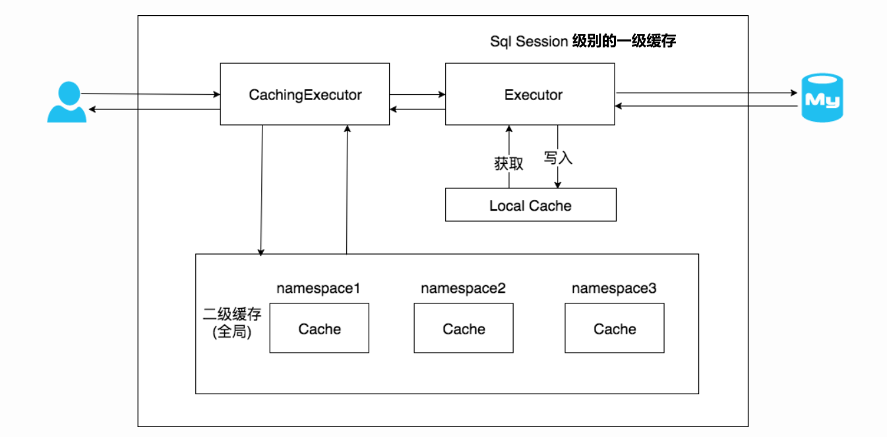
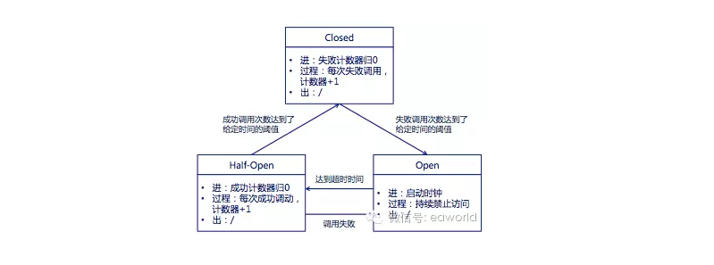
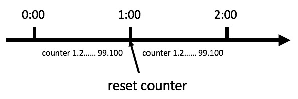
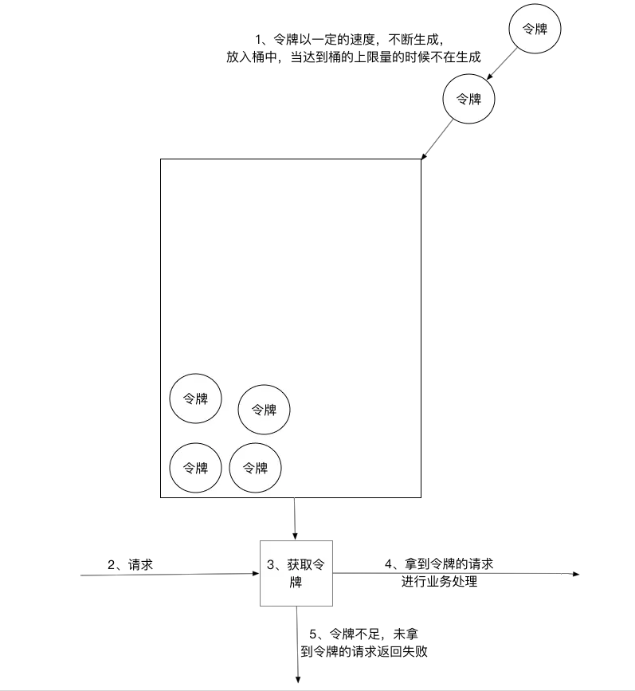
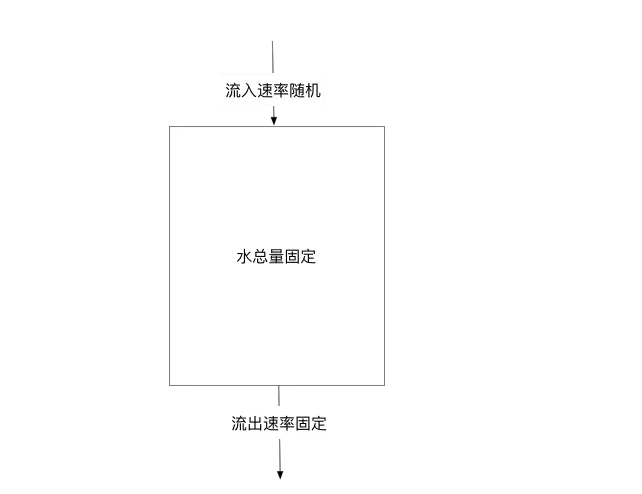

## spring的bean生命周期

Bean创建的生命周期：

>  class(UserService.class) --->推断构造方法 --->实例化---> 对象---> 属性填充(依赖注入) ---> [初始化afterPropertiesSet(), 需要实现接口InitializeBean]---> [AOP ---> 代理对象---> 属性填充]---> Bean对象

一般来说，上面实例化后的对象和最终拿到的Bean对象是同一个对象，但AOP除外。

这部分网上有很多文章都讲到了，下面的内容整理自：https://yemengying.com/2016/07/14/spring-bean-life-cycle/24 ，除了这篇文章，再推荐一篇很不错的文章 ：https://www.cnblogs.com/zrtqsk/p/3735273.html105 。

- Bean 容器找到配置文件中 Spring Bean 的定义。
- Bean 容器利用 Java Reflection API 创建一个Bean的实例。
- 如果涉及到一些属性值 利用 `set()`方法设置一些属性值。
- 如果 Bean 实现了 `BeanNameAware` 接口，调用 `setBeanName()`方法，传入Bean的名字。
- 如果 Bean 实现了 `BeanClassLoaderAware` 接口，调用 `setBeanClassLoader()`方法，传入 `ClassLoader`对象的实例。
- 如果Bean实现了 `BeanFactoryAware` 接口，调用 `setBeanClassLoader()`方法，传入 `ClassLoade` r对象的实例。
- 与上面的类似，如果实现了其他 `*.Aware`接口，就调用相应的方法。
- 如果有和加载这个 Bean 的 Spring 容器相关的 `BeanPostProcessor` 对象，执行`postProcessBeforeInitialization()` 方法
- 如果Bean实现了`InitializingBean`接口，执行`afterPropertiesSet()`方法。
- 如果 Bean 在配置文件中的定义包含 init-method 属性，执行指定的方法。
- 如果有和加载这个 Bean的 Spring 容器相关的 `BeanPostProcessor` 对象，执行`postProcessAfterInitialization()` 方法
- 当要销毁 Bean 的时候，如果 Bean 实现了 `DisposableBean` 接口，执行 `destroy()` 方法。
- 当要销毁 Bean 的时候，如果 Bean 在配置文件中的定义包含 destroy-method 属性，执行指定的方法。


## 循环依赖如何解决

①构造器的循环依赖：

这个Spring解决不了

②setter循环依赖

1. singleton作用域的依赖

   通过提前暴露的方式解决，spring实例化一个对象有如下三步：实例化、依赖注入、初始化。实例化完成之后就直接将此对象暴露出去了，哪怕依赖还没有完全暴露，

2. prototype作用域的依赖

   对于"prototype"作用域bean，Spring容器无法完成依赖注入，因为Spring容器不进行缓存"prototype"作用域的bean，因此无法提前暴露一个创建中的bean。

## 说说你对Spring的IOC机制的理解可以吗？

启动时会启动spring容器，其根据xml配置或者注解，去实例化各种bean对象，然后再根据xml配置或者注解去管理bean之间的依赖注入，对bean对象直接的引用关系去进行依赖注入，spring会将依赖的bean实例化并注入进去。

底层的核心技术是反射，他会通过反射的技术，直接根据你的类去构建对应的对象出来。

spring ioc将系统的类与类之间彻底的解耦合了。

```java
@Resource
private MyService myservice;

// 原来的类是：
@Service
MyServiceImpl implements MyService;

// 如果要改为一个新的NewServiceManagerImpl，在原来就需要改变大量的代码
// 使用了spring，则只需要改变注解配置，将新的类配置到spring容器中即可：
@Service
NewServiceManagerImpl implements MyService;
```

## 什么是AOP？

传统OOP是从上到下的开发，与OOP对比，AOP能处理一些横切性问题，这些横切性问题不会影响到主逻辑的实现，，但是会散落到代码的各个部分，难以维护。AOP就是把这些问题和主业务逻辑分开，达到与主业务逻辑解耦的目的。

其底层原理就是动态代理。

## Spring AOP 和 AspectJ AOP 有什么区别？

**Spring AOP 属于运行时增强，而 AspectJ 是编译时增强。** 

## 了解过cglib动态代理吗？他跟jdk动态代理的区别是什么

动态代理其实就是动态的创建一个代理类出来，创建这个代理类的实例对象，在这个里面引用你真正自己写的类，所有的方法的调用都是先走代理类的对象的方法，他负责做一些代码上的增强，再去调用你写的那个类。

spring里面使用aop，比如对一批类和他们的方法做了一个切面，定义好了要在这些类的方法里增强的代码，spring必然要对哪些类生成动态代理，在动态代理中去执行你定义的一些增强代码。

如果类是实现了某个接口的，则spring aop会使用jdk动态代理，生成一个跟你实现同一接口的一个代理类，构造一个实例对象出来，jdk动态代理其实是在类有接口的时候会来使用。

很多时候我们可能某个类是没有实现接口的，那spring aop会改用cglib来生成动态代理，会生成类的子类，他可以动态生成字节码，覆盖一些方法，在方法里面加入增强的代码。

1、如果目标对象实现了接口，默认情况下会采用JDK的动态代理实现AOP

2、如果目标对象实现了接口，可以强制使用CGLIB实现AOP 

3、如果目标对象没有实现了接口，必须采用CGLIB库，spring会自动在JDK动态代理和CGLIB之间转换

jdk动态代理的代码实例：

```java
public class JdkProxy implements InvocationHandler {
    /**
     * 需要代理的目标对象
     **/
    private Object target;
    
    @Override
    public Object invoke(Object proxy, Method method, Object[] args) throws Throwable {
        System.out.println("JDK动态代理，监听开始！");
        Object result = method.invoke(target, args);
        System.out.println("JDK动态代理，监听结束！");
        return result;
    }
    
    /**
     * 定义获取代理对象方法
     **/
    private Object getJDKProxy(Object targetObject){
        //为目标对象target赋值
        this.target = targetObject;
        //JDK动态代理只能针对实现了接口的类进行代理，newProxyInstance 函数所需参数就可看出
        return Proxy.newProxyInstance(targetObject.getClass().getClassLoader(),
                                      targetObject.getClass().getInterfaces(), this);
    }
    
    public static void main(String[] args) {
        JdkProxy jdkProxy = new JdkProxy();//实例化JDKProxy对象
        UserManager user = (UserManager) jdkProxy.getJDKProxy(new UserManagerImpl());//获取代理对象
        user.addUser("admin", "123123");//执行新增方法
    }
}
```

cglib动态代理代码示例：

```java
//Cglib动态代理，实现MethodInterceptor接口
public class CglibProxy implements MethodInterceptor {
    private Object target;//需要代理的目标对象
    
    //重写拦截方法
    @Override
    public Object intercept(Object obj, Method method, Object[] arr, MethodProxy proxy) throws Throwable {
        System.out.println("Cglib动态代理，监听开始！");
        Object invoke = method.invoke(target, arr);//方法执行，参数：target 目标对象 arr参数数组
        System.out.println("Cglib动态代理，监听结束！");
        return invoke;
    }
    
    //定义获取代理对象方法
    public Object getCglibProxy(Object objectTarget){
        //为目标对象target赋值
        this.target = objectTarget;
        Enhancer enhancer = new Enhancer();
        //设置父类,因为Cglib是针对指定的类生成一个子类，所以需要指定父类
        enhancer.setSuperclass(objectTarget.getClass());
        enhancer.setCallback(this);// 设置回调 
        Object result = enhancer.create();//创建并返回代理对象
        return result;
    }
    
    public static void main(String[] args) {
        CglibProxy cglib = new CglibProxy();//实例化CglibProxy对象
        UserManager user =  (UserManager) cglib.getCglibProxy(new UserManagerImpl());//获取代理对象
        user.delUser("admin");//执行删除方法
    }
    
}
```

### JDK动态代理和CGLIB字节码生成的区别是什么

 （1）JDK动态代理只能对实现了接口的类生成代理，而不能针对没有实现接口的类
 （2）CGLIB是针对类实现代理，主要是对指定的类生成一个子类，覆盖其中的方法
  因为是继承，所以该类或方法最好不要声明成final 

## 说说Spring中的Bean是不是线程安全的

spring里面的bean可以分为5个范围：

1. singleton：默认，每个容器中只有一个实例

2. prototype：为每一个bean请求提供一个实例

   **一般下面几种作用于都不会用：**

3. request：为每一个网络请求创建一个实例，请求完成后，bean会失效并被垃圾回收器回收

4. session：与request范围类似，确保每个session有一个bean的实例，在session过期后，bean会随之失效

5. global-session

答案是否定的，spring bean的**默认作用域singletom不是线程安全**的。

**但一般来说java web服务的bean中很少放一些实例变量，大部分情况是并发访问数据库、缓存这些组件，是无状态的，这时候并发访问也没问题。**

## Spring的事务实现原理是什么？能聊聊你对事务传播机制的理解吗？

### 实现原理

```java
@Transactional(propagation = Propagation.REQUIRED)
public void methodA() {
	methodB();
    // doSomthing
}

@Transactional(propagation = Propagation.REQUIRED)
public void methodA() {
    // doSomthing
}
```

### 传播机制

1. Required：如果当前有事务，则加入，没有则新建
2. Required_new：无论当前有没有事务，都新建一个事务来执行，原事务（有的话）会被挂起
3. nested：调用嵌套事务，外层加一个savepoint，自己出错会回滚外层代码到savepoint（也就是回滚子事务），外层继续执行
4. supports：有事务就加入事务，没有就以非事务方式执行
5. NOT_SUPPORTED：始终以非事务方式执行，原事务（有的话）会被挂起
6. MANDATORY：有则加入，没有就抛异常
7. never：不使用事务，有的话抛异常

## 说说Spring Boot的核心架构

spring boot内嵌一个tomcat服务器，可以直接把写好的java web系统给启动起来，直接运行一个main方法，就可以直接把tomcat服务器跑起来，把我们的代码运行起来。

**自动装配**，比如说可以引入mybatis，其实主要引入一个starter依赖，就可以将组件装入系统，后续很多配置和定义的一些繁琐的工作就可以免去了，自动装配的功能可以自动把一些事情搞定，就不需要程序员去做了。

就比如xml文件和dao类的对应关系，在之前是需要使用xml文件来配置的，现在只需要注解。

### spring家族中组件的关系

Spring Framework：Spring Framework是一个一站式的轻量级的java开发框架，核心是控制反转（IoC）和面向切面（AOP），针对于开发的WEB层(springMVC)、业务层(IoC)、持久层(jdbcTemplate)等都提供了多种配置解决方案。

Spring Boot为快速启动且最小化配置的spring应用而设计，并且它具有用于构建生产级别应用的一套固化的视图。

> **`Spring Boot`中的一些特征：**
>
> - 创建独立的`Spring`应用。
> - 嵌入式`Tomcat`、`Jetty`、 `Undertow`容器（无需部署war文件）。
> - 提供的`starters` 简化构建配置
> - 尽可能自动配置`spring`应用。
> - 提供生产指标,例如指标、健壮检查和外部化配置
> - 完全没有代码生成和`XML`配置要求

Spring Cloud事实上是一整套**基于Spring Boot的微服务解决方案**。它为开发者提供了很多工具，用于快速构建分布式系统的一些通用模式，例如：配置管理、注册中心、服务发现、限流、网关、链路追踪等。

## spring bean的生命周期

1. 实例化bean：如果要使用一个bean的话，会去实例化

2. 设置对象属性（依赖注入）：需要去看看你的这个bean依赖了什么bean，把依赖的bean也创建出来，进行一个注入，比如说通过构造函数，setter

3. 处理Aware接口：接着，spring会查看是否实现了XXXAware接口。

   如果这个bean实现了ApplicationContextAware接口，spring容器就会调用我们的bean的setApplicationContext(ApplicationContext)方法，传入Spring上下文，把Spring容器传递给这个bean

4. BeanPostProcessor：

   如果想在bean实例构建好了之后，此时在这个时间，我们想要对Bean进行一些自定义的处理，可以让Bean实现BeanPostProcessor接口，那将会调用postProcessBeforeInitialization(Object obj, String s)方法。

5. InitializingBeanBean和init-method：

   如果bean在spring配置文件中配置了init-method属性，则会自动调用其配置的初始化方法

6. BeanPostProcessor：

   如果bean实现了BeanPostProcessor接口，将会调用postProcessAfterInitialization(Object obj, String s)方法。由于这个方法是在Bean初始化结束时调用的，所以可以被应用于内存或者缓存技术。

   经过上面几个步骤，Bean就已经被正确创建了，之后就可以使用这个Bean了。

7. DisposableBean

   当Bean不再需要时，会经过清理阶段，如果Bean实现了DisposableBean这个接口，会调用其实现的destroy()方法。

8. destroy-method

   最后，如果这个Bean的Spring配置中配置了destroy-method属性，会自动调用其装配的销毁方法。

## 能说说Spring中都使用了哪些设计模式吗？

### 工厂模式

spring ioc核心的设计模式的思想体现，他自己就是一个大工厂，把所有的bean实例都放在了spring容器里（大工厂），如果你要使用bean，去找spring容器就可以了，自己就不用创建对象了。

### 单例模式

spring默认来说，对每个bean走的都是一个单例模式，确保每个类在系统运行期间只有一个实例对象，只有一个bean。

### 代理模式

如果要对一些类的方法切入一些增强的代码，会创建一些动态代理的对象，让你对那些目标对象的访问，先经过动态代理对象，动态代理对象先做一些增强的代码，调用你的目标对象。

## Mybatis二级缓存机制

### 一级缓存

1. MyBatis一级缓存的生命周期和SqlSession一致。
2. MyBatis一级缓存内部设计简单，只是一个没有容量限定的HashMap，在缓存的功能性上有所欠缺。
3. MyBatis的一级缓存最大范围是SqlSession内部，有多个SqlSession或者分布式的环境下，数据库写操作会引起脏数据，建议设定缓存级别为Statement。



### 二级缓存

1. MyBatis的二级缓存相对于一级缓存来说，实现了`SqlSession`之间缓存数据的共享，同时粒度更加的细，能够到`namespace`级别，通过Cache接口实现类不同的组合，对Cache的可控性也更强。
2. MyBatis在多表查询时，极大可能会出现脏数据，有设计上的缺陷，安全使用二级缓存的条件比较苛刻。
3. 在分布式环境下，由于默认的MyBatis Cache实现都是基于本地的，分布式环境下必然会出现读取到脏数据，需要使用集中式缓存将MyBatis的Cache接口实现，有一定的开发成本，直接使用Redis、Memcached等分布式缓存可能成本更低，安全性也更高。

## springcloud中组件以及原理

### 熔断器Hystrix

> 参考链接：https://www.cnblogs.com/yawen/p/6655352.html

#### 一、问题产生

雪崩效应：是一种因服务提供者的不可用导致服务调用者的不可用,并将不可用逐渐放大的过程

形成过程：

1. 服务提供者不可用   

​           a）硬件故障：硬件损坏造成的服务器主机宕机, 网络硬件故障造成的服务提供者的不可访问

​           b）程序Bug

​           c)  缓存击穿：缓存击穿一般发生在缓存应用重启, 所有缓存被清空时,以及短时间内大量缓存失效时. 大量的缓存不命中, 使请求直击后端,造成服务提供者超负荷运行,引起服务不可用

​           d）用户大量请求：在秒杀和大促开始前,如果准备不充分,用户发起大量请求也会造成服务提供者的不可用

2. 重试加大流量

​           a）用户重试：在服务提供者不可用后, 用户由于忍受不了界面上长时间的等待,而不断刷新页面甚至提交表单

​           b）代码逻辑重试: 服务调用端的会存在大量服务异常后的重试逻辑

3. 服务调用者不可用

同步等待造成的资源耗尽：当服务调用者使用同步调用 时, 会产生大量的等待线程占用系统资源. 一旦线程资源被耗尽,服务调用者提供的服务也将处于不可用状态, 于是服务雪崩效应产生了。

#### 二、概念

1. **服务熔断**：
    一般是指软件系统中，由于某些原因使得服务出现了过载现象，为防止造成整个系统故障，从而采用的一种保护措施，所以很多地方把熔断亦称为过载保护。很多时候刚开始可能只是系统出现了局部的、小规模的故障，然而由于种种原因，故障影响的范围越来越大，最终导致了全局性的后果。
   **适用场景**：防止应用程序直接调用那些很可能会调用失败的远程服务或共享资源
2. **服务降级**:
        当服务器压力剧增的情况下，根据当前业务情况及流量对一些服务和页面有策略的降级，以此释放服务器资源以保证核心任务的正常运行。

#### 三、工作原理

Hystrix 是一个帮助解决分布式系统交互时超时处理和容错的类库, 它同样拥有保护系统的能力。Netflix的众多开源项目之一。

##### **隔离**

Hystrix隔离方式采用线程/信号的方式，通过隔离限制依赖的并发量和阻塞扩散

1. 线程隔离

Hystrix在用户请求和服务之间加入了线程池。

Hystrix为每个依赖调用分配一个小的线程池，**如果线程池已满调用将被立即拒绝，默认不采用排队.加速失败判定时间。**线程数是可以被设定的。

**原理：**用户的请求将不再直接访问服务，而是通过线程池中的空闲线程来访问服务，如果线程池已满，则会进行降级处理，用户的请求不会被阻塞，至少可以看到一个执行结果（例如返回友好的提示信息），而不是无休止的等待或者看到系统崩溃。

2. 信号隔离：

信号隔离也可以用于限制并发访问，防止阻塞扩散, 与线程隔离最大不同在于执行依赖代码的线程依然是请求线程（该线程需要通过信号申请, 如果客户端是可信的且可以快速返回，可以使用信号隔离替换线程隔离,降低开销。而且信号量的大小可以动态调整, 线程池大小不可以。


##### **熔断**

如果某个目标服务调用慢或者有大量超时，此时，熔断该服务的调用，对于后续调用请求，不在继续调用目标服务，直接返回，快速释放资源。如果目标服务情况好转则恢复调用。

**熔断器:Circuit Breaker**

熔断器是位于线程池之前的组件。用户请求某一服务之后，Hystrix会先经过熔断器，此时如果熔断器的状态是打开（跳起），则说明已经熔断，这时将直接进行降级处理，不会继续将请求发到线程池**。**熔断器相当于在线程池之前的一层屏障。每个熔断器默认维护10个bucket ，每秒创建一个bucket ，每个blucket记录成功,失败,超时,拒绝的次数。当有新的bucket被创建时，最旧的bucket会被抛弃。



- Closed：熔断器关闭状态，调用失败次数积累，到了阈值（或一定比例）则启动熔断机制；
- Open：熔断器打开状态，此时对下游的调用都内部直接返回错误，不走网络，但设计了一个时钟选项，默认的时钟达到了一定时间（这个时间一般设置成平均故障处理时间，也就是MTTR），到了这个时间，进入半熔断状态；
- Half-Open：半熔断状态，允许定量的服务请求，如果调用都成功（或一定比例）则认为恢复了，关闭熔断器，否则认为还没好，又回到熔断器打开状态； 

## 限流算法

1. 计数器算法

   计数器算法是限流算法里最简单也是最容易实现的一种算法。

   比如我们规定，对于A接口来说，我们1分钟的访问次数不能超过100个。

   那么我们可以这么做：

   在一开始的时候，我们可以设置一个计数器counter

   每当一个请求过来的时候，counter就加1，如果counter的值大于100并且该请求与第一个 请求的间隔时间还在1分钟之内，那么说明请求数过多；

   如果该请求与第一个请求的间隔时间大于1分钟，且counter的值还在限流范围内，那么就重置 counter

   具体算法的示意图如下：

   

2. 计数器+滑动窗口算法

3. 令牌桶算法

   令牌桶算法是比较常见的限流算法之一，大概描述如下：
   1）、所有的请求在处理之前都需要拿到一个可用的令牌才会被处理；
   2）、根据限流大小，设置按照一定的速率往桶里添加令牌；
   3）、桶设置最大的放置令牌限制，当桶满时、新添加的令牌就被丢弃或者拒绝；
   4）、请求达到后首先要获取令牌桶中的令牌，拿着令牌才可以进行其他的业务逻辑，处理完业务逻辑之后，将令牌直接删除；
   5）、令牌桶有最低限额，当桶中的令牌达到最低限额的时候，请求处理完之后将不会删除令牌，以此保证足够的限流；

   

4. 漏桶算法

   漏桶算法其实很简单，可以粗略的认为就是注水漏水过程，往桶中以一定速率流出水，以任意速率流入水，当水超过桶流量则丢弃，因为桶容量是不变的，保证了整体的速率。

   
