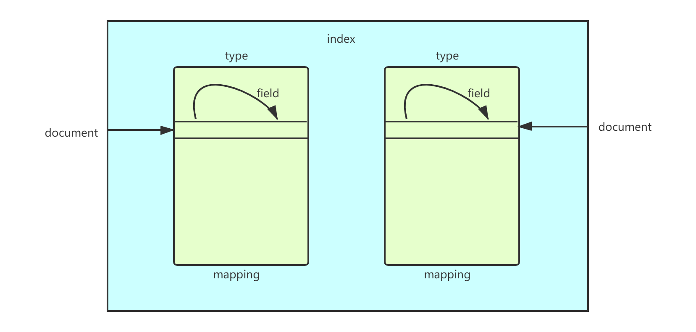
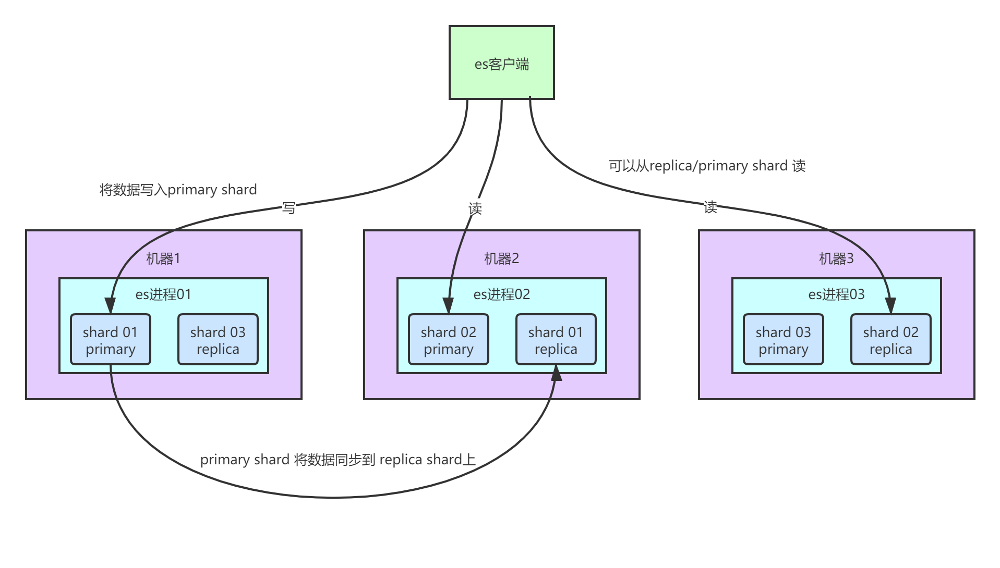
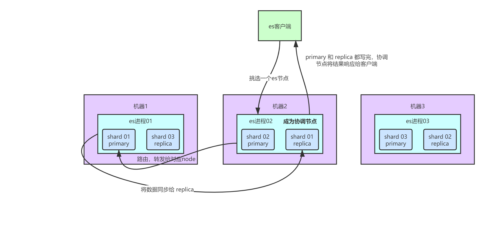
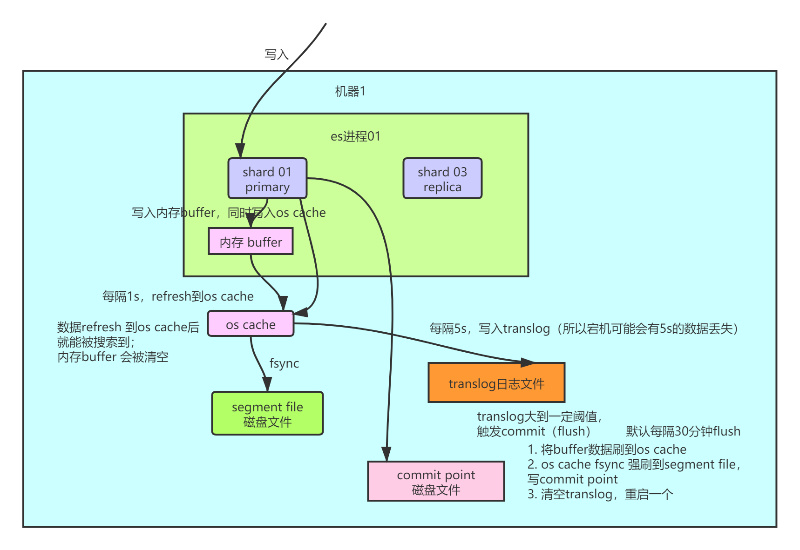

业内目前来说分布式搜索引擎事实上的一个标准就是elasticsearch。

## 底层的Lucene介绍一下，倒排索引介绍一下

生活中的数据分为结构化数据和非结构化数据。

- 结构化数据：具有固定格式或有限长度的数据，如数据库，元数据等。
- 非结构化数据：不定长或无固定格式的数据，如邮件，word文档等磁盘上的文件

而非结构化数据又有两种查询方法：

1. 顺序扫描法(Serial Scanning)

　　所谓顺序扫描，比如要找内容包含某一个字符串的文件，就是一个文档一个文档的看，对于每一个文档，从头看到尾，如果此文档包含此字符串，则此文档为我们要找的文件，接着看下一个文件，直到扫描完所有的文件。如利用windows的搜索也可以搜索文件内容，只是相当的慢。

2. 全文检索(Full-text Search)

　　将非结构化数据中的一部分信息提取出来，重新组织，使其变得有一定结构，然后对此有一定结构的数据进行搜索，从而达到搜索相对较快的目的。这部分从非结构化数据中提取出的然后重新组织的信息，我们称之**索引**。

**先建立索引，再对索引进行搜索的过程就叫全文检索(Full-text Search)。**

### **Lucene的简单介绍**

Lucene是apache下的一个开放源代码的全文检索引擎工具包。提供了完整的查询引擎和索引引擎，部分文本分析引擎。Lucene的目的是为软件开发人员提供一个简单易用的工具包，以方便的在目标系统中实现**全文检索**的功能。

### **Lucene的应用场景**

对于数据量大、数据结构不固定的数据可采用全文检索方式搜索，比如百度、Google等搜索引擎、论坛站内搜索、电商网站站内搜索等。

### Lucene的底层原理

**倒排索引**

在搜索引擎中，每个文档都有一个对应的文档 ID，文档内容被表示为一系列关键词的集合。例如，文档 1 经过分词，提取了 20 个关键词，每个关键词都会记录它在文档中出现的次数和出现位置。

那么，倒排索引就是**关键词到文档ID**  的映射，每个关键词都对应着一系列的文件，这些文件中都出现了关键词。

举个栗子。

有以下文档：

| DocId | Doc                                            |
| ----- | ---------------------------------------------- |
| 1     | 谷歌地图之父跳槽 Facebook                      |
| 2     | 谷歌地图之父加盟 Facebook                      |
| 3     | 谷歌地图创始人拉斯离开谷歌加盟 Facebook        |
| 4     | 谷歌地图之父跳槽 Facebook 与 Wave 项目取消有关 |
| 5     | 谷歌地图之父拉斯加盟社交网站 Facebook          |

对文档进行分词之后，得到以下**倒排索引**。

| WordId | Word     | DocIds    |
| ------ | -------- | --------- |
| 1      | 谷歌     | 1,2,3,4,5 |
| 2      | 地图     | 1,2,3,4,5 |
| 3      | 之父     | 1,2,4,5   |
| 4      | 跳槽     | 1,4       |
| 5      | Facebook | 1,2,3,4,5 |
| 6      | 加盟     | 2,3,5     |
| 7      | 创始人   | 3         |
| 8      | 拉斯     | 3,5       |
| 9      | 离开     | 3         |
| 10     | 与       | 4         |
| ..     | ..       | ..        |

另外，实用的倒排索引还可以记录更多的信息，比如文档频率信息，表示在文档集合中有多少个文档包含某个单词。

那么，有了倒排索引，搜索引擎可以很方便地响应用户的查询。比如用户输入查询 `Facebook`，搜索系统查找倒排索引，从中读出包含这个单词的文档，这些文档就是提供给用户的搜索结果。

要注意倒排索引的两个重要细节：

- 倒排索引中的所有词项对应一个或多个文档；
- 倒排索引中的词项**根据字典顺序升序排列**

> 上面只是一个简单的栗子，并没有严格按照字典顺序升序排列。

### Lucene的执行原理


## es的分布式架构原理能说一下吗？（es是如何实现分布式的）

核心思想是在多台机器上启动多个es进程，组成了一个es集群。

es中存储数据的基本单位是索引，一个索引差不多是相当于MySQL里面的一张表，index -> type -> mapping -> document -> field.

- index：MySQL里面的一张表

- type：没法跟MySQL里去对比，一个index里面可以有多个type，每个type的字段都是差不多的，但是有一些略微的差别。

>  好比说，有一个index，是订单index，里面专门是放订单数据的。就好比说你在MySQL中建表，有些订单是实物商品的订单，就好比说一件衣服，一双鞋子；有些订单是虚拟商品的订单，就好比说游戏点卡、话费充值。就两种订单大部分字段是一样的，但是少部分字段可能有略微的一些差别。

- 每个type有一个mapping，如果认为一个type是一个具体的表，而index代表多个type的共同类型，**mapping就是这个type的表结构定义**，定义了type中每个字段的名称，字段是什么类型的，然后还要这个字段的各种配置。

- 实际上往index里的一个type里面写的**一条数据叫做一个document**，一条document就代表了MySQL中某个表里面的一行，每个document有多个field，**每个field就代表了这个document中的一个字段的值**。



接着搞一个索引，这个索引可以拆分成多个shard，每个shard存储部分数据。

> 拆分为多个shard的好处：
>
> 1. **支持横向扩展**：原来数据量3T，分为了3个shard，每个shard就1T的数据。若现在数据量增大到4T，则只需要重新建一个有4个shard的索引然后将数据导进去即可。
> 2. 提高性能：数据分布在多个shard -> 多个机器上，所有操作就可以在多台机器上并行执行了，提高了吞吐量和性能。

shard的数据实际上有多个备份，每个shard都有一个`primary shard`，负责写入数据，除此之外还有几个`replica shard`。`primary shard`写入数据之后，会将数据同步到其他几个`replica shard`上去。



通过这个replica的方案，每个shard的数据都有多个备份，如果某个机器宕机了是没关系的，还是有别的数据副本在别的机器上的。**达到了高可用的目的。**

es集群的多个节点，会自动选举出一个master节点，其职责有：维护索引元数据，负责切换primary、replica shard身份等。

如果master节点宕机了，那么会重新选举一个master节点。

如果非master节点宕机了：

- 将宕机节点中primary shard的身份转移到其他的replica shard
- 修复好节点重启后，master节点会控制将缺失的replica shard分配过去，同步后续修改的数据，让集群恢复正常。

## 分布式搜索引擎写入和查询的工作流程是什么样的？

### es写数据过程

1. 客户端会选择一个node发请求过去，此时这个node就被称为coordinating node（协调节点）
2. 协调节点对请求的document进行路由，将请求转发给对应node（保存primary shard的节点）
3. 实际的node上的primary node进行请求处理，然后将数据同步到所有的replica node
4. 当协调节点发现primary node和所有replica node都操作完成之后，返回响应结果给客户端。



### es读取数据过程

读取操作即为通过doc id进行数据查询

1. 客户端将doc id传给任意一个node节点，此节点称为coordinating node（协调节点）。
2. 协调节点收到请求后，对doc id进行路由，将请求转发到对应的node，此处会使用`round-robin`随机轮询算法，在primary node 和所有 replica node 之间随机选择一个进行读请求的负载均衡。
3. 接受请求的node返回对应的document给协调节点。
4. 协调节点将document返回给客户端。

### es搜索数据的过程

es最强大的是全文检索，比如有如下三条数据：

> java真好玩啊
>
> java真难学啊
>
> j2ee特别牛

此时如果根据`java`关键字来搜索，则会将包含java的document全部搜索出来并返回前两条数据。

1. 客户端发送请求给一个node，此时此node变为协调节点（coordinating node）
2. 协调节点将搜索请求转发到所有的shard对应的primary shard或者replica shard（任何一种shard都可以接收读请求）

3. query phase： 每个shard将自己的搜索结果（其实就是一些doc id）返回给协调节点，由协调节点进行数据的合并、排序、分页等操作，并最终产出结果
4. fetch phase：接着由协调节点根据doc id去各个节点拉取实际的document数据，最终返回给客户端。

> 写请求是写入 primary shard，然后同步给所有的 replica shard；读请求可以从 primary shard 或 replica shard 读取，采用的是随机轮询算法。

### 写数据的底层原理



#### primary shard收到写请求之后会进行如下步骤：

1. 将数据写入内存buffer，此时在buffer中的数据是搜索不到的。同时将数据写入到translog中。

2. 执行refresh操作：当[`buffer快满了`]/[`每隔1s`]，会将buffer中的数据写入到segment file中，然后清空buffer，此时数据在客户端就可以被搜索到了。除此之外，每秒钟都会生成一个新的segment file，这个segment file就存储最近1s内buffer中写入的数据。

   > 上面写入translog、segment file文件的操作，不是直接写入文件的，而是先将数据写入一个叫os cache的区域，即操作系统缓存。

   > 为什么es为准实时（NRT全程near real-time）的呢？因为es默认是每隔1s将数据写入到segment file的，所以写入数据一秒钟之后才可以被看到。当然了，此处可以通过es的restful api或者java api手动执行一次refresh操作，将数据从buffer中移到os cache中，此时就可以直接读到数据了。

3. 重复上面的步骤，新的数据不断进入segment file和translog中，每次refresh完成之后，buffer会被清空，而translog则会不断膨胀，当translog达到一定大小时/每隔30min，会触发下面的commit(flush)操作。

   > 此处的commit操作，也可以通过api进行触发

4. commit/flush操作：
   1. 执行refresh操作，将buffer中数据写入到os cache中，清空buffer
   2. 执行fsyn操作，将os cache中的数据强行刷到磁盘上去
   3. 将一个commit point写入磁盘文件，里面标识着这个commit point所对应的所有segment file
   4. 清空现有translog日志文件，重启一个translog，此时commit操作完成。

#### translog 日志文件的作用是什么？

你执行 commit 操作之前，数据要么是停留在 buffer 中，要么是停留在 os cache 中，无论是 buffer 还是 os cache 都是内存，一旦这台机器死了，内存中的数据就全丢了。所以需要将数据对应的操作写入一个专门的日志文件 `translog` 中，一旦此时机器宕机，再次重启的时候，es 会自动读取 translog 日志文件中的数据，恢复到内存 buffer 和 os cache 中去。

translog 其实也是先写入 os cache 的，默认每隔 5 秒刷一次到磁盘中去，所以默认情况下，可能有 5 秒的数据会仅仅停留在 buffer 或者 translog 文件的 os cache 中，如果此时机器挂了，会**丢失** 5 秒钟的数据。但是这样性能比较好，最多丢 5 秒的数据。也可以将 translog 设置成每次写操作必须是直接 `fsync` 到磁盘，但是性能会差很多。

#### 总结

数据先被写入到内存buffer，然后每隔1s，将数据refresh到os cache，到了os cache后，数据就能被搜索到（所以我们才说es是准实时的，中间有1s的延迟）。每隔5s，将数据写入translog（这样如果机器宕机，内存数据全部小时，最多会有5s的数据丢失），translog大到一定程度，或者默认每隔30min，会触发commit操作，将缓冲区的数据都flush到segment file磁盘文件中。

> 数据写入到segment时，就同时建立好了倒排索引。

### 删除、更新数据的底层原理

#### 删除操作

commit时会生成一个.del文件，里面将某个doc标识为deleted状态，那么搜索的时候根据这个.del文件就可以知道这个doc是否被删除了。

#### 更新操作

将原来的doc标识为删除，然后新写入一条数据。

#### merge操作

buffer 每 refresh 一次，就会产生一个 `segment file`，所以默认情况下是 1 秒钟一个 `segment file`，这样下来 `segment file` 会越来越多，此时会定期执行 merge：

merge 的时候，会将多个 `segment file` 合并成一个，同时这里会将标识为 `deleted` 的 doc 给**物理删除掉**，然后将新的 `segment file` 写入磁盘，这里会写一个 `commit point`，标识所有新的 `segment file`，然后打开 `segment file` 供搜索使用，同时删除旧的 `segment file`。

#### 归并策略

归并线程是按照一定的运行策略来挑选 segment 进行归并的。主要有以下几条：

- index.merge.policy.floor_segment 默认 2MB，小于这个大小的 segment，优先被归并。
- index.merge.policy.max_merge_at_once 默认一次最多归并 10 个 segment
- index.merge.policy.max_merge_at_once_explicit 默认 forcemerge 时一次最多归并 30 个 segment。
- index.merge.policy.max_merged_segment 默认 5 GB，大于这个大小的 segment，不用参与归并。forcemerge 除外。

根据这段策略，其实我们也可以从另一个角度考虑如何减少 segment 归并的消耗以及提高响应的办法：加大 flush 间隔，尽量让每次新生成的 segment 本身大小就比较大。

#### forcemerge 接口

既然默认的最大 segment 大小是 5GB。那么一个比较庞大的数据索引，就必然会有为数不少的 segment 永远存在，这对文件句柄，内存等资源都是极大的浪费。但是由于归并任务太消耗资源，所以一般不太选择加大 `index.merge.policy.max_merged_segment` 配置，而是在负载较低的时间段，通过 forcemerge 接口，强制归并 segment。

```
# curl -XPOST http://127.0.0.1:9200/logstash-2015-06.10/_forcemerge?max_num_segments=1
```

由于 forcemerge 线程对资源的消耗比普通的归并线程大得多，所以，绝对不建议对还在写入数据的热索引执行这个操作。

## 分布式搜索引擎在几十亿数据量级的场景下如何优化查询性能？

在海量数据的场景下，如何提升es的搜索性能呢

### 性能优化的杀手锏——filesystem cache（os cache）

针对的是os cache，操作系统的缓存，这个是对es性能影响最大的

es的搜索引擎严重依赖于操作系统级别的filesystem cache，如果可以给filesystem cache更多的内存，尽量让内存可以容纳更多的index segment file，是走纯内存的，那么一般来说性能会比走磁盘要搞一个数量级，基本上就是毫秒级的，从几毫秒到几百毫秒不等。

归根结底，如果想让es的性能最好，最佳的情况下，就是你的机器内存，至少可以容纳你的总数据量的一半。

因此，就实践经验来说，最好是仅仅在es中存储少量的数据，就是你要用来搜索的那些索引。

比如有一行数据：

id name age ... 30个字段

但是搜索时只需要根据id、name、age三个字段来搜索，如果傻乎乎的往es中写入一行数据的所有字段，那无用数据会占用大量的filesystem cache。因此仅仅写入三个要用来搜索的字段即可。然你可以把其他的字段数据存在 mysql/hbase 里，一般是建议用 `es + hbase` 这么一个架构。

hbase 的特点是**适用于海量数据的在线存储**，就是对 hbase 可以写入海量数据，但是不要做复杂的搜索，做很简单的一些根据 id 或者范围进行查询的这么一个操作就可以了。从 es 中根据 name 和 age 去搜索，拿到的结果可能就 20 个 `doc id`，然后根据 `doc id` 到 hbase 里去查询每个 `doc id` 对应的**完整的数据**，给查出来，再返回给前端。

写入 es 的数据最好小于等于，或者是略微大于 es 的 filesystem cache 的内存容量。然后你从 es 检索可能就花费 20ms，然后再根据 es 返回的 id 去 hbase 里查询，查 20 条数据，可能也就耗费个 30ms，可能你原来那么玩儿，1T 数据都放 es，会每次查询都是 5~10s，现在可能性能就会很高，每次查询就是 50ms。

### 数据预热

如果数据确实很大，es集群中每个机器写入的数据量还是超过了filesystem cache一倍。

那对于哪些觉得比较热的、经常会有人访问的数据，可以做一个专门的缓存预热子系统，每隔一段时间就去请求一遍那些比较热的数据。这样就可以提前将数据加载到filesystem cache。

### 冷热分离

es可以做类似于MySQL的水平拆分，就是说将大量的访问很少、频率很低的数据，单独写一个索引，然后将访问很平的热数据单独写一个索引。最好是将**冷数据写入一个索引中，然后热数据写入另外一个索引中**，这样可以确保热数据在被预热之后，尽量都让他们留在 `filesystem os cache` 里，**别让冷数据给冲刷掉**。

### document模型设计

MySQL中有两张表

订单表：id order_code price_count

1 测试订单 5000

订单条目表：id order_id goods_id purchase_count

1 1 1 2 2000

2 1 2 5 200

在MySQL里，是这样查询的：

```sql
select * from order join order_item on order_id = item.order_id where order_id = 1

1 测试订单 5000 1 1 1 2 2000

1 测试订单 5000 2 1 2 5 200
```

但是在es中应该尽量少用复杂的关联查询，一旦用了，性能一般都不太好。

因此，尽量在写入es的java系统里，就完成关联，将关联好的数据直接写入es中，搜索的时候就不需要利用es的搜索语法来进行数据筛选了。

### 分页性能优化

 es的分页是比较坑的，下面举一个例子：

如果每页10条数据，现在要查询第100页，实际上es会把每个shard上存储的前1000条数据都查到一个协调节点上，如果有5个shard，那就会有5000条数据被传到协调节点。接着协调节点会对这5000条数据进行一些合并、处理，在获取到最终第100页的10条数据。

因为es是分布式的，如果要查第100页的10条数据，不可能从5个shard上每个shard就查询2条数据然后返回10条，这个逻辑是错的。必须要在每个shard上都拿出来1000条数据然后进行排序、筛选等操作然后再次分页拿到第100页的数据。

因此翻页时查的越深，每个shard返回的数据就会越多，而且协调节点处理的时间就会越长。所以用es来分页的话，会发现越往后翻越慢。

针对这个问题：

1. 不允许深度分页/默认深度分页性能很差

   系统不允许翻页很深，对产品经理直接说说翻得越深，则性能越差。

2. 类似于app里的推荐商品一样，不断下拉处理一页一页的

   类似于微博中，下拉刷微博，刷出来一页一页的，可以用scroll api，自己百度。。

scroll 会一次性生成**所有数据的一个快照**，每次滑动向后翻页就是通过**游标** `scroll_id` 移动，获取下一页下一页这样子，性能会比上面说的那种分页性能要高很多很多，基本上都是毫秒级的。

但是，唯一的一点就是，这个适合于那种类似微博下拉翻页的，**不能随意跳到任何一页的场景**。也就是说，你不能先进入第 10 页，然后去第 120 页，然后又回到第 58 页，不能跳到随机页。所以现在很多产品，都是不允许你随意翻页的，app，也有一些网站，做的就是你只能往下拉，一页一页的翻。
初始化时必须指定 `scroll` 参数，告诉 es 要保存此次搜索的上下文多长时间。你需要确保用户不会持续不断翻页翻几个小时，否则可能因为超时而失败。

除了用 `scroll api`，你也可以用 `search_after` 来做，`search_after` 的思想是使用前一页的结果来帮助检索下一页的数据，显然，这种方式也不允许你随意翻页，你只能一页页往后翻。初始化时，需要使用一个唯一值的字段作为 sort 字段。

## 你们公司生产环境的分布式部署搜索引擎是怎么部署的呢？

1. es 生产集群我们部署了 5 台机器，每台机器是 6 核 64G 的，集群总内存是 320G。
2. 我们 es 集群的日增量数据大概是 2000 万条，每天日增量数据大概是 500MB，每月增量数据大概是 6 亿，15G。目前系统已经运行了几个月，现在 es 集群里数据总量大概是 100G 左右。
3. 目前线上有 5 个索引（这个结合你们自己业务来，看看自己有哪些数据可以放 es 的），每个索引的数据量大概是 20G，所以这个数据量之内，我们每个索引分配的是 8 个 shard，比默认的 5 个 shard 多了 3 个 shard。


