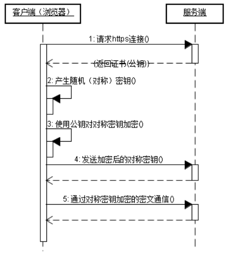
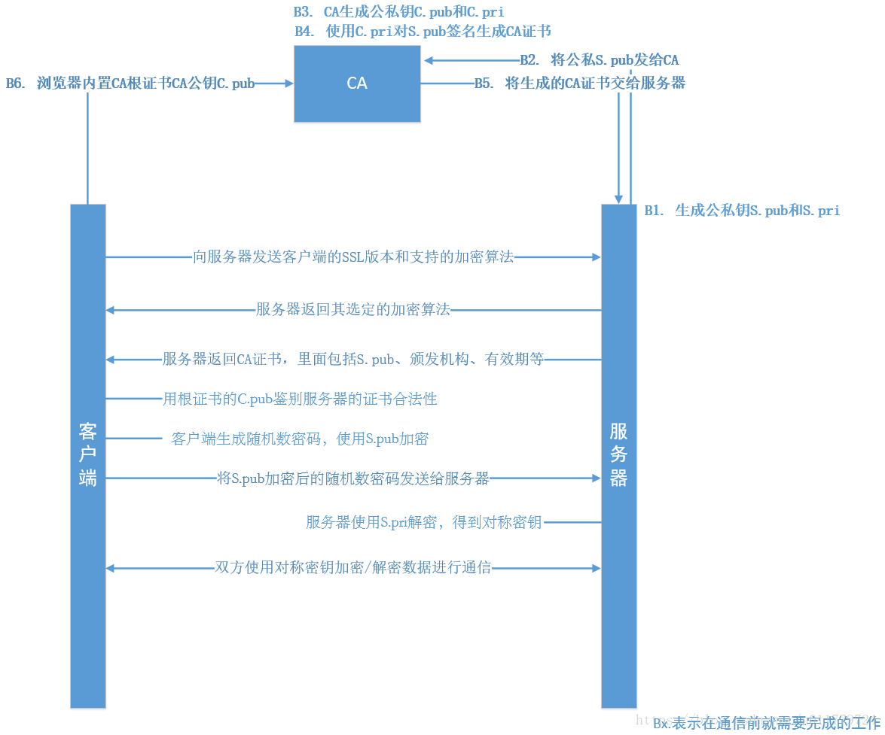
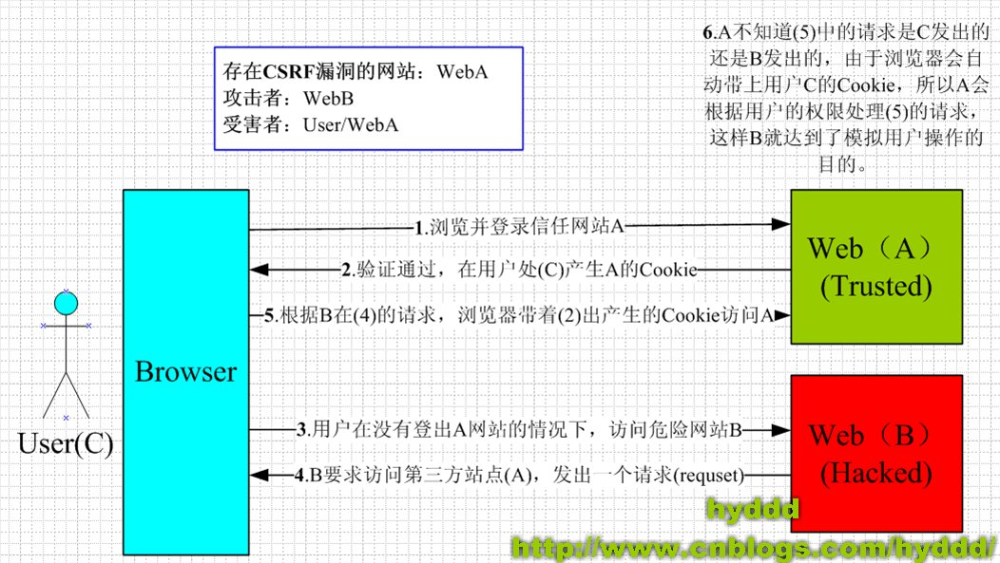
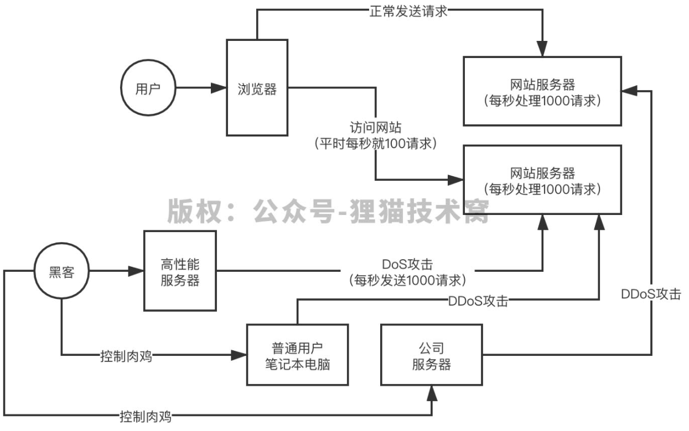

# 将URL输入到浏览器上并敲回车后到浏览器显示内容，一共经历了哪些内容
1. 域名解析
    1. 浏览器搜索自己的DNS缓存，缓存中维护了一张域名与IP地址对应的表。
    2. 如果在DNS缓存中没有查到，则去操作系统的DNS缓存中查找
    3. 如果依然没有，则将域名发送至本地域名服务器（递归查询方式），本地域名服务器查询自己的DNS缓存
    4. 如果没有，则本地域名服务器会向后继续递归查找
        1. 向根域名服务器发送请求，根域名服务器返回.com域的顶级域名服务器地址
        2. 向.com域的域名服务器发送请求，返回权威域名服务器的服务器地址
        3. 向权威域名服务器地址发送请求，得到IP地址
    5. 本地域名服务器将IP地址发送到操作系统并将其缓存下来
    6. 操作系统将IP地址发送到浏览器并将其缓存下来
    7. 浏览器拿到IP地址
2. 浏览器发送HTTP请求
3. **传输层**：选择发送协议，UDP还是TCP。TCP是可靠的面向连接的传输协议，对HTTP请求进行封装，加入了端口号等信息；而UDP则不是面向连接的，
4. **网络层**：通过IP协议将IP地址封装为IP数据报；然后会用到ARP协议（Address Resolution Protocol，即地址解析协议），主机将包含有目标IP地址的IP数据报全网广播，并接收返回信息，确定目标的物理地址，获得目标地址的MAC地址
5. **数据链路层**：把网络层交下来的IP数据报添加首位封装为MAC帧，根据目的MAC地址来建立TCP连接，三次握手确定之后，接收端在拿到物理层上交的比特流之后，根据首尾标记，识别帧的开始和结束，将中间的数据上交到网络层，然后层层向上传递到应用层
6. 服务端响应请求并请求客户端请求的数据，传回客户端
7. 断开TCP连接，浏览器开始渲染页面呈现给用户


### 各DNS服务器的含义
比如 segmentfault.com

「浏览器」查询浏览器缓存和系统缓存>>有缓存则返回结果（完毕）

「浏览器」没有缓存>>

「浏览器」向「递归DNS服务器」查询>>

「递归DNS服务器」查询缓存>>有缓存则返回结果（完毕）

「递归DNS服务器」没有缓存>>

「递归DNS服务器」向「根服务器」查询「.com的权威DNS服务器」的地址>>

「递归DNS服务器」向「.com的权威DNS服务器」查询「segmentfault.com所使用的权威DNS服务器」的地址>>

「递归DNS服务器」向「segmentfault.com所使用的权威DNS服务器」查询解析获得DNS记录并缓存>>

「递归DNS服务器」向「浏览器」返回结果（完毕）

---------

「递归DNS服务器」就是公众DNS服务器，你在电脑或路由器设置的，比如运营商的DNS服务器或者114DNS服务器这种。

「根服务器」就是大名鼎鼎的13个根服务器那个。

「.com的权威DNS服务器」就是记录各个.com的域名所使用的「网站所使用的权威DNS服务器」的地方。归这个根域名的注册局管理。（别的根域名也有自己的权威DNS服务器）

「网站所使用的权威DNS服务器」就是网站的权威DNS服务器，记录网站的DNS记录的地方，你可以看看DNSPod。

「域名」「IP地址」「根服务器」归ICANN和IANA管理

# Cookie 的作用是什么?和 Session 有什么区别？

Cookie 和 Session 都是用来跟踪浏览器用户身份的会话方式，但是两者的应用场景不太一样。

**Cookie 一般用来保存用户信息**

1. 我们在 Cookie 中保存已经登录过得用户信息，下次访问网站的时候页面可以自动帮你登录的一些基本信息给填了；
2. 一般的网站都会有保持登录也就是说下次你再访问网站的时候就不需要重新登录了，这是因为用户登录的时候我们可以存放了一个 Token 在 Cookie 中，下次登录的时候只需要根据 Token 值来查找用户即可(为了安全考虑，重新登录一般要将 Token 重写)；
3. 登录一次网站后访问网站其他页面不需要重新登录。

**Session 的主要作用就是通过服务端记录用户的状态** 

典型的场景是购物车，当你要添加商品到购物车的时候，系统不知道是哪个用户操作的，因为 HTTP 协议是无状态的。服务端给特定的用户创建特定的 Session 之后就可以标识这个用户并且跟踪这个用户了。

Cookie 数据保存在**客户端(浏览器端)**，而Session 数据保存在**服务器端**。

Cookie 存储在客户端中，而 Session 存储在服务器上，相对来说 Session 安全性更高。如果要在 Cookie 中存储一些敏感信息，不要直接写入 Cookie 中，最好能将 Cookie 信息**加密**然后使用到的时候再去服务器端解密。

# 网络协议

## UDP 和 TCP 的区别

**UDP 的主要特点是 **

① 无连接

② 尽最大努力交付

③ 面向报文

④ 无拥塞控制 

⑤ 支持一对一，一对多，多对一和多对多的交互通信 

⑥ 首部开销小（只有四个字段：源端口，目的端口，长度和检验和）

**TCP 的主要特点**

① 面向连接

② 每一条 TCP 连接只能是一对一的

③ 提供可靠交付

④ 提供全双工通信

⑤ 面向字节流

UDP协议无需握手，速度快，消耗少，但是无确保机制，易丢包；TCP三次握手，速度慢消耗多，但是可以确保消息正确发送。

TCP（Transmission Control Protocol，传输控制协议）是基于连接的协议，也就是说，在正式收发数据前，必须和对方建立可靠的连接。一个TCP连接必须要经过三次“对话”才能建立起来，其中的过程非常复杂，我们这里只做简单、形象的介绍，你只要做到能够理解这个过程即可。我们来看看这三次对话的简单过程：主机A向主机B发出连接请求数据包：“我想给你发数据，可以吗？”，这是第一次对话；主机B向主机A发送同意连接和要求同步（同步就是两台主机一个在发送，一个在接收，协调工作）的数据包：“可以，你什么时候发？”，这是第二次对话；主机A再发出一个数据包确认主机B的要求同步：“我现在就发，你接着吧！”，这是第三次对话。三次“对话”的目的是使数据包的发送和接收同步，经过三次“对话”之后，主机A才向主机B正式发送数据。

UDP（User Data Protocol，用户数据报协议）是与TCP相对应的协议。它是面向非连接的协议，它不与对方建立连接，而是直接就把数据包发送过去。

UDP适用于一次只传送少量数据、对可靠性要求不高的应用环境。

## **套接字：**

TCP 用主机的 IP 地址加上主机上的端口号作为 TCP 连接的端点。这样的端点就叫做套接字（socket）或插口。套接字用（IP 地址：端口号）来表示。每一条 TCP 连接唯一被通信两端的两个端点所确定。

## 三次握手

### 三次握手的过程讲一下

1. 客户端向服务端发送自己想要建立TCP连接的请求，报文：SYN = 1, seq = x
2. 服务端向客户端返回自己收到请求的报文，同时也是自己的建立报文：ACK=1, SYN=1, seq=y, ack=x+1
3. 客户端返回给客户端自己收到请求的报文：ACK=1, ack=y+1, seq=x+1

|                              | SYN  | ACK  | seq  | ack  |
| ---------------------------- | ---- | ---- | ---- | ---- |
| 第一次握手：客户端 -> 服务端 | 1    |      | x    |      |
| 第一次握手：服务端 -> 客户端 | 1    | 1    | y    | x+1  |
| 第三次握手：客户端 -> 服务端 |      | 1    | x+1  | y+1  |


### 为什么要三次握手

**三次握手的目的是建立可靠的通信信道，说到通讯，简单来说就是数据的发送与接收，而三次握手最主要的目的就是双方确认自己与对方的发送与接收是正常的。**

第一次握手：Client 什么都不能确认；Server 确认了对方发送正常，自己接收正常

第二次握手：Client 确认了：自己发送、接收正常，对方发送、接收正常；Server 确认了：对方发送正常，自己接收正常

第三次握手：Client 确认了：自己发送、接收正常，对方发送、接收正常；Server 确认了：自己发送、接收正常，对方发送、接收正常

所以三次握手就能确认双发收发功能都正常，缺一不可。

### 两次握手会产生什么问题呢？

如果两次握手，那可能会导致**服务端浪费不必要的资源：**

客户端第一次发送连接建立请求之后，由于网络问题，此请求迟迟没有到达服务端，因此也就收不到服务端的返回数据。此时以为网络出错，重新发送了一次，此次建立成功，并正常进行了数据交换及连接关闭。

过一会之后网络正常了，第一次发出来的请求又到达了服务端，此时服务端没有确认机制，直接就进入了监听状态，导致了服务器资源浪费。

### 如果已经建立了连接，但是客户端突然出现故障了怎么办？

TCP还设有一个**保活计时器**，显然，客户端如果出现故障，服务器不能一直等下去，白白浪费资源。服务器每收到一次客户端的请求后都会重新复位这个计时器，时间通常是设置为2小时，若两小时还没有收到客户端的任何数据，服务器就会发送一个探测报文段，以后**每隔75秒**发送一次。若**一连发送10个探测报文**仍然没反应，服务器就认为客户端出了故障，接着就关闭连接。

##  四次挥手的过程讲一下

1. 客户端不需要向服务端传输数据后，发送FIN报文，其FIN=1, seq = x
2. 服务端收到客户端的FIN报文后，返回报文：ACK=1, ack = x + 1
3. 服务端也不需要传输数据后，向客户端发送报文：FIN=1, seq = y, ACK = 1, ack = x + 1
4. 客户端收到报文后，返回报文：ACK=1, ack = y + 1, seq = x + 1

|                              | FIN  | ACK  | seq   | ack   |
| ---------------------------- | ---- | ---- | ----- | ----- |
| 第一次挥手：客户端 -> 服务端 | 1    |      | x     |       |
| 第二次挥手：服务端 -> 客户端 |      | 1    | v     | x + 1 |
| 第三次挥手：服务端 -> 客户端 | 1    | 1    | y     | x + 1 |
| 第四次挥手：客户端 -> 服务端 |      | 1    | x + 1 | y + 1 |


### 为什么最后客户端还需要等待2MSL？

1. 为了保证ACK报文正确的传送到服务端，避免因为网络问题丢包导致收不到服务端后续的重试报文。如果收到服务端的重试FIN报文之后，TCP连接已经关闭了，那此时客户端会发送RST报文重新建立连接。
2. 保证网络中现存的所有报文死翘翘。避免下个同源端口和同目的端口建立TCP连接后的报文与此次连接发出去的报文出现冲突。

# 对称加密和非对称加密

- 对称加密: 加密和解密的秘钥使用的是同一个.
- 非对称加密: 与对称加密算法不同，非对称加密算法需要两个密钥：公开密钥（publickey）和私有密钥（privatekey）。

## 对称加密算法

密钥较短，破译困难，除了数据加密标准（DES），另一个对称密钥加密系统是国际数据加密算法（IDEA），它比DES的加密性好，且对计算机性能要求也没有那么高.

**优点**

算法公开、计算量小、加密速度快、加密效率高

**缺点**

在数据传送前，发送方和接收方必须商定好秘钥，然后 使双方都能保存好秘钥。其次如果一方的秘钥被泄露，那么加密信息也就不安全了。另外，每对用户每次使用对称加密算法时，都需要使用其他人不知道的唯一秘钥，这会使得收、发双方所拥有的钥匙数量巨大，密钥管理成为双方的负担。

常见的对称加密算法有: DES、3DES、Blowfish、IDEA、RC4、RC5、RC6 和 AES 

## 非对称加密算法

公开密钥与私有密钥是一对，如果用公开密钥对数据进行加密，只有用对应的私有密钥才能解密；如果用私有密钥对数据进行加密，那么只有用对应的公开密钥才能解密。

**信息交互的基本过程**

1. 甲方生成一对密钥并将其中的一把作为公用密钥向其它方公开；
2. 得到该公用密钥的乙方使用该密钥对机密信息进行加密后再发送给甲方；
3. 甲方再用自己保存的另一把专用密钥对加密后的信息进行解密。

>  甲方只能用其专用密钥解密由其公用密钥加密后的任何信息。

**优点**

安全

**缺点**

速度较慢

常见的非对称加密算法有: RSA、ECC（移动设备用）、Diffie-Hellman、El Gamal、DSA（数字签名用）

### 数字签名

非对称加密的另一个功能是数字签名。

服务端将要传输的数据使用hash摘要算法将摘要计算出来附在信息后面，然后用自己的私钥去加密一下再传给客户端。

客户端收到数据后，使用公钥去解密，然后去计算数据的hash摘要和传过来的hash摘要是否一致，如果一致则代表此数据就是服务端传过来的。

# HTTP

## HTTP与HTTPS的介绍

超文本传输协议（Hyper Text Transfer Protocol，HTTP）是互联网上应用最为广泛的一种网络协议。其是以明文方式发送信息的，在网络上是不安全的。

HTTPS：是以安全为目标的 HTTP 通道，是 HTTP 的安全版。HTTPS 的安全基础是 SSL。



## HTTP与HTTPS的区别

1. 安全性：HTTPS是密文传输，更安全。而HTTP是明文的。
2. HTTP 和 HTTPS 使用的是完全不同的连接方式，用的端口也不一样，前者是80，后者是443。
3. HTTP 的连接很简单，是无状态的。HTTPS 协议是由 SSL+HTTP 协议构建的可进行加密传输、身份认证的网络协议，比 HTTP 协议安全。

## HTTPS 的优点

1. 使用 HTTPS 协议可认证用户和服务器，确保数据发送到正确的客户机和服务器。
2. HTTPS 协议是由SSL+HTTP 协议构建的可进行加密传输、身份认证的网络协议，要比 HTTP 协议安全，可防止数据在传输过程中不被窃取、修改，确保数据的完整性。
3. HTTPS 是现行架构下最安全的解决方案，虽然不是绝对安全，但它大幅增加了中间人攻击的成本。

## HTTPS 的缺点（对比优点）

1. 耗时。HTTPS 协议握手阶段比较费时，会使页面的加载时间延长近。
2. 效率不高。HTTPS 连接缓存不如 HTTP 高效，会增加数据开销，甚至已有的安全措施也会因此而受到影响。
3. 安全是有范围的，在黑客攻击、拒绝服务攻击和服务器劫持等方面几乎起不到什么作用。

## HTTPS建立连接的过程



## HTTP 1.0 和 HTTP 1.1 的主要区别是什么?

> 这部分回答引用这篇文章 https://mp.weixin.qq.com/s/GICbiyJpINrHZ41u_4zT-A 的一些内容。

HTTP1.0 最早在网页中使用是在 1996 年，那个时候只是使用一些较为简单的网页上和网络请求上，而 HTTP1.1 则在 1999 年才开始广泛应用于现在的各大浏览器网络请求中，同时 HTTP1.1 也是当前使用最为广泛的 HTTP 协议。 主要区别主要体现在：

1. **长连接** : **在 HTTP/1.0 中，默认使用的是短连接**，也就是说每次请求都要重新建立一次连接。HTTP 是基于 TCP/IP 协议的,每一次建立或者断开连接都需要三次握手四次挥手的开销，如果每次请求都要这样的话，开销会比较大。因此最好能维持一个长连接，可以用个长连接来发多个请求。**HTTP 1.1 起，默认使用长连接** ,默认开启 Connection： keep-alive。 **HTTP/1.1 的持续连接有非流水线方式和流水线方式** 。流水线方式是客户在收到 HTTP 的响应报文之前就能接着发送新的请求报文。与之相对应的非流水线方式是客户在收到前一个响应后才能发送下一个请求。
2. **错误状态响应码** :在 HTTP1.1 中**新增了 24 个错误状态响应码**，如 409（Conflict）表示请求的资源与资源的当前状态发生冲突；410（Gone）表示服务器上的某个资源被永久性的删除。
3. **缓存处理** :在 HTTP1.0 中主要使用 header 里的 If-Modified-Since,Expires 来做为缓存判断的标准，HTTP1.1 则**引入了更多的缓存控制策略**例如 Entity tag，If-Unmodified-Since, If-Match, If-None-Match 等更多可供选择的缓存头来控制缓存策略。
4. **带宽优化及网络连接的使用** :HTTP1.0 中，存在一些浪费带宽的现象，例如客户端只是需要某个对象的一部分，而服务器却将整个对象送过来了，并且不支持断点续传功能，HTTP1.1 则在请求头引入了 range 头域，它**允许只请求资源的某个部分**，即返回码是 206（Partial Content），这样就方便了开发者自由的选择以便于充分利用带宽和连接。
5. **Host头处理**，在HTTP1.0中认为每台服务器都绑定一个唯一的IP地址，因此，请求消息中的URL并没有传递主机名（hostname）。但随着虚拟主机技术的发展，在一台物理服务器上可以存在多个虚拟主机（Multi-homed Web Servers），并且它们共享一个IP地址。HTTP1.1的请求消息和响应消息都应支持Host头域，且请求消息中如果没有Host头域会报告一个错误（400 Bad Request）。

## HTTP状态码分类

HTTP状态码由三个十进制数字组成，第一个十进制数字定义了状态码的类型，后两个数字没有分类的作用。HTTP状态码共分为5种类型：

| 分类 | 分类描述                                       |
| :--- | :--------------------------------------------- |
| 1**  | 信息，服务器收到请求，需要请求者继续执行操作   |
| 2**  | 成功，操作被成功接收并处理                     |
| 3**  | 重定向，需要进一步的操作以完成请求             |
| 4**  | 客户端错误，请求包含语法错误或无法完成请求     |
| 5**  | 服务器错误，服务器在处理请求的过程中发生了错误 |

HTTP状态码列表:

| 状态码 | 状态码英文名称                  | 中文描述                                                     |
| :----- | :------------------------------ | :----------------------------------------------------------- |
| 100    | Continue                        | 继续。客户端应继续其请求                                     |
| 101    | Switching Protocols             | 切换协议。服务器根据客户端的请求切换协议。只能切换到更高级的协议，例如，切换到HTTP的新版本协议 |
|        |                                 |                                                              |
| 200    | OK                              | 请求成功。一般用于GET与POST请求                              |
| 201    | Created                         | 已创建。成功请求并创建了新的资源                             |
| 202    | Accepted                        | 已接受。已经接受请求，但未处理完成                           |
| 203    | Non-Authoritative Information   | 非授权信息。请求成功。但返回的meta信息不在原始的服务器，而是一个副本 |
| 204    | No Content                      | 无内容。服务器成功处理，但未返回内容。在未更新网页的情况下，可确保浏览器继续显示当前文档 |
| 205    | Reset Content                   | 重置内容。服务器处理成功，用户终端（例如：浏览器）应重置文档视图。可通过此返回码清除浏览器的表单域 |
| 206    | Partial Content                 | 返回了部分内容。服务器成功处理了部分GET请求                  |
|        |                                 |                                                              |
| 300    | Multiple Choices                | 多种选择。请求的资源可包括多个位置，相应可返回一个资源特征与地址的列表用于用户终端（例如：浏览器）选择 |
| 301    | Moved Permanently               | 永久移动。请求的资源已被永久的移动到新URI，返回信息会包括新的URI，浏览器会自动定向到新URI。今后任何新的请求都应使用新的URI代替 |
| 302    | Found                           | 临时移动。与301类似。但资源只是临时被移动。客户端应继续使用原有URI |
| 303    | See Other                       | 查看其它地址。与301类似。使用GET和POST请求查看               |
| 304    | Not Modified                    | 未修改。所请求的资源未修改，服务器返回此状态码时，不会返回任何资源。客户端通常会缓存访问过的资源，通过提供一个头信息指出客户端希望只返回在指定日期之后修改的资源 |
| 305    | Use Proxy                       | 使用代理。所请求的资源必须通过代理访问                       |
| 306    | Unused                          | 已经被废弃的HTTP状态码                                       |
| 307    | Temporary Redirect              | 临时重定向。与302类似。使用GET请求重定向                     |
|        |                                 |                                                              |
| 400    | Bad Request                     | 客户端请求的语法错误，服务器无法理解                         |
| 401    | Unauthorized                    | 请求要求用户的身份认证                                       |
| 402    | Payment Required                | 保留，将来使用                                               |
| 403    | Forbidden                       | 服务器理解请求客户端的请求，但是拒绝执行此请求               |
| 404    | Not Found                       | 服务器无法根据客户端的请求找到资源（网页）。通过此代码，网站设计人员可设置"您所请求的资源无法找到"的个性页面 |
| 405    | Method Not Allowed              | 客户端请求中的方法被禁止                                     |
| 406    | Not Acceptable                  | 服务器无法根据客户端请求的内容特性完成请求                   |
| 407    | Proxy Authentication Required   | 请求要求代理的身份认证，与401类似，但请求者应当使用代理进行授权 |
| 408    | Request Time-out                | 服务器等待客户端发送的请求时间过长，超时                     |
| 409    | Conflict                        | 服务器完成客户端的 PUT 请求时可能返回此代码，服务器处理请求时发生了冲突 |
| 410    | Gone                            | 客户端请求的资源已经不存在。410不同于404，如果资源以前有现在被永久删除了可使用410代码，网站设计人员可通过301代码指定资源的新位置 |
| 411    | Length Required                 | 服务器无法处理客户端发送的不带Content-Length的请求信息       |
| 412    | Precondition Failed             | 客户端请求信息的先决条件错误                                 |
| 413    | Request Entity Too Large        | 由于请求的实体过大，服务器无法处理，因此拒绝请求。为防止客户端的连续请求，服务器可能会关闭连接。如果只是服务器暂时无法处理，则会包含一个Retry-After的响应信息 |
| 414    | Request-URI Too Large           | 请求的URI过长（URI通常为网址），服务器无法处理               |
| 415    | Unsupported Media Type          | 服务器无法处理请求附带的媒体格式                             |
| 416    | Requested range not satisfiable | 客户端请求的范围无效                                         |
| 417    | Expectation Failed              | 服务器无法满足Expect的请求头信息                             |
|        |                                 |                                                              |
| 500    | Internal Server Error           | 服务器内部错误，无法完成请求                                 |
| 501    | Not Implemented                 | 服务器不支持请求的功能，无法完成请求                         |
| 502    | Bad Gateway                     | 作为网关或者代理工作的服务器尝试执行请求时，从远程服务器接收到了一个无效的响应 |
| 503    | Service Unavailable             | 由于超载或系统维护，服务器暂时的无法处理客户端的请求。延时的长度可包含在服务器的Retry-After头信息中 |
| 504    | Gateway Time-out                | 充当网关或代理的服务器，未及时从远端服务器获取请求           |
| 505    | HTTP Version not supported      | 服务器不支持请求的HTTP协议的版本，无法完成处理               |


**301**：永久重定向，这样的话浏览器会加一个缓存，后续再来访问此网址的时候就走缓存了

**302：**临时重定向，后续访问的时候还是会走服务器

对一个短链接长链接的转换服务器来说，最好还是返回302映射到对应的长链接网址上去，这样虽然会加大服务器负载，但是可以进行点击次数的统计。


**502：**502一般是由于服务器返回超时导致的，没有按时将代理服务器请求的数据返回过去。或者是代理服务器的配置不正确：connection-timeout配置，配置的是服务器和具体服务之间的超时等待时间，如果太短的话，可能还没有正常返回过来就被代理服务器给判定为异常了。

这种情况下一般需要查看日志并进行针对性的代码优化，除此之外，还有可能是网络拥塞问题，导致长时间没有返回，另外，返回数据体过大也有可能。

**504：**504一般是网不通。

先看正向代理是否正确，这个接口之外的能否访问到。

然后看看是不是配置成了只能代理http和https，即代理配置是否正确。

然后再考虑对方是不是服务没有启动。

再考虑对方的反向代理配置是否正确。

# 网络攻击

## CSRF（Cross-site request forgery 跨站请求伪造）攻击

简单理解CSRF攻击：

攻击者诱导受害者进入第三方网站，在第三方网站中，向被攻击网站发送跨站请求。利用受害者在被攻击网站已经获取的注册凭证，绕过后台的用户验证，达到冒充用户对被攻击的网站执行某项操作的目的。也就是攻击者盗用用户的身份，以用户的名义发送恶意请求。

下图简单描述了一下CSRF的过程



从上图可以看出，要完成一次CSRF攻击，受害者必须依次完成两个步骤：

1. 登录受信任网站A，并在本地生成Cookie。
2. 在不登出A的情况下，访问危险网站B。

### CSRF的防御方法

1、同源检测，限制跨域访问：验证 HTTP Referer 字段

根据 HTTP 协议，在 HTTP 头中有一个字段叫 Referer，它记录了该 HTTP 请求的来源地址。对于每一个请求验证其 Referer 值

2、在请求地址中添加 token 并验证

可以在 HTTP 请求中以参数的形式加入一个随机产生的 token，并在服务器端建立一个拦截器来验证这个 token，如果请求中没有 token 或者 token 内容不正确，则认为可能是 CSRF 攻击而拒绝该请求。

3、在 HTTP 头中自定义属性并验证

这种方法也是使用 token 并进行验证，和上一种方法不同的是，这里并不是把 token 以参数的形式置于 HTTP 请求之中，而是把它放到 HTTP 头中自定义的属性里。

## XSS（Cross Site Scripting 跨站脚本攻击）攻击

### 介绍

**植入**：攻击者将恶意代码植入到html中

**运行**：用户访问html页面时，恶意代码也被执行了

### 危害

- **窃取网页浏览中的cookie值**：

  同CSRF攻击

- **劫持流量实现恶意跳转**

  在网页中插入这样一条script代码：

  ```js
  <script>window.location.href="http://www.baidu.com";</script>
  ```

  那么网页就会自动跳转到百度

### 分类

1. 反射型XSS

   攻击相对于访问者而言是一次性的，具体表现在我们把我们的恶意脚本通过url的方式传递给了服务器，而服务器则只是不加处理的把脚本“反射”回访问者的浏览器而使访问者的浏览器执行相应的脚本。

   也就是说想要触发漏洞，需要访问特定的链接才能够实现。

2. 储存型XSS

   它与反射型XSS最大的不同就是服务器在接收到恶意脚本时会将其做一些处理。

   例如储存到数据库中，然后当我们再次访问相同页面时，将恶意脚本从数据库中取出并返回给浏览器执行。这就意味着只要访问了这个页面的访客，都有可能会执行这段恶意脚本，因此储存型XSS的危害会更大。

### 实例应用

**1、劫持访问**

劫持访问就是在恶意脚本中插入诸如的代码，那么页面就会跳转到百度首页。

**2、盗用cookie实现无密码登录**

**3、配合csrf攻击完成恶意请求**

### 防范手段

- 首先是过滤。对诸如`<script>、、<a>`等标签进行过滤。
- 其次是编码。像一些常见的符号，如<>在输入的时候要对其进行转换编码，这样做浏览器是不会对该标签进行解释执行的，同时也不影响显示效果。
- 最后是限制。通过以上的案例我们不难发现xss攻击要能达成往往需要较长的字符串，因此对于一些可以预期的输入可以通过限制长度强制截断来进行防御。

## Dos攻击

DDoS，distributed denial of service，分布式拒绝服务攻击，最可怕的黑客攻击，可以把你的网站、APP、系统给搞瘫痪了。

### Dos攻击

DoS攻击，就是黑客知道服务器地址了，然后系统假设每秒就抗下1000请求，黑客就以每秒1000请求访问你，你的服务器线程资源全部打满，正常用户根本无法发送请求，你的网站就宕机了；甚至他以每秒1万请求攻击你的服务器呢？那就的系统机器就挂了。

DoS攻击是一对一的，就是黑客搞一台高性能服务器，拼命发送请求给你的一台服务器，但是如果你的服务器配置超高，每秒抗1万请求，结果黑客的机器每秒才5000请求，那么就没用了。

#### DDoS攻击

DDoS的意思就是黑客控制大量的机器，比如普通人的电脑，或者是一些公司的服务器，被他的一些木马植入给控制了，就是所谓的“肉鸡”，然后黑客下达指令，让所有肉鸡一起发送请求给攻击目标，直接搞瘫你的服务器。



## 中间人攻击

中间攻击人是攻击方,同时与服务器和客户端建立起连接，并让对方认为连接是安全的，但是实际上整个通信过程都被攻击者控制了。攻击者不仅能够获得双方的通信信息，还能修改通信信息。

防御中间人攻击其实并不难，只需要增加一个安全通道来传输信息，HTTPS就可以防御中间人的攻击，但是并不是说使用HTTPS就可以高枕无忧，因为如果你没有完全关闭HTTP访问的话攻击者可以通过某些方式将HTTPS降级为HTTP从而实现中间人攻击。

# 杂七杂八

## URI 和 URL 的区别是什么?

- URI(Uniform Resource Identifier) 是统一资源标志符，可以唯一标识一个资源。
- URL(Uniform Resource Locator) 是统一资源定位符，可以提供该资源的路径。它是一种具体的 URI，即 URL 可以用来标识一个资源，而且还指明了如何 locate 这个资源。

URI 的作用像身份证号一样，URL 的作用更像家庭住址一样。URL 是一种具体的 URI，它不仅唯一标识资源，而且还提供了定位该资源的信息。


# OSI七层模型图解


