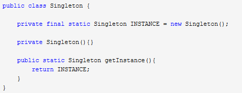
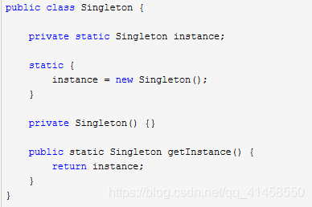
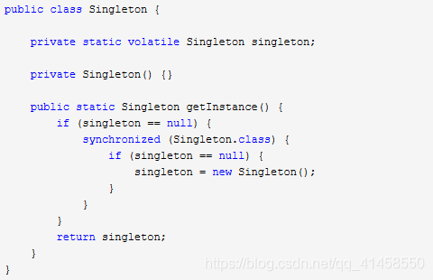
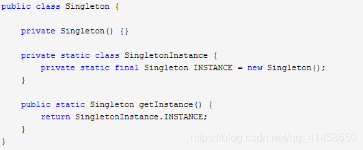
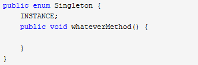

# 单例模式有几种？
> [java单例模式——详解JAVA单例模式及8种实现方式](https://blog.csdn.net/qq_41458550/article/details/109243456)

## 1.饿汉式（静态常量）【可用】
优点：这种写法比较简单，就是在类装载的时候就完成实例化。避免了线程同步问题。

缺点：在类装载的时候就完成实例化，没有达到Lazy Loading的效果。如果从始至终从未使用过这个实例，则会造成内存的浪费。

## 2.饿汉式（静态代码块）【可用】

这种方式和上面的方式其实类似，只不过将类实例化的过程放在了静态代码块中，也是在类装载的时候，就执行静态代码块中的代码，初始化类的实例。优缺点和上面是一样的。

## 双重检查【推荐使用】
Double-Check概念对于多线程开发者来说不会陌生，如代码中所示，我们进行了两次if (singleton == null)检查，这样就可以保证线程安全了。这样，实例化代码只用执行一次，后面再次访问时，判断if (singleton == null)，直接return实例化对象。

优点：线程安全；延迟加载；效率较高。

## 静态内部类【推荐使用】
这种方式跟饿汉式方式采用的机制类似，但又有不同。两者都是采用了类装载的机制来保证初始化实例时只有一个线程。不同的地方在饿汉式方式是只要Singleton类被装载就会实例化，没有Lazy-Loading的作用，而静态内部类方式在Singleton类被装载时并不会立即实例化，而是在需要实例化时，调用getInstance方法，才会装载SingletonInstance类，从而完成Singleton的实例化。

类的静态属性只会在第一次加载类的时候初始化，所以在这里，JVM帮助我们保证了线程的安全性，在类进行初始化时，别的线程是无法进入的。

优点：避免了线程不安全，延迟加载，效率高。

## 枚举【推荐使用】

借助JDK1.5中添加的枚举来实现单例模式。不仅能避免多线程同步问题，而且还能防止反序列化重新创建新的对象。

# 简单工厂模式、工厂模式、抽象工厂模式之间的异同？
1. 简单工厂模式就是定义一个工厂类 ，里面有一个create方法，通过传进去的参数来if-else式的判断创建哪个产品

2. 工厂模式则将工厂抽象为一个接口，所有的工厂类都去实现它，不同的工厂类负责创建不同的产品

3. 抽象工厂模式则更进一步，将工厂和产品都抽象出来：
* 抽象工厂接口定义了同一个产品族的产品生产行为
* 抽象产品接口定义了一个产品族