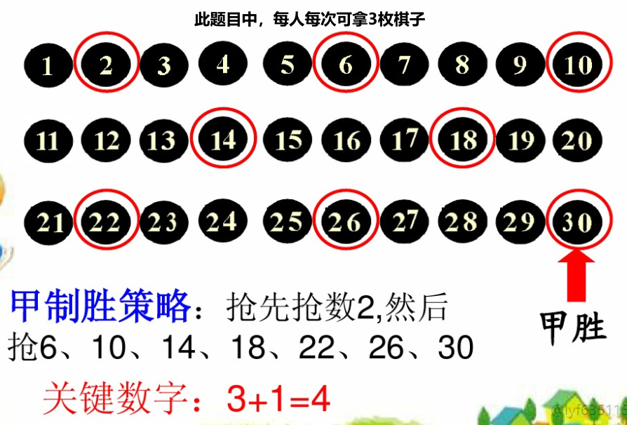

# Java

## java中快速失败(fail-fast)和安全失败(fail-safe)的区别是什么？
1. 快速失败（fail—fast）

	在用迭代器遍历一个集合对象时，如果遍历过程中对集合对象的内容进行了修改（增加、删除、修改），则会抛出Concurrent Modification Exception。

	**原理**：迭代器在遍历过程中是直接访问内部数据的，因此内部的数据在遍历的过程中无法被修改。为了保证不被修改，迭代器内部维护了一个标记 “mode” ，当集合结构改变（添加删除或者修改），标记"mode"会被修改，而迭代器每次的hasNext()和next()方法都会检查该"mode"是否被改变，当检测到被修改时，抛出Concurrent Modification Exception

	**场景**：java.util包下的集合类都是快速失败的，不能在多线程下发生并发修改（迭代过程中被修改）。

2. 安全失败（fail—safe）

	采用安全失败机制的集合容器，在遍历时不是直接在集合内容上访问的，而是先复制原有集合内容，在拷贝的集合上进行遍历。
	
	**原理**：由于迭代时是对原集合的拷贝进行遍历，所以在遍历过程中对原集合所作的修改并不能被迭代器检测到，所以不会触发Concurrent Modification Exception。
	
	**缺点**：基于拷贝内容的优点是避免了Concurrent Modification Exception，但同样地，迭代器并不能访问到修改后的内容，即：迭代器遍历的是开始遍历那一刻拿到的集合拷贝，在遍历期间原集合发生的修改迭代器是不知道的。

	**场景**：java.util.concurrent包下的容器都是安全失败，可以在多线程下并发使用，并发修改。
3. 区别：一个直接访问源数据，有人修改及抛异常，一个先拷贝一份再访问，但是不能及时获取到最新的数据。

## 类加载机制

### 1.类加载过程
类加载分为三个过程：加载、连接、初始化，而连接又分为三部分：验证、准备、解析。
#### 加载
加载即为将类的class文件读入内存，并为之创建一个 java.lang.Class 对象，也就是说，当程序中使用任何类时，系统都会为之建立一个java.lang.Class对象。

通过使用不同的类加载器，可以从不同来源加载类的二进制数据，通常有如下几种来源。

	- 从本地文件系统加载class文件，这是前面绝大部分示例程序的类加载方式。
	- 从JAR包加载class文件，这种方式也是很常见的，前面介绍JDBC编程时用到的数据库驱动类就放在JAR文件中，JVM可以从JAR文件中直接加载该class文件。
	- 通过网络加载class文件。
	- 把一个Java源文件动态编译，并执行加载。

类加载器通常无须等到“首次使用”该类时才加载该类，Java虚拟机规范允许系统预先加载某些类。

#### 连接
- 验证

验证被加载的类是否有正确的内部结构，包括文件格式验证、元数据验证、字节码验证、符号引用验证
   	1. 文件格式验证： 验证字节流是否符合CLASS文件格式规范
 	2. 元数据验证：对字节码描述的信息进行语义的分析，分析是否符合java的语言语法的规范
 	3. 字节码验证：最重要的验证环节，分析数据流和控制，确定语义是合法的，符合逻辑的。主要的针对元数据验证后对方法体的验证。保证类方法在运行时不会有危害出现。
 	4. 符号引用验证：主要是针对符号引用转换为直接引用的时候，是会延伸到第三解析阶段，主要去确定访问类型等涉及到引用的情况，主要是要保证引用一定会被访问到，不会出现类等无法访问的问题。

- 准备

负责为类的静态变量分配内存，并设置默认初始值。

- 解析

将类的二进制数据中的符号引用替换成直接引用。

#### 初始化

为类的静态变量赋正确的值

### 2.类加载时机
1. 创建类的实例
2. 访问某个类的静态变量或者对该静态变量进行赋值
3. 调用某个类的静态方法
4. 反射（Class.forName("com.hfut.edu.Main")）
5. 初始化一个类的子类（会首先初始化其父类）
6. 执行main函数会导致其所在的类初始化
### 3.类加载器(待补充)
## 解决Hash冲突的四个方法
约定： H(key)为一开始的哈希函数算出来的哈希地址
### 1. 开放定址法（再散列法）
当关键字的哈希地址 p = H(key) 出现冲突时，以 p 为基础，产生另一个哈希地址p1，如果p1依然存在冲突，则再以p为基础，生成另一个哈希地址p2，一直到不产生冲突为止。

一个通用的 再散列函数 如下 ：

 ` Hi=（H（key）+di）% m   i=1，2，…，n`

主要有如下三种方法：
1. 线性探测再散列

	出现冲突后，直接闷着头往后继续找，找到空位就直接插进去。

2. 二次探测再散列

	di=12，-12，22，-22，…，k2，-k2    ( k<=m/2 )
	
	特点是冲突发生后就左右跳跃，找到空位就直接插进去。

3. 伪随机探测再散列

	di是一个伪随机数数列
### 2. 再哈希法
准备多个哈希函数备用，一个不管用就用备用的
### 3. 链地址法
哈希地址相同的元素其实保存在一个链表中，有冲突就直接往对应的链表后面插即可
### 4. 建立公共溢出区
将hash表分为基本表和溢出表两部分，和基本表发生冲突的元素，一律填入溢出表

### 5. 优缺点
1. 拉链法（开放散列）
	- 优点：
		- 元素总数不确定时处理的较好
		- 删除较为方便
	- 缺点
		- 存储地址随机分布，相较于固定分布的数组来说，效率会差一些
		- 总数不变时可以设计一个不会产生冲突的完美哈希函数，此时封闭散列的性能将远高于开放散列
		- 不容易进行序列化操作
2. 开发定址法（封闭散列）
	- 优点
		- 容易序列化
		- 总数不变可以开发完美哈希函数，效率高
	- 缺点
		- 总数变化时可能会导致经常性扩容，扩容开销很大，会严重影响性能
		- 删除时比较麻烦，需要将后续插入的元素都往前移，不然会产生找不到元素的情况发生

# 操作系统

# Linux

# 算法

## 常见排序算法

## 有N个节点的满二叉树的高度
1+logN

## 如何实现关键字输入提示

> 使用字典树

复杂度多少？有没有其他方案？

> 哈希

如果是中文呢

> 分词后建立字典树？

## 红黑树

红黑树是一种具有红色和黑色链接的平衡查找树，同时满足：

1. 节点只能为红色或者黑色
2. 根节点一定是黑色的
3. 叶子节点一定是黑色的
4. 红色节点都不相邻
5. 任一节点到其每个叶子节点的路径中，包含相同数量的黑色节点

# 内存映射技术——MMap

实现的目标：把一个磁盘文件映射到内存里来，然后把映射到内存里来的数据通过socket发送出去

有一种mmap技术，也就是内存映射，直接将磁盘文件数据映射到内核缓冲区，这个映射的过程是基于DMA引擎拷贝的，同时用户缓冲区是跟内核缓冲区共享一块映射数据的，建立共享映射之后，就不需要从内核缓冲区拷贝到用户缓冲区了。

光是这一点，就可以避免一次拷贝了，但是这个过程中还是会用户态切换到内核态去进行映射拷贝，接着再次从内核态切换到用户态，建立用户缓冲区和内核缓冲区的映射。

接着把数据通过Socket发送出去，还是要再次切换到内核态。

接着直接把内核缓冲区里的数据拷贝到Socket缓冲区里去，然后再拷贝到网络协议引擎里，发送出去就可以了，最后切换回用户态。

减少一次拷贝，但是并不减少切换次数，一共是4次切换，3次拷贝。

mmap技术是主要在RocketMQ里来使用的。

# 零拷贝技术

1. 从用户态切换到内核态，在内核态的状态下，把磁盘上的数据拷贝到内核缓冲区，同时从内核缓冲区拷贝一些offset和length到Socket缓冲区
2. 从内核态切换到用户态，从内核缓冲区直接把数据拷贝到网络协议引擎里去

零拷贝技术只要**2次切换，2次拷贝**，就可以了

kafka、tomcat，都是用的零拷贝技术，rocketmq用的是mmap技术，mmap还是要多2次切换和1次拷贝的。

# 如何将一个长地址映射为短地址呢？

## 生成流程（使用放号器）

（1）利用放号器，初始值为0，对于每一个短链接生成请求，都递增放号器的值，再将此值转换为62进制（a-zA-Z0-9），比如第一次请求时放号器的值为0，对应62进制为a，第二次请求时放号器的值为1，对应62进制为b，第10001次请求时放号器的值为10000，对应62进制为sBc。

（2）将短链接服务器域名与放号器的62进制值进行字符串连接，即为短链接的URL，比如：t.cn/sBc。

（3）重定向过程：生成短链接之后，需要存储短链接到长链接的映射关系，即sBc -> URL，浏览器访问短链接服务器时，根据URL Path取到原始的链接，然后进行302重定向。映射关系可使用K-V存储，比如Redis或Memcache。

## 跳转过程

（1）用户访问短链接：http://t.cn/RuPKzRW；

（2）短链接服务器t.cn收到请求，根据URL路径RuPKzRW获取到原始的长链接（KV缓存数据库中去查找）：https://blog.csdn.net/xlgen157387/article/details/79863301；

（3）服务器返回302状态码，将响应头中的Location设置为：https://blog.csdn.net/xlgen157387/article/details/79863301；

（4）浏览器重新向https://blog.csdn.net/xlgen157387/article/details/79863301发送请求；

（5）返回响应；

## 优化的点

1. 算法优化：为了避免一个长地址生成了多个短地址，造成资源浪费，可以使用查表的方式（DB效率较低）或者本地LUR缓存（存储最近N次的映射结果）去进行查重。

2. 可伸缩和高可用

   使用“分片”思想将放号器集群化：每个实例负责特定号段的分发，比如部署10台Redis，每台分别负责号段尾号0-9的分发，此时发号器的步长设置为10（实例数量）。

   另外，也可将长链接与短链接映射关系的存储进行分片，由于没有一个中心化的存储位置，因此需要开发额外的服务，用于查找短链接对应的原始链接的存储节点，这样才能去正确的节点上找到映射关系。

# 线程模型Reactor

# DDD领域驱动设计以及平时开发的规范

# 拿棋子问题

总共有N枚棋子，每人每次可以拿1到M个，谁拿完后棋子的数量为0谁就获胜。

第一个拿棋子的人的必胜策略：每一次都将棋子拿到只剩 (M的倍数 + 1) 的数量，否则就必输。

# 项目中遇到的最大挑战

之前有一个任务，要求做一批接口，将不同表中的数据全量导出到文件中。

同时还要复用之前的一些业务逻辑

初步思考了一下，我发现全量导出可能会有如下问题：

1. 数据导出了多条重复的一模一样的
2. 由于数据量太大，导出完成时，文件中不包括开始后插入的数据
3. 数据量太大，导出耗时太久，前台等待超时。
4. 数据全部加载到内存中将内存撑爆。
5. 使用pageHelper之后，数据量太大时使用limit分页会出现性能问题。

分别的解决方案也思考了一下：

1. 多条重复数据，出现的场景就是在我已经导出的数据页中又新加了数据，这会导致前面一页的数据被排挤到了后面一页，但是想了下这是不可能的，因为我们的表结构设计，以及数据库规范，都要求主键是增长的，不能在前面插入数据。
2. 导出完成时不包括开始后插入的数据，这个和问题一一样，也是数据插到前面才会出现问题。
3. 数据量太大，导出耗时太长，前台等待超时。超时后返回给前台提示消息，让用户去一个特定的导出文件下载页面等待导出完毕；同时用多线程的思想来优化了一下，多个线程共同工作。
4. 数据量太大，将数据全部导出后撑爆了内存。这个是使用了分治的思想，将各个页码生成的数据，放到一些临时文件中，最后再进行一个文件合并。
5. 新加一个索引，使用inner join的方式，在子查询里面将主键都查询出来，然后在外层查询中直接通过主键查找，ref级别的。

### 解决过线上问题吗？

线上有出现过一个问题，就是Full GC 问题，有个同事在代码中使用Map实现了一个缓存，但是没有限制它的大小，导致缓存数量一直在上升，内存越来越大，直到出现了OOM问题。

# HR面试问题总结

## 自我介绍

### 说一下自己在学校或者在工作中印象最深刻的项目

## 讲一下工作经历，具体做了什么，你在其中承担了什么样的角色

实习半年+工作一年，我在我们组基本上可以独立完成领导安排的任务了，所以一般java服务这边有什么设计任务的时候，我的导师会将其转发给我，让我来设计，设计完后他来把控大方向

决策能力、主导能力、主动性

## 讨论项目

### 你们团队多少人，前端有多少人，组里多少人

组里一共20人左右，与我一同维护java项目的还有4人

### 你在这个项目中对于你来说最大的挑战

**恒生**：业务复杂度较高的任务，复用原有前后台代码，完成一系列数据全量导出的接口，当时涉及到的接口接近30个，如果每一个接口都复制重写一份的话会加大很多工作量，而且现有的各个接口也不支持页面的数据格式化，需要专门设计一个配置方案来承担此次重构的工作。

**阿里**： 业务压力比较大，需要尽快上线，而且我对业务还不是特别熟悉，因此我发挥了我善于归纳总结的能力，将链路图画了出来，然后一个节点一个节点的分析了过去，最终解决了问题。

### 让你自豪的事情

我刚刚开始学习java源码的时候，调用了一个公司自研组件的api，是设置键值的超时时间的，我当时认为应该会和大部分api相同，单位是ms，然后我设置了不起作用。试了几次之后，我直接点到了源码里面，原来里面加了处理，是秒的概念。我迅速的解决了这个问题，因此从那以后我觉得养成看源码的习惯很重要，因为文档这个东西不可能覆盖所有，一些基本的还是需要自己去看。

**阿里**：两周内将一个完全不了解的业务上线成功并取得了不错的成绩。

### 在项目中和其他业务部门沟通的内容，举例子

**恒生**：接口的对接，将我们服务的接口暴露出去，以javadoc文档的形式交付出去。
​除此之外，还对接了一个报表模块，将我们组的境外数据同步至他们的库中

**阿里**：这个在阿里真的是太多了，举例来讲：
需求方面：需要和产品一直保持沟通，确保最终产品与产品经理设计的相同；
技术方面：由于阿里的中间件特别多，因此我每次出现问题若看文档解决不了就需要深入的与其他部门的同学进行沟通。

### 在项目中是否发现自己技术栈的短板

当时开发行情服务时，我对redis接触的很少，然后需要一点时间去接触，导致我的开发速度没有达到我对平均预期，因此我决定多接触一些常用的中间件，因此我开始接触像redis、rabbitmq、kafka的一些中间件，也有对MySQL的部分底层有研究，除此之外juc的并发包下面的内容也有在学习。

### 针对上线步骤或者代码规范，你认为有什么不足和需要改进的地方

可以将测试过程前移，与开发人员一同测试，开发人员滚动交付，测试人员也滚动测试。

### 项目使用了什么架构，亮点是什么

交易清算分离，可以做到24小时滚动交易、滚动清算，因为各个交易所有时差，每个交易所的交易时间段不同，交易完成之后需要进行一轮清算，保证资金可用的正确性。

实现方式：将复杂的业务场景解耦化，在数据层面保证资金的隔离性。

### 难点是什么

分布式一致性场景：多个服务共同去订阅消息刷新缓存，势必会造成缓存的不一致场景，使用分布式锁的方式，每个缓存只有一个服务在刷新

高并发场景：多个用户一同订阅行情，此外还需要处理高流量大并发的行情信息，因此引入redis缓存层，解决高性能的要求。

高可用场景：这个之前我们的项目里没有体现出来，前两天和三面的面试官交流时想到了这个问题，我们是有个前置机组件进行外部行情源的对接的，因此这个行情服务对这个组件的依赖性很高，而交易员的交易策略又和行情数据有关，因此此处应该加一个保障机制，我这两天的初步想法是：前置机对接zk，注册一个节点，依赖服务去订阅监听器，当宕机的时候发送消息给前台，这时候前台去判断此问题，如果出问题就直接在前台响应，警告交易员不要再交易了。

### 想做技术还是业务

技术与业务合并的那种，我很乐意用技术来解决业务难题，而且我觉得将复杂业务的场景抽离到技术上是一件很难的事情，我想要朝着这个方向去努力

技术的落地离不开一个好的业务方向，而一个好的业务方向则需要强大的技术作为支撑，我觉得这两者其实是分不开的。做业务的同时需要了解公司所用中间件的技术底层原理，而做基础中间件研发的同学，也需要去了解到业务的需求。

### 压力大的时候，如何解决

和女朋友出去旅游一下，看看祖国的大好河山
如果时间不够的话，看看书、看看电影，去放松一下自己的大脑

## 生活

### 你更趋向于做什么类型的工作

### 趋向于在哪工作

​	杭州，打算在这边买房

### 有没有被否定过，是怎么想的

​	大二转专业的时候，一开始是想要转到计算机学院的，但是在那之前看到书不够多，经历也不够好，因此没有成功。后面好好准备了一些，在第二批转专业的机会中又再一次申请转到软件学院，这次成功了。
​	我觉得认定一个自己的目标，哪怕被否定了也要坚持不懈的朝着那个方向努力，坚持自己，不忘初心。

### 讲讲大学期间压力比较大的一段时间

​	大二一整个学期，每到考试周压力都很大，需要准备软件学院大一大二共两年的专业课，压力很大，但是我没有被打倒，每次考试周都会加班加点的学，最终取得了还算满意的成绩。

### 怎么和同事沟通的，是怎么问问题的

​	真诚、礼貌性的去问问题，我觉得有问题的话一定要多问，多去请教一下团队中的老员工，问问题时也要注意问到点子上，要用简洁的语言将问题描述清楚。当然了，一些小问题的话我不会直接去询问别人的，我会先主动查询一些资料，像官网上、博客上的帖子，都会先独自去看看，如果实在搞不定再去问别人。

## 公司

### 评价前公司

1. 有技术，有自研的开发团队，这是恒生在toB的金融领域做到这么大的一个很重要原因

2. 我所在的组氛围很好，组中比较注重新人的培养，会经常举办一些培训的会议，帮助新人更好的融入团队。

### 为什么跳槽？

### 对不是互联网电商方向，其他方向感兴趣吗？

目前我仅仅工作一年，所以我对行业的要求不是那么的大，我认为每个行业都是有共通性的，目前我关注的是我的技术水平发展。

而且我目前对任何事物都有探索欲，有强烈的主观性，并能很好地接受各个工作任务。

### 今后有什么职场规划或者学习计划。

进入职场的前三年要深耕技术，钻研出自己的深度，然后后面就开始打算有计划的朝着管理方向发展。

### 你认为你的个人性格是怎样的呢

- 自信：无论什么时刻，任何事情都不会打倒我，我都会拥有一个良好的心态去迎接挑战。进行报表模块开发时，我们承受了客户的压力，使用了之前没有用过的技术栈，迅速对接，将我们组的数据成功同步到了他们的数据库。
- 性格富有亲和力：可以和身边的同事、同学们打好关系。
- 认真细致：喜欢关注细节，仅仅工作一年时间，我导师就因为我的高质量代码而给我申请开通了代码审核权限，让我去帮忙审核同事的代码。
- 计划性：每天都会列下来一天要做的事情，以免浪费光阴，完不成任务。
- 团结：我不喜欢单打独斗，我喜欢和同事们一同完成任务，完成设计文档的时候我会主动的征求几位同事的意见，让他们帮我参谋参谋，有没有什么遗漏的。
- 决策能力
- 主导能力
- 主动性

## 你的优缺点是什么？

- **认真细致**。我很细心，所以考虑东西的时候会比较周全，仅仅一年工作经历，我的leader就给我开通了代码审核的权限，让我去帮忙审核同事们的代码。
  - 但是我觉得宏观视野和战略思维略显不足，有时候看一些问题不能站在公司和团队的高度。而且有时候会过度关注细节，花很多的精力去思考和处理细节，甚至有时候钻牛角尖。但是我已经在尝试改进，比如会提醒自己定期关注一下任务的整体进度和同事们的进展，及时和领导汇报，以便能重新关注大局。这样我既可以确保质量，但又不会过于陷入细枝末节，影响团队按时完成任务。
- **乐于助人。**我比较喜欢帮助别人解决问题，因为我觉得这样可以让团队获益，可以加速团队的开发进度。
  - 但是有时候这也会成为一个缺点，有时候自己的任务还没有完成，别人过来找我寻求帮助时我会忍不住放下手头的任务去帮助他。为了改善这个问题，我现在通过Excel对自己的任务进行量化和管理。这样我可以随时知道我手头的任务量和需要完成的大概时间，这样我就能明白，我是否还有足够的时间和精力去帮助他人，承担更多的任务。

- **计划性**。我喜欢做任何事情都提前规划好，而且我也会按照自己的日程来开展工作，这样的工作方式让我做事情的时候很有信心，而不会有焦虑感。
  - 但是如果一个任务的目标过于模糊，或者我的项目团队其他成员过于缺乏计划性，也会让我受不了。无论是工作中还是生活中，所以我的一些没有计划性的朋友往往说我是活在日历上的人，我的男(女)朋友也会觉得有时候我过于苛求，有时候这也给我带来很多烦恼，比如出行计划的安排他们往往觉得我安排的过细和缺乏弹性。
- **决策能力、主导能力、主动性**

### 喜欢看什么书

比较喜欢看技术方面的书，jvm、数据结构、MySQL最近都在看，当然了，文学小说看的也比较多，像基督山伯爵、活着、三体这些书都有看

### 认为自己在这个岗位上的竞争优势是什么

技术方面，能够通过前面几场技术面的同学，也包括我在内，在技术方面肯定是可以能够胜任此项工作的。

因此我要阐述的不是这一点：

1. 我刚刚毕业一年，身上的行业、公司烙印不是特别大。除此之外有了一年的编码、设计经验，可以让我在解决实际问题时更加游刃有余，因此有可培养价值。
2. 我对阿里有着很大的向往之情，这代表我会珍惜来之不易的机会
3. 我为人踏实上进、有很强的主观能动性，我喜欢在工作中遇到问题时主动寻求帮助，而不是被动的被询问，也因此在去年年中评价中拿到了A的评级。
4. 我比较喜欢为团队做出贡献，比如去年我就为团队做了一点小工具，帮他们解决了一些特定场景的问题。

### 你身边同学如何评价你、老师呢

好多人都说我很自信，有些时候他们看我明明没有把握，但是我还是冲上去把任务接了下来。我认为做任何事都要有自信，怂了就很容易做不好。

### 如果与同事发生了意见的不一致，你会如何解决呢

认真听取对方的意见，然后与我的想法进行对比。

如果我觉得我们两个人的想法相近或者他的更好，那我就会直接赞同他，相比于一时的胜负，我更看重问题的解决结果。

如果我觉得我的更好，那我会主动的去搜集一些示例，用真实案例去说服他，如果依然说服不了且此问题很大，我就会主动和他一起去找对这方面比较熟悉的同事，让他帮忙参考一下。

## 实事

## 分析阿里最近发生的负面事件

谈谈自己的看法

最近事件又反转了，好像是女员工的问题，现在男方想要去使用法律控告了。这件事我从一开始就有些关注了，因为我感觉没这么简单，我个人认为想把事情闹大，通过舆论来达成某种目的的大多数都有问题。

我认为评价一家公司不能抓着这种事情看，阿里对社会的贡献是极其巨大的，之前河南水灾，腾讯捐了1亿，而阿里捐了2.5亿，这仅仅只是捐款，在此之外阿里通过供应链优势调用了大量的储备物资，第一时间发去河南。除此之外疫情期间，阿里禁止了口罩等医疗物资出口，大量采办医疗物资送去武汉，我认为这些都是阿里的大局观、为国家、为人民做的大贡献，所以阿里深深的吸引了我，我十分想加入阿里，成为阿里的一员。

## 反问：

公司对待新人有哪些培训？

# 携程二面
## 一个题目，分别用SQL和Java代码实现
有一张表，有三个字段：员工ID、部门ID、员工薪资

现在需要排序查询每个部门的平均薪资，但是平均薪资是去除掉该部门的最大N个和最小N个员工的薪资后的平均薪资。

## 让你设计一个秒杀系统，你会怎么来设计
> 参考：[秒杀业务/超卖的几种解决思路](http://t.zoukankan.com/yaopengfei-p-12418229.html)

**问题：**

1. 高并发
2. 超卖
3. 恶意请求
4. 链接暴露
5. 数据库宕机

**解决：**
1. 服务单一职责原则
2. 秒杀链接加盐
3. Redis集群/库存预热
4. Nginx网关层负载均衡
5. 资源静态化
6. 按钮控制
7. 限流、降级、熔断、隔离
8. 削峰填谷

**超卖问题的解决**
1. 加锁
2. 库存放在Redis里面并通过LUA脚本去解决
3. 请求放到消息队列里面，不立即操作